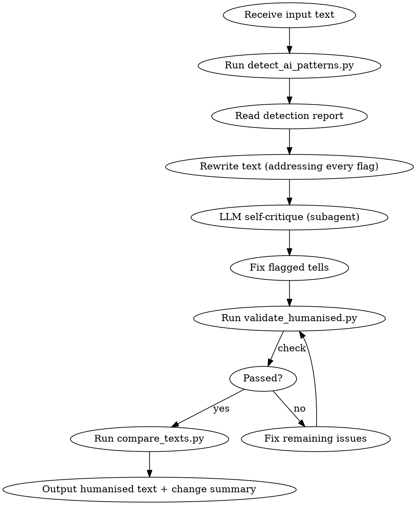

# Humanise Text

Strip every detectable sign of AI writing. Output prose where every word is chosen with precision, intention, and meaning.

## When to Use

- User pastes text and asks to humanise/humanize it
- User asks to remove AI patterns or make text sound natural
- User asks to "de-slop" or "clean up" AI writing
- Text needs to pass as human-written

## When NOT to Use

- Creative fiction or poetry (the rules don't apply)
- User wants AI style preserved
- Text is already human-written and natural

## Core Principles

1. **Preserve meaning exactly.** Every idea in the original must survive. Nothing added, nothing lost.
2. **Match the input's register.** Formal input stays formal. Casual stays casual. Strip AI patterns, not the writer's intent.
3. **Every word earns its place.** If a sentence works without a word, the word is needless. Cut it.
4. **Precision over inflation.** "Use" not "utilize." "Show" not "demonstrate." Anglo-Saxon over Latin.
5. **Rhythm over monotony.** Vary sentence length. Mix 3-word punches with 30-word runs. SD > 6 words.
6. **The writer's voice survives.** Strip AI tells, not personality. If the original has opinions, humor, tangents, or a distinctive rhythm, protect those. Humanisation reveals the person underneath the machine output.
7. **Agents must use Claude Opus 4.6** for all rewriting work. Writing quality is non-negotiable.

## Workflow



## Execution Steps

### Step 1: Save Input

Save the user's text to a temp file:
```bash
# Save input to temp file for script processing
cat > /tmp/humanise_input.txt << 'INPUTEOF'
[user's text here]
INPUTEOF
```

### Step 2: Detect AI Patterns

```bash
python3 ~/.claude/skills/humanise-text/scripts/detect_ai_patterns.py /tmp/humanise_input.txt --format json > /tmp/humanise_report.json
```

Read the JSON report. Note:
- `ai_density_score` (0-100) — the overall contamination level
- `flagged_words` — every AI word with position and severity
- `flagged_phrases` — every AI phrase by category
- `structural_patterns` — negative parallelism, tricolons, trailing -ing clauses, etc.
- `rhythm_analysis` — sentence/paragraph length variance
- `tone_analysis` — hedging, weasel words, nominalizations

### Step 3: Rewrite

Read these reference files before rewriting:
- `./reference/banned_patterns.md` — Every banned word/phrase with human alternatives
- `./reference/structural_tells.md` — Structural patterns to break
- `./reference/rewrite_principles.md` — Positive guidance for human prose

**Rewrite rules (non-negotiable):**

**Words:**
- Replace EVERY red-flag word. Zero tolerance. Use the alternatives from banned_patterns.md.
- Yellow-flag words: max 1 per document. If used, it must be the precisely correct word.
- Replace copula avoidance ("serves as a" → "is a").
- De-nominalize: find -tion/-ment/-ance nouns hiding verbs. Liberate the verb.
- Prefer Anglo-Saxon: "use" not "utilize", "help" not "facilitate", "start" not "commence".

**Phrases:**
- Delete all formulaic openings ("In today's ever-evolving..."). Start with the actual point.
- Delete all formulaic closings ("The future looks bright"). End with the last substantive thought, or a specific, earned conclusion.
- Delete all hedging ("It's important to note that"). State the thing directly.
- Delete all editorialising ("No discussion would be complete without").
- Delete all sycophancy residue ("Great question!").
- Replace significance inflation ("stands as a testament to" → "proves" or "shows").

**Structure:**
- Break negative parallelism ("It's not just X, it's Y"). Rephrase. State the positive claim directly.
- Break rule-of-three. Not every group needs three items. Use two. Or four. Or one.
- Remove trailing -ing clauses. Make the trailing clause its own sentence, or restructure.
- Replace em dashes with commas, parentheses, or colons where appropriate. Keep em dashes only where they genuinely add spontaneity (max 2 per 500 words).
- Break uniform paragraph structure. Vary lengths. One-sentence paragraphs are fine. Ten-sentence paragraphs are fine. Let content dictate length.
- Vary paragraph openings. Never start more than 2 of 5 consecutive paragraphs with "The [noun]."
- Stop synonym cycling. Pick one term for a concept and use it.

**Rhythm:**
- Target sentence length SD > 6 words.
- Mix fragments (2-5 words) with complex sentences (25-35 words).
- Follow the 1-1-3 pattern loosely: two short sentences, then one long. Then break the pattern.
- Read aloud mentally. If every sentence takes the same breath, rewrite.

**Transitions:**
- Delete "Moreover," "Furthermore," "Additionally," "Notably," "Consequently."
- Use "But," "And," "So," "Still," "Yet" — or no transition at all. The paragraph break is the transition.

**Tone and voice:**
- Detect the input's intended formality level. Match it.
- If input is casual: use contractions, short sentences, direct address.
- If input is formal: maintain formality but strip the inflation. Formal doesn't mean bloated.
- If input is academic: keep technical precision but replace AI padding.
- If the original has opinions, react to them — don't flatten them into neutral reporting. "This is concerning" is AI; the original's "I keep thinking about how wrong this feels" is human. Protect that.
- If the original has humor, tangents, or asides — keep them. These are the exact qualities that separate human writing from model output.
- Mixed feelings are human. "I loved the interface but the onboarding confused me" is more authentic than "The product has both strengths and areas for improvement."

**For long texts (>2000 words):**
Split into logical sections and dispatch parallel Opus 4.6 agents. Each agent gets:
- Their section of text
- The detection report for that section
- The reference files
- The preceding paragraph (for continuity) and following paragraph (for transition)
A coordinator agent stitches results, checks seam consistency, and runs final validation.

### Step 3.5: LLM Self-Critique (Subagent)

After rewriting, spawn a Claude Opus 4.6 subagent to read the rewritten text blind. The subagent receives ONLY the rewritten text — not the original, not the detection report. Its job is narrow: spot remaining AI tells.

**Subagent prompt** (use this exact framing):
```
Read the text below. Does it read like a human wrote it, or does it still feel AI-generated?

Identify ONLY specific sentences or phrases that still feel machine-written. For each one, say what makes it feel AI and suggest a tighter alternative.

Rules:
- Do NOT reorganize, restructure, or change the meaning of the text.
- Do NOT add content, expand ideas, or change the argument.
- Do NOT touch sentences that already sound human — leave them alone.
- Focus narrowly on: robotic rhythm, AI vocabulary, formulaic transitions, and flat tone.
- If the text already reads as human, say so and stop.

[THE REWRITTEN TEXT HERE]
```

Read the subagent's response. Fix only the specific tells it identified. If it says the text reads human, skip to Step 4.

This step catches subtle tells that survive the initial rewrite — things like an overly tidy rhythm across paragraphs, or a sloganistic conclusion that the regex-based validator wouldn't flag. The narrow prompt prevents the critique from drifting into "let me rewrite the whole thing differently."

### Step 4: Validate

Save rewritten text and run:
```bash
python3 ~/.claude/skills/humanise-text/scripts/validate_humanised.py /tmp/humanise_input.txt /tmp/humanise_output.txt
```

If FAIL: read the report, fix the specific failures, re-validate. Max 3 iterations.

### Step 5: Compare and Report

```bash
python3 ~/.claude/skills/humanise-text/scripts/compare_texts.py /tmp/humanise_input.txt /tmp/humanise_output.txt
```

### Step 6: Output

Present the humanised text to the user, followed by a brief change summary:
- AI density: before → after
- Words replaced: count
- Structural patterns removed: list
- Sentence rhythm SD: before → after

## Reference Files

- `./reference/banned_patterns.md` — Complete word/phrase catalogue with alternatives
- `./reference/structural_tells.md` — Structural pattern detection and fixes
- `./reference/rewrite_principles.md` — Positive writing guidance

## Scripts

- `scripts/detect_ai_patterns.py` — Scan text, produce JSON report
- `scripts/validate_humanised.py` — Verify output passes thresholds
- `scripts/compare_texts.py` — Show before/after diff

## Examples

See `./examples/` for before/after transformations:
- `academic_before_after.md` — Scientific writing
- `business_before_after.md` — Marketing/business copy
- `blog_before_after.md` — Cultural/travel/tech articles
