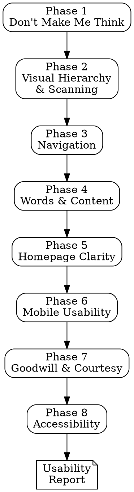

# UX Usability Review

## Overview

A structured usability audit methodology based on *Don't Make Me Think* by Steve Krug. Guides you through 8 sequential phases to systematically evaluate an interface for cognitive load, scanability, navigation clarity, content quality, mobile usability, accessibility, and the overall user experience. The core principle: if a user has to stop and think about how to use your interface, something needs to be redesigned.

## When to Use

- Before launching a product, feature, or redesign
- When users report confusion, abandonment, or support requests about basic tasks
- During design reviews or code reviews that affect user flows
- When evaluating a competitor's interface for strengths and weaknesses
- When onboarding a new team member to UX standards
- As a complement to the ui-polish-review skill (that skill covers visual quality; this one covers usability)

## When NOT to Use

- For purely visual/aesthetic evaluation (use the ui-polish-review skill for that)
- For performance or technical audits
- As a substitute for actual usability testing with real users (this is a heuristic review, not a user test)
- For content strategy or copywriting projects (though content clarity is covered)

## Process

Work through each phase **sequentially**. At each phase:

1. **Ask** targeted questions about the specific interface being reviewed
2. **Read** the relevant chapter summary from `front-end-design/dont-make-me-think/` for detailed guidance
3. **Suggest and execute** concrete tests (grep patterns in source code, manual inspection tasks, quick user tests)
4. **Flag findings** with severity: `CRITICAL` / `HIGH` / `MEDIUM` / `LOW` / `INFO`
5. **Summarize** findings before moving to the next phase

If the application does not have a relevant surface for a phase (e.g., no homepage for an internal tool), acknowledge and skip with rationale.



---

## Phase 1: The "Don't Make Me Think" Test

**Reference:** `front-end-design/dont-make-me-think/ch01-dont-make-me-think.md`, `ch02`

**Goal:** Evaluate whether each screen is self-evident -- a user should immediately understand what it is and what to do without expending mental effort.

**Questions to ask:**
- For each screen: would a first-time user immediately understand what this is and what to do next?
- Are there clever, creative, or branded labels where conventional ones would be clearer? ("Job-o-Rama" vs "Jobs", "Quick Procurement Module" vs "Shopping Cart")
- Is it obvious what is clickable and what is not? (Links look like links, buttons look like buttons, non-interactive elements do not look clickable.)
- Are users expected to read and comprehend, or can they scan and act?
- The 5-second test: if someone saw this page for only 5 seconds, could they tell you what the site does and what the primary action is?

**Tests to run:**
```
# Find potentially clever/non-standard labels and navigation items
grep -rn "nav\|Nav\|navigation\|menu\|Menu\|sidebar\|Sidebar" --include="*.tsx" --include="*.jsx" --include="*.html" --include="*.vue"

# Find link/button text to review for clarity
grep -rn ">.*<\/a>\|>.*<\/button>\|>.*<\/Link>" --include="*.tsx" --include="*.jsx" --include="*.html"

# Check for elements styled to look clickable but are not (or vice versa)
grep -rn "cursor:\s*pointer" --include="*.css" --include="*.scss"
grep -rn "cursor-pointer" --include="*.tsx" --include="*.jsx" --include="*.html"

# Find tooltips (may indicate UI is not self-explanatory)
grep -rn "tooltip\|Tooltip\|title=\"\|data-tip\|aria-label" --include="*.tsx" --include="*.jsx" --include="*.html" --include="*.vue"

# Check for instructional text that might indicate confusing UI
grep -rn "Click here\|click here\|Please note\|Note:\|Instructions:\|How to\|how to\|Steps:" --include="*.tsx" --include="*.jsx" --include="*.html" --include="*.vue"
```

**The 5-Second Test (manual):**
1. Open the page. Look at it for exactly 5 seconds. Look away.
2. Can you answer: What is this site/app? What is the main thing I can do? Where would I start?
3. If any of these are unclear, the page fails this test.

**Visual inspection checklist:**
- [ ] Is every interactive element visually distinguishable from non-interactive elements?
- [ ] Are labels conventional and immediately understandable (no jargon, no cleverness)?
- [ ] Can you identify the primary action on each screen within 2 seconds?
- [ ] Is the page self-evident (no instructions needed) or at minimum self-explanatory (brief moment to understand)?
- [ ] Would removing any "How to" text or instructions break the experience? (If yes, the UI needs redesign, not instructions.)

**Finding template:**
```
[SEVERITY] Cognitive Load: [description]
  Affected: [screen/component]
  Issue: [what makes the user think]
  User question: [the question mark in the user's head — e.g., "Is this clickable?" or "What does 'Synergy Hub' mean?"]
  Fix: [specific recommendation — e.g., "rename 'Synergy Hub' to 'Team Dashboard'"]
```

---

## Phase 2: Visual Hierarchy & Scanning

**Reference:** `front-end-design/dont-make-me-think/ch03-billboard-design-101.md`

**Goal:** Verify the page supports scanning behavior -- users do not read web pages, they scan them. The design must make the most important content immediately findable.

**Questions to ask:**
- Is there a clear visual hierarchy where the most important thing is the most prominent?
- Are pages broken into clearly defined, visually distinct areas?
- Is text formatted for scanning? (Meaningful headings, short paragraphs, bold key terms, bullet lists.)
- Is there excessive visual noise? (Too many competing elements, background patterns, unnecessary decoration, animation overload.)
- Are related items visually grouped (proximity) and unrelated items visually separated?

**Tests to run:**
```
# Check for heading structure (are headings used to break up content?)
grep -rn "<h[1-6]\|<Heading\|role=\"heading\"" --include="*.tsx" --include="*.jsx" --include="*.html" --include="*.vue"

# Find long text blocks without headings or formatting (walls of text)
# Look for paragraphs or text blocks without structure
grep -rn "<p>" --include="*.tsx" --include="*.jsx" --include="*.html" --include="*.vue"

# Check for bullet/ordered lists (good for scanning)
grep -rn "<ul\|<ol\|<li" --include="*.tsx" --include="*.jsx" --include="*.html" --include="*.vue"

# Find text formatting helpers (bold for key terms)
grep -rn "<strong\|<b>\|<em>\|font-bold\|font-semibold\|fontWeight.*bold" --include="*.tsx" --include="*.jsx" --include="*.html" --include="*.vue"

# Check for potential noise: excessive decoration, patterns, animations
grep -rn "background-image:\|background-pattern\|animation:\|@keyframes" --include="*.css" --include="*.scss"
```

**Visual inspection checklist:**
- [ ] Can you identify the page's purpose and primary content within 3 seconds of looking at it?
- [ ] Are there clearly defined visual areas (header, main content, sidebar, footer) with obvious boundaries?
- [ ] Is body text broken into short paragraphs (3-4 sentences max) with descriptive headings?
- [ ] Are key terms bolded or otherwise highlighted for scanners?
- [ ] Is the page free of excessive visual noise (competing elements, unnecessary decoration, distracting animations)?
- [ ] Is whitespace used effectively to create breathing room and visual grouping?

**Finding template:**
```
[SEVERITY] Scanning & Hierarchy: [description]
  Affected: [screen/section]
  Issue: [e.g., "400-word paragraph with no headings, no bold, no lists"]
  Impact: [users will skip this content entirely rather than read it]
  Fix: [e.g., "break into 3 short paragraphs with descriptive headings, bold key terms, use bullet list for features"]
```

---

## Phase 3: Navigation

**Reference:** `front-end-design/dont-make-me-think/ch06-street-signs-and-breadcrumbs.md`

**Goal:** Verify that navigation is clear, persistent, and enables users to always answer three fundamental questions: Where am I? Where can I go? How do I get back?

**Questions to ask:**
- Is there persistent global navigation visible on every page?
- Can the user always answer: Where am I? Where can I go? How do I get back?
- Is there a clear "you are here" indicator in the navigation (active state, highlight, bold)?
- Does every page have a name/title that matches what was clicked to reach it?
- Are breadcrumbs present for deep hierarchies (3+ levels)?
- Is there a persistent, accessible search function?
- Is the logo linked to the homepage?

**Tests to run:**
```
# Check for navigation component
grep -rn "<nav\|<Nav\|role=\"navigation\"\|Navbar\|Header\|AppBar\|TopBar" --include="*.tsx" --include="*.jsx" --include="*.html" --include="*.vue"

# Check for "you are here" indicators (active/current state in navigation)
grep -rn "active\|current\|isActive\|aria-current\|selected\|activeClassName\|pathname" --include="*.tsx" --include="*.jsx" --include="*.html" --include="*.vue" --include="*.css" --include="*.scss"

# Check for breadcrumbs
grep -rn "breadcrumb\|Breadcrumb\|aria-label=\"breadcrumb\"\|role=\"navigation\".*breadcrumb" --include="*.tsx" --include="*.jsx" --include="*.html" --include="*.vue"

# Check for search functionality
grep -rn "search\|Search\|type=\"search\"\|role=\"search\"\|searchParams\|useSearch" --include="*.tsx" --include="*.jsx" --include="*.html" --include="*.vue"

# Check for back/home navigation
grep -rn "back\|Back\|home\|Home\|logo.*href\|logo.*link\|Logo.*Link" --include="*.tsx" --include="*.jsx" --include="*.html" --include="*.vue"

# Check for page titles/headings matching navigation labels
grep -rn "<title\|<h1\|document\.title\|useTitle\|Head>" --include="*.tsx" --include="*.jsx" --include="*.html" --include="*.vue"
```

**The Trunk Test (standalone quick-check):**
Land on any interior page of the site blindly (not the homepage). Can you immediately answer:
1. What site is this? (Site identity/logo visible)
2. What page am I on? (Page name/title visible)
3. What are the major sections? (Global navigation visible)
4. What are my options at this level? (Local navigation visible)
5. Where am I in the scheme of things? (Breadcrumbs or "you are here" indicator)
6. How can I search? (Search box visible or easily findable)

If any of these questions cannot be answered within 5 seconds, flag it.

**Visual inspection checklist:**
- [ ] Is global navigation persistent and visible on every page (not hidden behind a hamburger on desktop)?
- [ ] Is there a "you are here" indicator showing the current page/section?
- [ ] Do page titles match the navigation labels that led to them?
- [ ] Are breadcrumbs present for content deeper than 2 levels?
- [ ] Is the logo clickable and linked to the homepage?
- [ ] Can the user always get back to where they came from (back button works, breadcrumbs, or explicit back link)?

**Finding template:**
```
[SEVERITY] Navigation: [description]
  Affected: [screen/flow]
  Trunk test: [which questions could not be answered]
  Issue: [e.g., "no 'you are here' indicator — active nav item has no visual distinction"]
  Fix: [e.g., "add font-weight: 600 and a left border accent to the active navigation item"]
```

---

## Phase 4: Words & Content

**Reference:** `front-end-design/dont-make-me-think/ch04`, `ch05-omit-needless-words.md`

**Goal:** Verify that all text on the interface is concise, useful, and free of "happy talk," unnecessary instructions, and marketing fluff. Every word should earn its place.

**Questions to ask:**
- Is there "happy talk" that should be removed? ("Welcome to our innovative platform...", "We're passionate about...", "Thank you for choosing...")
- Are there instructions that would be unnecessary if the interface were better designed?
- Can half the words on any given page be removed without losing meaning?
- Are labels clear, conventional, and user-language (not marketing-speak or internal jargon)?
- Are error messages written in plain language that tells the user what happened and what to do?

**Tests to run:**
```
# Find happy talk and filler text patterns
grep -rni "welcome to\|we're passionate\|we believe\|our mission\|thank you for\|we're excited\|innovative\|cutting-edge\|world-class\|best-in-class\|leverage\|synergy\|empower\|revolutionize" --include="*.tsx" --include="*.jsx" --include="*.html" --include="*.vue" --include="*.md"

# Find instructional text that might indicate confusing UI
grep -rni "please\s\+\(enter\|click\|select\|choose\|note\)\|in order to\|you must\|make sure to\|don't forget\|remember to\|follow these steps\|instructions:" --include="*.tsx" --include="*.jsx" --include="*.html" --include="*.vue"

# Find generic/unhelpful error messages
grep -rni "something went wrong\|an error occurred\|unexpected error\|oops\|try again later\|contact support\|error:\s*true" --include="*.tsx" --include="*.jsx" --include="*.html" --include="*.vue" --include="*.ts" --include="*.js"

# Find button/link text that could be clearer
grep -rni "click here\|learn more\|read more\|submit\|go\|here\b" --include="*.tsx" --include="*.jsx" --include="*.html" --include="*.vue"

# Find long text blocks (potential walls of text)
grep -rn "<p>" --include="*.tsx" --include="*.jsx" --include="*.html" --include="*.vue"
```

**Visual inspection checklist:**
- [ ] Is the page free of "happy talk" that adds no information? (Marketing fluff, welcome messages, mission statements in the UI.)
- [ ] Are there instructions that could be eliminated by redesigning the interface?
- [ ] Could any paragraph on the page be cut in half without losing essential meaning?
- [ ] Do button labels clearly describe what will happen when clicked? ("Save changes" not "Submit", "Create account" not "Go".)
- [ ] Are error messages specific and actionable? ("Email is already registered. Try signing in instead." not "An error occurred.")

**Finding template:**
```
[SEVERITY] Content: [description]
  Affected: [screen/section]
  Current text: "[the problematic text]"
  Issue: [e.g., "happy talk — provides no useful information"]
  Suggested text: "[concise alternative]" or "Remove entirely"
```

---

## Phase 5: Homepage Clarity

**Reference:** `front-end-design/dont-make-me-think/ch07-the-first-step-in-recovery.md`

**Goal:** Verify the homepage immediately communicates what the site is, what the user can do, and why they should care -- within 5 seconds, for a first-time visitor.

**Questions to ask:**
- Does the homepage answer three questions within 5 seconds: What is this? What can I do here? Why should I be here (and not somewhere else)?
- Is there a clear, concise tagline near the logo that describes the site's purpose?
- Is the homepage cluttered with competing priorities, or is there a clear hierarchy of importance?
- Can a first-time visitor understand the site's purpose without scrolling?
- Is the primary call-to-action obvious and compelling?
- Does the homepage avoid the trap of trying to showcase everything at once?

**Tests to run:**
```
# Check for tagline/value proposition near the top
grep -rn "tagline\|slogan\|hero\|Hero\|headline\|Headline\|value-prop\|subtitle\|subheading" --include="*.tsx" --include="*.jsx" --include="*.html" --include="*.vue"

# Check the homepage/landing page component
grep -rn "HomePage\|LandingPage\|Landing\|index\.\(tsx\|jsx\)\|page\.\(tsx\|jsx\)" --include="*.tsx" --include="*.jsx"

# Find the primary call-to-action on the homepage
grep -rn "cta\|CTA\|call-to-action\|get-started\|GetStarted\|sign-up\|SignUp\|try-free\|hero.*button\|Hero.*Button" --include="*.tsx" --include="*.jsx" --include="*.html" --include="*.vue"

# Check for competing CTAs (too many primary actions)
grep -rn "btn-primary\|variant=\"primary\"\|variant='primary'" --include="*.tsx" --include="*.jsx" --include="*.html" --include="*.vue"

# Look for logo + tagline proximity
grep -rn "logo\|Logo\|brand\|Brand" --include="*.tsx" --include="*.jsx" --include="*.html" --include="*.vue"
```

**The 5-Second Homepage Test (manual):**
1. Open the homepage. Start a 5-second timer. Look away when it ends.
2. Write down answers to: What does this site do? What is the main action I can take? Who is this for?
3. If any answer is vague or wrong, the homepage needs work.

**Visual inspection checklist:**
- [ ] Is the site's purpose communicated above the fold without scrolling?
- [ ] Is there a tagline or value proposition near the logo?
- [ ] Is there one clear primary CTA (not 5 competing buttons)?
- [ ] Is the homepage free of "everything and the kitchen sink" syndrome?
- [ ] Would a first-time visitor from your target audience understand the purpose in 5 seconds?
- [ ] Is the homepage hierarchy clear: primary message > secondary features > tertiary details?

**Finding template:**
```
[SEVERITY] Homepage Clarity: [description]
  Affected: [homepage section]
  The 3 questions:
    What is this? [clear / unclear — what a user might guess]
    What can I do? [clear / unclear — what the primary action appears to be]
    Why here? [clear / unclear — is the value proposition communicated?]
  Fix: [e.g., "add a tagline under the logo: 'Project management for remote teams' and make the 'Start free trial' button the sole primary CTA above the fold"]
```

---

## Phase 6: Mobile Usability

**Reference:** `front-end-design/dont-make-me-think/ch10-mobile-usability.md`

**Goal:** Verify the interface works well on mobile devices -- adequate touch targets, readable text, accessible features, and a complete (not stripped-down) experience.

**Questions to ask:**
- Are touch targets at least 44x44 points (Apple HIG) / 48x48dp (Material) with adequate spacing between them?
- Are key features accessible on mobile, not hidden or removed?
- Can the interface be used comfortably one-handed?
- Is text readable without zooming (minimum 16px for body text)?
- Is the mobile experience feature-complete (not a stripped-down version of desktop)?
- Is the viewport meta tag set correctly to prevent unintended zooming issues?
- Are form inputs using appropriate mobile keyboard types (email, tel, number)?

**Tests to run:**
```
# Check for viewport meta tag
grep -rn "viewport" --include="*.html" --include="*.tsx" --include="*.jsx"

# Check for responsive design (media queries, responsive utilities)
grep -rn "@media\|breakpoint\|responsive\|sm:\|md:\|lg:\|xl:" --include="*.css" --include="*.scss" --include="*.tsx" --include="*.jsx"

# Check touch target sizes (minimum 44x44 / 48x48)
grep -rn "min-height:\s*\(4[0-3]\|3[0-9]\|[12][0-9]\|[0-9]\)px\|min-width:\s*\(4[0-3]\|3[0-9]\|[12][0-9]\|[0-9]\)px" --include="*.css" --include="*.scss"
grep -rn "h-[0-9]\b\|w-[0-9]\b\|h-1[0-1]\b\|w-1[0-1]\b" --include="*.tsx" --include="*.jsx" --include="*.html"

# Check for appropriate input types on mobile
grep -rn "type=\"email\"\|type=\"tel\"\|type=\"number\"\|type=\"url\"\|type=\"search\"\|inputMode\|inputmode\|autocomplete" --include="*.tsx" --include="*.jsx" --include="*.html" --include="*.vue"

# Check for mobile navigation patterns (hamburger, bottom nav, sheet)
grep -rn "hamburger\|menu-toggle\|mobile-menu\|drawer\|Drawer\|Sheet\|BottomNav\|bottom-nav\|MobileNav" --include="*.tsx" --include="*.jsx" --include="*.html" --include="*.vue"

# Check for horizontal scrolling issues (content wider than viewport)
grep -rn "overflow-x:\s*hidden\|overflow-x:\s*auto\|overflow-x:\s*scroll\|overflow-hidden\|overflow-x-auto" --include="*.css" --include="*.scss" --include="*.tsx" --include="*.jsx"

# Check font sizes (body text should be at least 16px on mobile to prevent zoom)
grep -rn "font-size:\s*1[0-5]px\|font-size:\s*[0-9]px\|text-xs\b\|text-\[1[0-3]px\]" --include="*.css" --include="*.scss" --include="*.tsx" --include="*.jsx"
```

**Visual inspection checklist (test on actual mobile device or device emulation):**
- [ ] Can all buttons and links be tapped accurately with a thumb (44x44pt minimum)?
- [ ] Is there enough spacing between tap targets to prevent mis-taps?
- [ ] Is body text at least 16px and readable without zooming?
- [ ] Are all desktop features accessible on mobile (not removed or hidden)?
- [ ] Can critical flows (signup, login, checkout, search) be completed on mobile?
- [ ] Do form inputs trigger the appropriate mobile keyboard (email, number, tel)?
- [ ] Is horizontal scrolling avoided (no content bleeding off-screen)?
- [ ] Is the mobile navigation easy to access and use one-handed?

**Finding template:**
```
[SEVERITY] Mobile Usability: [description]
  Affected: [screen/component]
  Issue: [e.g., "secondary navigation links are 28x28px with 4px spacing — too small to tap accurately"]
  Device tested: [device or viewport size]
  Fix: [e.g., "increase tap targets to 44x44px minimum with 8px spacing between items"]
```

---

## Phase 7: Goodwill & Courtesy

**Reference:** `front-end-design/dont-make-me-think/ch11-usability-as-common-courtesy.md`

**Goal:** Verify the interface respects users' time, provides information they need upfront, and makes it easy to recover from mistakes. Every friction point depletes the user's "reservoir of goodwill"; every courteous interaction refills it.

**Questions to ask:**
- Is information users commonly need readily available? (Pricing, shipping costs, contact info, support, FAQs -- not buried 3 clicks deep.)
- Are forms asking only for information that is genuinely necessary? (No phone number unless you will call them. No company name for personal accounts.)
- Are error messages helpful, specific, and constructive? (Not just "Invalid input" but "Email must include an @ symbol.")
- Can users easily recover from mistakes? (Undo, back button works, clear error states, confirm destructive actions.)
- Are loading, empty, and error states designed and helpful (not default browser behavior)?
- Is the interface free of "dark patterns"? (Tricking users into subscriptions, hiding unsubscribe, pre-checked consent boxes.)

**Tests to run:**
```
# Find form fields — check if all are necessary
grep -rn "<input\|<Input\|<textarea\|<Textarea\|<select\|<Select\|type=\"text\"\|type=\"email\"\|type=\"tel\"\|type=\"number\"" --include="*.tsx" --include="*.jsx" --include="*.html" --include="*.vue"

# Check for required fields (are they all truly required?)
grep -rn "required\|isRequired\|\*\|aria-required" --include="*.tsx" --include="*.jsx" --include="*.html" --include="*.vue"

# Find error message patterns
grep -rni "error\|invalid\|required\|must\|cannot\|failed\|incorrect\|wrong" --include="*.tsx" --include="*.jsx" --include="*.html" --include="*.vue" --include="*.ts" --include="*.js"

# Check for undo/recovery mechanisms
grep -rn "undo\|Undo\|revert\|Revert\|restore\|Restore\|confirm\|Confirm\|are you sure\|Are you sure" --include="*.tsx" --include="*.jsx" --include="*.html" --include="*.vue"

# Check for loading states
grep -rn "loading\|Loading\|isLoading\|isPending\|skeleton\|Skeleton\|spinner\|Spinner\|progress\|Progress" --include="*.tsx" --include="*.jsx" --include="*.html" --include="*.vue"

# Check for empty states
grep -rn "empty\|Empty\|no-data\|noData\|no-results\|noResults\|nothing\|zero-state\|emptyState" --include="*.tsx" --include="*.jsx" --include="*.html" --include="*.vue"

# Check for dark patterns
grep -rni "pre-check\|prechecked\|default.*checked\|checked.*default\|opt.out\|unsubscribe\|cancel.*hidden\|hidden.*cancel" --include="*.tsx" --include="*.jsx" --include="*.html" --include="*.vue"

# Check for confirmation dialogs on destructive actions
grep -rn "delete\|Delete\|remove\|Remove\|destroy\|Destroy" --include="*.tsx" --include="*.jsx" --include="*.html" --include="*.vue"
```

**Visual inspection checklist:**
- [ ] Can users find pricing, contact info, shipping details, and support within 1-2 clicks from any page?
- [ ] Do forms ask only for necessary information? (Would you be annoyed filling this form out?)
- [ ] Are error messages specific and tell the user how to fix the problem?
- [ ] Is there a confirmation step before destructive actions (delete account, remove data)?
- [ ] Do loading states inform the user something is happening (skeleton screens, progress indicators)?
- [ ] Are empty states helpful with messaging and a clear next action?
- [ ] Is the interface free of dark patterns (pre-checked boxes, hidden unsubscribe, confusing opt-out language)?

**Finding template:**
```
[SEVERITY] Goodwill: [description]
  Affected: [screen/flow]
  Issue: [e.g., "registration form asks for phone number, company name, and job title — none required for the service"]
  Goodwill impact: [depletes / neutral / builds]
  Fix: [e.g., "remove phone, company, and title fields — ask only for name, email, and password"]
```

---

## Phase 8: Accessibility

**Reference:** `front-end-design/dont-make-me-think/ch12-accessibility-and-you.md`

**Goal:** Verify the interface is usable by people with diverse abilities -- proper heading structure, alt text, keyboard navigation, contrast, form labels, focus indicators, and skip navigation.

**Questions to ask:**
- Is there a proper heading hierarchy (h1 > h2 > h3, with no skipped levels)?
- Do all meaningful images have descriptive alt text? (Decorative images should have empty alt="".)
- Can all interactive elements be reached and operated by keyboard alone?
- Is there sufficient color contrast (WCAG AA: 4.5:1 for normal text, 3:1 for large text)?
- Do all form inputs have programmatically associated labels?
- Are focus indicators visible and clear?
- Is there a "skip to main content" link for keyboard users?
- Is ARIA used correctly (not overused or used as a substitute for semantic HTML)?

**Tests to run:**
```
# Check heading hierarchy (should be sequential, no skipping)
grep -rn "<h1\|<h2\|<h3\|<h4\|<h5\|<h6" --include="*.tsx" --include="*.jsx" --include="*.html" --include="*.vue"

# Check for images without alt text
grep -rn " h2 > h3 without skipping levels?
- [ ] Do all informative images have meaningful alt text?
- [ ] Can you tab through all interactive elements in a logical order?
- [ ] Are focus indicators clearly visible on every interactive element?
- [ ] Does all text meet WCAG AA contrast requirements (4.5:1 normal, 3:1 large)?
- [ ] Does every form input have a visible label (not just placeholder text)?
- [ ] Is there a "skip to main content" link that appears on keyboard focus?
- [ ] Can all functionality triggered by mouse events also be triggered by keyboard?
- [ ] Does the interface avoid conveying information through color alone?

**Finding template:**
```
[SEVERITY] Accessibility: [description]
  Affected: [component/screen]
  WCAG criterion: [e.g., "1.1.1 Non-text Content" or "2.4.7 Focus Visible"]
  Issue: [e.g., "product images have no alt text — screen readers announce 'image' with no context"]
  Users impacted: [e.g., "screen reader users, keyboard-only users"]
  Fix: [e.g., "add descriptive alt text: alt='Red leather notebook, 5x7 inches, 200 pages'"]
```

---

## Severity Rating Guide

| Severity | Criteria | Examples |
|----------|----------|---------|
| **CRITICAL** | Unusable for a user group, core functionality inaccessible, users cannot complete key tasks | No keyboard navigation on forms, primary action invisible or unreachable, mobile users cannot sign up, zero color contrast on essential text |
| **HIGH** | Confusing navigation, unclear purpose, major accessibility gap, users get lost or stuck | No "you are here" indicator, homepage fails 5-second test, no heading hierarchy, missing form labels, trunk test fails on 3+ questions |
| **MEDIUM** | Excessive text, inconsistent patterns, minor accessibility gaps, users slow down but can proceed | Happy talk on every page, instructions needed for basic tasks, some missing alt text, focus indicators missing on some elements |
| **LOW** | Polish issues, could be clearer, minor friction | Some error messages are generic, empty states show "No data", button labels could be more descriptive, some mobile tap targets slightly small |
| **INFO** | Usability testing suggestion, potential improvement, best practice not yet applied | "Consider running a 5-second test with real users", "A skeleton loading state would improve perceived performance", "Adding breadcrumbs would help deep navigation" |

## Common Mistakes

| Mistake | Fix |
|---------|-----|
| Designing for reading instead of scanning | Use headings, short paragraphs, bold key terms, and bullet lists — users scan, they do not read |
| Using clever labels instead of conventional ones | "Jobs" beats "Career Opportunities Portal" every time — use the simplest, most common label |
| Hiding navigation behind a hamburger on desktop | Persistent visible navigation is always preferable to hidden navigation on screens with space |
| No "you are here" indicator | Highlight the current page/section in the navigation with visual distinction (bold, underline, accent color) |
| Writing instructions instead of fixing the design | If you need to explain how to use something, the design needs improvement — not documentation |
| Generic error messages | "An error occurred" helps no one — say what went wrong and how to fix it |
| Asking for unnecessary form fields | Every field you add decreases completion rate — ask only for what you truly need |
| Placeholder text as the only label | Placeholders disappear on focus — every input needs a persistent, visible label |
| Removing focus outlines for aesthetics | Replace the default outline with a custom focus indicator — never remove it entirely |
| Mobile as an afterthought | Design for mobile first or in parallel — a responsive afterthought always feels like one |

---

## Standalone Quick-Check: The Trunk Test

Use this as a fast, independent check on any page of any site. It takes 30 seconds and surfaces the most common navigation failures.

**Instructions:** Navigate to any interior page of the site (not the homepage). Without scrolling or clicking, answer these 6 questions:

| # | Question | What to Look For | Pass/Fail |
|---|----------|-------------------|-----------|
| 1 | **What site is this?** | Logo or site name visible in a consistent location | |
| 2 | **What page am I on?** | Clear page title/heading that matches what was clicked | |
| 3 | **What are the major sections?** | Global navigation visible with clear section labels | |
| 4 | **What are my options at this level?** | Local/sub-navigation or clear content choices visible | |
| 5 | **Where am I in the scheme of things?** | "You are here" indicator, breadcrumbs, or highlighted nav item | |
| 6 | **How can I search?** | Search box or search icon visible without scrolling | |

**Scoring:**
- 6/6: Excellent navigation. Users will feel oriented and confident.
- 4-5/6: Good, but gaps exist. Address the failing items.
- 2-3/6: Significant navigation problems. Users will feel lost.
- 0-1/6: Critical navigation failure. Users will leave.

---

## Phase 9: Review & Report

**Generate the usability report:**

```markdown
# UX Usability Review Report: [Application/Site Name]
**Date:** [date]
**Reviewer:** [name]
**Scope:** [what was reviewed — screens, flows, user types]
**Method:** Heuristic review based on Don't Make Me Think principles

## Executive Summary
[1-2 paragraph summary of overall usability and key findings. State whether the interface passes the "don't make me think" standard and the trunk test.]

## Trunk Test Results
| Question | Answer | Pass/Fail |
|----------|--------|-----------|
| What site is this? | [answer] | [pass/fail] |
| What page am I on? | [answer] | [pass/fail] |
| Major sections? | [answer] | [pass/fail] |
| Options at this level? | [answer] | [pass/fail] |
| Where am I? | [answer] | [pass/fail] |
| How to search? | [answer] | [pass/fail] |
**Trunk Test Score:** [X/6]

## 5-Second Homepage Test Results
| Question | Answer | Clear? |
|----------|--------|--------|
| What is this site? | [answer] | [yes/no] |
| What can I do here? | [answer] | [yes/no] |
| Why should I be here? | [answer] | [yes/no] |

## Findings Summary
| # | Severity | Finding | Phase |
|---|----------|---------|-------|
| 1 | CRITICAL | [title] | [phase] |
| 2 | HIGH     | [title] | [phase] |
| ... | ... | ... | ... |

## Detailed Findings

### Finding 1: [Title]
**Severity:** CRITICAL / HIGH / MEDIUM / LOW / INFO
**Phase:** [which phase found it]
**Affected Component:** [screen, flow, component]

**Description:**
[What the usability issue is — describe the user's experience, not just the technical problem]

**User Impact:**
[How this affects real users — confusion, abandonment, errors, frustration, exclusion]

**Evidence:**
[What you observed — specific screens, text, interactions, test results]

**Recommended Fix:**
[Specific, actionable improvement — include before/after if helpful]

**Reference:**
[Don't Make Me Think chapter/principle reference]

---
[Repeat for each finding]

## Improvement Priority
1. **Fix CRITICAL findings immediately** — users are blocked or excluded
2. **Fix HIGH findings before launch** — users are confused or lost
3. **Fix MEDIUM findings in the next sprint** — users are slowed down
4. **Fix LOW findings as polish** — users are mildly inconvenienced
5. **Consider INFO suggestions** — for the next round of usability improvement

## Recommended Usability Tests
[Suggest specific usability tests to run with real users, based on findings:
- 5-second test on the homepage with 5 participants
- Task-based test: "Find [X] and complete [Y]" with 3-5 participants
- Navigation test: trunk test on 5 interior pages with 3 participants
- Mobile-specific test on [key flows] with 3 participants]

## Out of Scope / Not Reviewed
[What was explicitly excluded and why]
```
