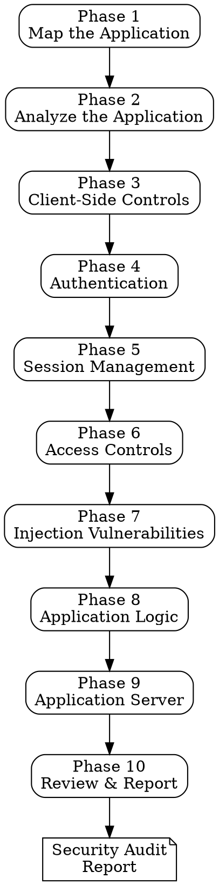

# Web Application Security Audit

## Overview

A structured penetration testing methodology based on *The Web Application Hacker's Handbook*. Guides you through 10 sequential phases to systematically identify vulnerabilities in any web application you're building or reviewing.

## When to Use

- Before deploying a web application to production
- When adding authentication, payment processing, or user-facing features
- During periodic security reviews
- After integrating third-party services or APIs
- When you suspect a specific vulnerability class but want comprehensive coverage

## When NOT to Use

- Against applications you don't own or have authorization to test
- As a replacement for professional penetration testing on critical systems
- For network-level security (this is application-layer focused)

## Process

Work through each phase **sequentially**. At each phase:

1. **Ask** targeted questions about the specific application
2. **Read** the relevant chapter summary from `cybersecurity/web-application-hackers-handbook/` for detailed guidance
3. **Suggest and execute** concrete tests (grep patterns in source code, curl commands, Burp Suite steps, automated scripts)
4. **Flag findings** with severity: `CRITICAL` / `HIGH` / `MEDIUM` / `LOW` / `INFO`
5. **Summarize** findings before moving to the next phase

If the application doesn't have a relevant surface for a phase (e.g., no file uploads), acknowledge and skip with rationale.



---

## Phase 1: Map the Application

**Reference:** `cybersecurity/web-application-hackers-handbook/ch04-mapping-the-application.md`

**Goal:** Discover the full attack surface before testing anything.

**Questions to ask:**
- What is the application's tech stack? (framework, language, database, hosting)
- What are all the routes/endpoints? (read route files, API definitions, OpenAPI specs)
- Are there admin panels, API docs, or debug endpoints?
- What third-party services are integrated?

**Tests to run:**
- Enumerate all routes from source code:
  ```
  # Express.js
  grep -rn "app\.\(get\|post\|put\|delete\|patch\)" --include="*.ts" --include="*.js"
  # Django
  grep -rn "path\|url(" --include="*.py" urls.py
  # Rails
  grep -rn "get\|post\|put\|delete\|patch\|resources\|resource" config/routes.rb
  # Next.js — check app/ and pages/ directory structure
  ```
- Check for exposed files: `robots.txt`, `sitemap.xml`, `.env`, `.git/`, `package.json`
- Search for hardcoded secrets in source:
  ```
  grep -rni "password\|secret\|api_key\|token\|private_key" --include="*.ts" --include="*.js" --include="*.py" --include="*.env*"
  ```
- Review HTML/JS comments for sensitive information
- Identify all input vectors: URL params, POST bodies, cookies, headers, file uploads, WebSockets

**Deliverable:** Complete attack surface map — routes, parameters, technologies, entry points.

---

## Phase 2: Analyze the Application

**Reference:** `cybersecurity/web-application-hackers-handbook/ch03-web-application-technologies.md`

**Goal:** Understand what the application does and identify high-risk areas.

**Questions to ask:**
- What are the core business functions? (user management, payments, data CRUD, search, file handling)
- Which functions handle sensitive data? (PII, financial, credentials)
- Are there multi-step processes? (checkout, registration, approval workflows)
- What user roles exist? What can each role do?

**Prioritize testing areas (highest risk first):**
1. Authentication and credential handling
2. Payment/financial transaction processing
3. File upload functionality
4. Administrative interfaces
5. API endpoints (often have weaker controls than web UI)
6. Search functionality (frequent injection target)
7. User-to-user features (stored XSS vector)
8. Data export/import (injection, XXE)

**Deliverable:** Functional map with risk-prioritized areas of interest.

---

## Phase 3: Test Client-Side Controls

**Reference:** `cybersecurity/web-application-hackers-handbook/ch05-bypassing-client-side-controls.md`

**Goal:** Verify the server never trusts client-side validation or state.

**Questions to ask:**
- Are there hidden form fields the server relies on? (prices, roles, user IDs)
- Is input validation only done client-side? (JavaScript, HTML5 attributes)
- Does the client transmit data that should be server-side state? (cart totals, discount flags, permission levels)

**Tests to run:**
- Search for hidden fields:
  ```
  grep -rn 'type="hidden"\|type=.hidden.' --include="*.html" --include="*.tsx" --include="*.jsx"
  ```
- Search for client-only validation:
  ```
  grep -rn "maxlength\|pattern=\|required\b" --include="*.html" --include="*.tsx" --include="*.jsx"
  ```
- Check if server-side validation mirrors client-side:
  ```
  grep -rn "validate\|sanitize\|zod\|yup\|joi\|class-validator" --include="*.ts" --include="*.js" --include="*.py"
  ```
- For each form, submit requests with: missing required fields, values exceeding maxlength, values violating patterns, modified hidden fields
- Test price/role/permission manipulation by modifying request bodies

**Finding template:**
```
[SEVERITY] Client-Side Control Bypass: [description]
  Affected: [endpoint/parameter]
  Test: [what you did]
  Result: [what happened]
  Impact: [what an attacker could achieve]
  Fix: [server-side validation recommendation]
```

---

## Phase 4: Test Authentication

**Reference:** `cybersecurity/web-application-hackers-handbook/ch06-attacking-authentication.md`

**Goal:** Verify authentication cannot be bypassed, brute-forced, or abused.

**Tests to run:**

**Username enumeration:**
- Compare responses for valid vs invalid usernames on login, registration, and password reset
- Check response body, status codes, timing differences, and response length
- Search for inconsistent error messages:
  ```
  grep -rn "invalid.*username\|user.*not found\|no.*account\|incorrect.*password" --include="*.ts" --include="*.js" --include="*.py"
  ```

**Brute-force resilience:**
- Check for account lockout, rate limiting, CAPTCHA
- Search for rate limiting implementation:
  ```
  grep -rn "rate.limit\|throttle\|brute\|lockout\|max.*attempts" --include="*.ts" --include="*.js" --include="*.py"
  ```

**Password policy:**
- Test minimum length, complexity requirements, common password blocking
- Check password storage:
  ```
  grep -rn "bcrypt\|argon2\|scrypt\|pbkdf2\|sha256\|sha1\|md5\|plaintext" --include="*.ts" --include="*.js" --include="*.py"
  ```
- `CRITICAL` if passwords stored as plaintext, MD5, or SHA1 without salt

**Password reset:**
- Check token randomness, expiry, single-use enforcement
- Check if reset tokens are in URLs (logged in server logs, browser history)

**Multi-factor authentication:**
- Can MFA step be skipped by directly requesting authenticated endpoints?
- Can MFA be bypassed by replaying codes or using expired codes?

**Remember me:**
- Decode the remember-me token (Base64, JWT) — does it contain user info?
- Is it invalidated on password change?

---

## Phase 5: Test Session Management

**Reference:** `cybersecurity/web-application-hackers-handbook/ch07-attacking-session-management.md`

**Goal:** Verify sessions cannot be hijacked, fixated, or predicted.

**Tests to run:**

**Token generation:**
- Collect multiple session tokens and check for patterns (sequential, timestamp-based, low entropy)
- Decode tokens (Base64, JWT) — do they contain sensitive data?
  ```
  # For JWTs
  grep -rn "jwt\|jsonwebtoken\|jose" --include="*.ts" --include="*.js" --include="*.py"
  ```

**Cookie flags:**
- Check every cookie for: `Secure`, `HttpOnly`, `SameSite`, `Domain`, `Path`
  ```
  grep -rn "Set-Cookie\|cookie\|setCookie\|httpOnly\|secure\|sameSite" --include="*.ts" --include="*.js" --include="*.py"
  ```
- `HIGH` if session cookie missing `HttpOnly` (XSS can steal it)
- `HIGH` if session cookie missing `Secure` (transmitted over HTTP)
- `MEDIUM` if session cookie missing `SameSite` (CSRF vector)

**Session lifecycle:**
- Does the token change after login? (session fixation if not)
- Is the session invalidated server-side on logout? (not just cookie deletion)
- Is there idle timeout and absolute timeout?

**CSRF protection:**
- Identify all state-changing operations (POST/PUT/DELETE)
- Check for anti-CSRF tokens:
  ```
  grep -rn "csrf\|xsrf\|_token\|csrfmiddleware" --include="*.ts" --include="*.js" --include="*.py" --include="*.html"
  ```
- Can state-changing requests succeed without the CSRF token?

---

## Phase 6: Test Access Controls

**Reference:** `cybersecurity/web-application-hackers-handbook/ch08-attacking-access-controls.md`

**Goal:** Verify users cannot access unauthorized data or functionality.

**Questions to ask:**
- What user roles exist? (admin, user, moderator, API consumer)
- How is authorization enforced? (middleware, decorators, inline checks)
- Are there resource IDs in URLs or request bodies that could be manipulated?

**Tests to run:**

**IDOR (Insecure Direct Object Reference):**
- Find all endpoints with resource IDs:
  ```
  grep -rn "/users/\|/orders/\|/documents/\|/api/.*/:id\|/api/.*/<.*>" --include="*.ts" --include="*.js" --include="*.py"
  ```
- As User A, request User B's resources by changing IDs
- `CRITICAL` if successful

**Vertical privilege escalation:**
- As a regular user, request admin endpoints directly
- Check if authorization is enforced per-endpoint:
  ```
  grep -rn "isAdmin\|requireAdmin\|role.*admin\|authorize\|permission\|@Roles\|@RequiresRole" --include="*.ts" --include="*.js" --include="*.py"
  ```
- Check if any endpoints lack authorization middleware

**Horizontal privilege escalation:**
- Modify user-identifying parameters (`user_id`, `account_id`, `email`) in requests
- Check if the server validates that the requested resource belongs to the authenticated user

**Multi-step process controls:**
- For multi-step flows (checkout, approval), test skipping to later steps directly
- Test performing steps out of order

---

## Phase 7: Test for Injection Vulnerabilities

**Reference:** `cybersecurity/web-application-hackers-handbook/ch09-attacking-data-stores.md`, `ch10-attacking-back-end-components.md`, `ch12-attacking-users-xss.md`

**Goal:** Verify all input is safely handled across every context.

**SQL Injection:**
```
# Find raw query construction (CRITICAL pattern)
grep -rn "query.*+\|execute.*+\|raw.*+\|\\.format.*SELECT\|f\".*SELECT\|f'.*SELECT" --include="*.ts" --include="*.js" --include="*.py"
# Verify parameterized queries are used
grep -rn "prepare\|parameterized\|\$[0-9]\|placeholder\|\?" --include="*.ts" --include="*.js" --include="*.py"
```
- `CRITICAL` if string concatenation/interpolation used in SQL queries

**XSS (Cross-Site Scripting):**
```
# Find dangerous DOM operations
grep -rn "innerHTML\|outerHTML\|document\.write\|\.html(\|dangerouslySetInnerHTML\|v-html\|\{!! " --include="*.ts" --include="*.js" --include="*.tsx" --include="*.jsx" --include="*.vue" --include="*.blade.php"
# Find eval usage
grep -rn "eval(\|Function(\|setTimeout.*string\|setInterval.*string" --include="*.ts" --include="*.js"
```
- `HIGH` for stored XSS, `MEDIUM` for reflected XSS, `MEDIUM` for DOM-based XSS

**OS Command Injection:**
```
grep -rn "exec(\|execSync\|spawn(\|system(\|popen\|subprocess\|child_process\|shell_exec\|passthru\|backtick" --include="*.ts" --include="*.js" --include="*.py" --include="*.php"
```
- `CRITICAL` if user input flows into command execution

**Path Traversal:**
```
grep -rn "readFile\|writeFile\|createReadStream\|open(\|path\.join.*req\|path\.resolve.*req\|fs\." --include="*.ts" --include="*.js" --include="*.py"
```
- Check if user input is used in file paths without sanitization

**XXE (XML External Entity):**
```
grep -rn "parseXML\|DOMParser\|SAXParser\|XMLReader\|etree\.parse\|xml2js\|libxml" --include="*.ts" --include="*.js" --include="*.py"
```
- Check if external entity processing is disabled

**SSRF (Server-Side Request Forgery):**
```
grep -rn "fetch(\|axios\|request(\|urllib\|http\.get\|https\.get\|curl\|wget" --include="*.ts" --include="*.js" --include="*.py"
```
- Check if user-supplied URLs are validated against an allowlist
- `CRITICAL` if user input flows directly into server-side HTTP requests without validation

**Server-Side Template Injection (SSTI):**
```
grep -rn "render_template_string\|Template(\|Jinja2\|nunjucks.*render\|handlebars.*compile\|ejs.*render" --include="*.ts" --include="*.js" --include="*.py"
```
- Check if user input is embedded in templates before rendering

---

## Phase 8: Test Application Logic

**Reference:** `cybersecurity/web-application-hackers-handbook/ch11-attacking-application-logic.md`

**Goal:** Identify flaws in business logic that automated scanners cannot find.

**Questions to ask:**
- What assumptions does each function make about user behavior?
- Are there multi-step processes? Can steps be skipped or reordered?
- Are there financial transactions? Can amounts be manipulated (negative values, zero, overflow)?
- Are there referral/reward/coupon systems? Can they be abused?

**Tests to run:**

**Race conditions:**
```
grep -rn "balance\|credits\|quantity\|stock\|inventory\|coupon\|redeem\|transfer\|withdraw" --include="*.ts" --include="*.js" --include="*.py"
```
- For any check-then-act pattern (check balance → deduct), test concurrent requests
- `HIGH` if double-spending or double-redemption is possible

**Multi-step process abuse:**
- Map every multi-step flow (checkout, registration, approval)
- Test: skip steps, repeat steps, go backward, change data between steps, switch user context between steps

**Transaction logic:**
- Test negative amounts, zero amounts, extremely large amounts
- Test fractional values where integers expected
- Test self-referral, circular referral chains

**Input normalization conflicts:**
- Test unicode normalization issues (different representations of same character)
- Test case sensitivity conflicts (register as "Admin" when "admin" exists)

---

## Phase 9: Test Application Server

**Reference:** `cybersecurity/web-application-hackers-handbook/ch18-attacking-the-application-server.md`

**Goal:** Verify the server platform itself is hardened.

**Tests to run:**

**Default credentials:**
- Check if admin panels exist at common paths: `/admin`, `/wp-admin`, `/phpmyadmin`, `/console`, `/manager`
- Test default credentials for any discovered admin interfaces

**Dangerous HTTP methods:**
```bash
curl -X OPTIONS <target-url> -i
```
- `MEDIUM` if PUT, DELETE, or TRACE are enabled unnecessarily

**Security headers:**
```bash
curl -s -I <target-url>
```
Check for:
- `Content-Security-Policy` — `HIGH` if missing (XSS mitigation)
- `Strict-Transport-Security` — `HIGH` if missing (HTTPS enforcement)
- `X-Frame-Options` or CSP `frame-ancestors` — `MEDIUM` if missing (clickjacking)
- `X-Content-Type-Options: nosniff` — `LOW` if missing (MIME sniffing)
- `Referrer-Policy` — `LOW` if missing (information leakage)
- `Permissions-Policy` — `INFO` if missing
- `Server` / `X-Powered-By` — `INFO` if present (version disclosure)

**Debug mode:**
```
grep -rn "DEBUG.*=.*True\|debug.*:.*true\|NODE_ENV.*development\|FLASK_DEBUG\|DJANGO_DEBUG" --include="*.py" --include="*.js" --include="*.ts" --include="*.env*" --include="*.yaml" --include="*.yml"
```
- `HIGH` if debug mode enabled in production config

**Dependency vulnerabilities:**
```bash
# Node.js
npm audit
# Python
pip-audit  # or safety check
# Ruby
bundle audit
```

**Known CVEs:**
- Check framework/library versions against known vulnerabilities
- `CRITICAL` for RCE CVEs, `HIGH` for auth bypass CVEs

---

## Phase 10: Review & Report

**Reference:** `cybersecurity/web-application-hackers-handbook/ch15-exploiting-information-disclosure.md`, `ch21-web-application-hackers-methodology.md`

**Final checks:**

**Information disclosure:**
```
grep -rn "console\.log\|print(\|logger\.\(debug\|info\)\|TODO\|FIXME\|HACK\|XXX" --include="*.ts" --include="*.js" --include="*.py"
```
- Check for verbose error messages exposing internals
- Check for exposed `.git/`, `.env`, source maps, backup files

**SSL/TLS:**
```bash
# If accessible externally
nmap --script ssl-enum-ciphers -p 443 <target>
# Or use testssl.sh
```

**Generate the audit report:**

```markdown
# Security Audit Report: [Application Name]
**Date:** [date]
**Auditor:** [name]
**Scope:** [what was tested]

## Executive Summary
[1-2 paragraph summary of overall security posture and critical findings]

## Findings Summary
| # | Severity | Finding | Phase |
|---|----------|---------|-------|
| 1 | CRITICAL | [title] | [phase] |
| 2 | HIGH     | [title] | [phase] |
| ... | ... | ... | ... |

## Detailed Findings

### Finding 1: [Title]
**Severity:** CRITICAL / HIGH / MEDIUM / LOW / INFO
**Phase:** [which phase found it]
**Affected Component:** [endpoint, file, function]

**Description:**
[What the vulnerability is and why it exists]

**Reproduction Steps:**
1. [Step-by-step to reproduce]

**Impact:**
[What an attacker could achieve — data access, account takeover, RCE, etc.]

**Remediation:**
[Specific, actionable fix with code example if possible]

**Reference:**
[OWASP, CWE, or WAHH chapter reference]

---
[Repeat for each finding]

## Recommendations Priority
1. [Fix critical/high findings immediately]
2. [Fix medium findings before next release]
3. [Fix low/info findings as part of regular maintenance]

## Out of Scope / Not Tested
[What was explicitly excluded and why]
```

## Severity Rating Guide

| Severity | Criteria | Examples |
|----------|----------|---------|
| **CRITICAL** | Immediate exploitation, RCE, full data breach, auth bypass | SQL injection with data access, RCE via command injection, hardcoded admin credentials, unauthenticated admin access |
| **HIGH** | Significant data exposure, account takeover, privilege escalation | Stored XSS, IDOR on sensitive data, broken access controls, session fixation, missing HTTPS enforcement |
| **MEDIUM** | Limited exploitation, requires user interaction, partial data exposure | Reflected XSS, CSRF on non-critical functions, missing SameSite cookies, verbose error messages with internal paths |
| **LOW** | Minor information disclosure, best practice violation | Version disclosure in headers, missing X-Content-Type-Options, autocomplete on sensitive fields |
| **INFO** | Observation, no direct security impact | Missing Permissions-Policy, minor configuration notes, suggestions for defense-in-depth |

## Common Mistakes

| Mistake | Fix |
|---------|-----|
| Testing only the happy path | Test every parameter with malicious input — injection lives in the edge cases |
| Skipping access control testing | IDOR is consistently a top vulnerability — test every resource endpoint with different user contexts |
| Only testing through the UI | The UI hides parameters, endpoints, and capabilities — test the API directly |
| Assuming the framework handles security | Frameworks provide tools, not guarantees — verify each mechanism is correctly configured and used |
| Testing in isolation | Chain findings — info disclosure + IDOR + XSS can escalate from LOW to CRITICAL |
| Stopping at first finding per category | One SQL injection doesn't mean all queries are vulnerable — test each endpoint independently |
