# Mermint Markdown Workflow

Use this workflow to render Markdown Mermaid blocks into GitHub-friendly `<picture>` markup and SVG assets.
Prefer running `mermint` directly from this GitHub repo with `npx`; do not assume a local checkout or global install.

## Inputs To Confirm

- Target markdown file (example: `README.md`)
- SVG output directory (example: `svgs`)
- In-place overwrite vs separate output path
- Whether Mermaid source must be preserved (`--keep-mermaid`)

## Preflight Checks

Before rendering, check:

- `node` is installed and version `>= 22`
- `npx` is available
- network access is available, because the CLI is fetched from GitHub

Example:

```bash
node --version
npx --version
```

## Standard Commands

Primary command:

```bash
npx --yes git+https://github.com/alessandrobologna/mermint.git \
  --input README.md \
  --svg-dir svgs \
  --keep-mermaid
```

Use explicit themes when you want stable readme-style output:

```bash
npx --yes git+https://github.com/alessandrobologna/mermint.git \
  --input README.md \
  --svg-dir svgs \
  --light-theme default \
  --theme dark \
  --keep-mermaid
```

For non-interactive in-place conversion (CI/automation), add `--yes`:

```bash
npx --yes git+https://github.com/alessandrobologna/mermint.git \
  --input README.md \
  --svg-dir svgs \
  --keep-mermaid \
  --yes
```

For a non-destructive preview, write to a separate markdown output:

```bash
npx --yes git+https://github.com/alessandrobologna/mermint.git \
  --input README.md \
  --output /tmp/README.rendered.md \
  --svg-dir /tmp/mermint-svgs \
  --keep-mermaid
```

## Frontmatter / Init Conventions

This workflow supports source-level Mermaid config in frontmatter/init, including:

- `config.look`
- `config.fontFamily`
- `config.architecture.iconPacks`
- `x-mermint.rough`

`mermint` includes a built-in `aws` icon pack for Mermaid architecture diagrams. Use `aws:<icon>` directly without adding a URL or local icon-pack path.

When generating or revising AWS architecture diagrams, read [references/aws-architecture-icons.md](references/aws-architecture-icons.md) before inventing icon names.
Prefer concrete AWS service icons over generic Mermaid shapes when the service is known.
Examples:

- use `aws:simple-storage-service` for S3-style storage instead of `disk`
- use `aws:dynamodb` for DynamoDB-style state instead of `database`
- use `aws:simple-queue-service` for SQS instead of a generic queue/storage symbol
- use `aws:amazon-simple-notification-service` or `aws:simple-notification-service` for SNS
- fall back to generic Mermaid shapes only when there is no suitable AWS service icon

Use `config.architecture.iconPacks` only when you need:

- additional non-AWS icon packs
- a local override for the built-in `aws` pack
- a pinned custom AWS pack snapshot

## Optional Hand-Drawn Tuning

Enable hand-drawn rendering with either:

- `config.look: handDrawn` in frontmatter/init
- `--look handDrawn` on the CLI

Tune the Rough.js pass with `x-mermint.rough` in source config, or with CLI flags when you want a one-off override.

Supported rough keys:

- `roughness`
- `fillWeight`
- `fillStyle`
- `hachureGap`
- `hachureAngle`
- `bowing`
- `strokeWidth`
- `seed`
- `disableMultiStroke`
- `disableMultiStrokeFill`
- `preserveVertices`

Important behavior:

- rough precedence is `CLI > source config > defaults`
- `--look classic` is incompatible with rough overrides
- built-in `aws` icons work normally in hand-drawn mode

Example with AWS icons and source-level Rough.js tuning:

```mermaid
---
config:
  look: handDrawn
x-mermint:
  rough:
    roughness: 0.55
    fillStyle: cross-hatch
    hachureGap: 1
    bowing: 0.8
    seed: 42
---
architecture-beta
  group api(aws:aws-api-gateway)[API Layer]
  service gateway(aws:aws-api-gateway)[API Gateway] in api
  group compute(aws:aws-lambda)[Compute]
  service fn(aws:aws-lambda)[Lambda] in compute
  gateway:R --> L:fn
```



Equivalent CLI shape for a one-off render:

```bash
npx --yes git+https://github.com/alessandrobologna/mermint.git \
  --input README.md \
  --svg-dir svgs \
  --keep-mermaid \
  --look handDrawn \
  --roughness 0.55 \
  --fill-style cross-hatch \
  --hachure-gap 1 \
  --bowing 0.8 \
  --seed 42
```

## AWS Architecture Example

Built-in AWS icons with no extra pack config:

```mermaid
---
config:
  look: handDrawn
---
architecture-beta
  group api(aws:aws-api-gateway)[API Layer]
  service gateway(aws:aws-api-gateway)[API Gateway] in api

  group compute(aws:aws-lambda)[Compute]
  service lambda(aws:aws-lambda)[Lambda] in compute

  group messaging(aws:simple-queue-service)[Messaging]
  service queue(aws:simple-queue-service)[SQS] in messaging

  gateway:R --> L:lambda
  lambda:B --> T:queue
```



Override the built-in `aws` pack only when needed:

```mermaid
---
config:
  architecture:
    iconPacks:
      aws: ./aws-architecture-service-icons.json
---
architecture-beta
  service queue(aws:simple-queue-service)[SQS]
```



If icon packs use relative paths, they resolve from:

- diagram mode: directory of the input `.mmd` file
- markdown mode: directory of the markdown file

## Verification Checklist

After rendering:

1. Confirm markdown contains `<picture>` blocks:
```bash
rg -n "<picture>" README.md
```
2. If `--keep-mermaid` is expected, confirm preserved source blocks:
```bash
rg -n "data-mermint-source=\"true\"" README.md
```
3. Confirm SVG assets exist and are non-empty:
```bash
ls -la svgs
```

## Failure Recovery

- If `node --version` is lower than `22`, upgrade Node before running `mermint`.
- If `npx` is unavailable, install a recent Node.js distribution that includes npm/npx.
- If Playwright browsers are missing:
```bash
npx playwright install
```
- If verification uses `rg` and it is unavailable, use `grep` instead.
- If rendering fails due to invalid source rough config, fix `x-mermint.rough` values in source or remove conflicting `--look classic`.
