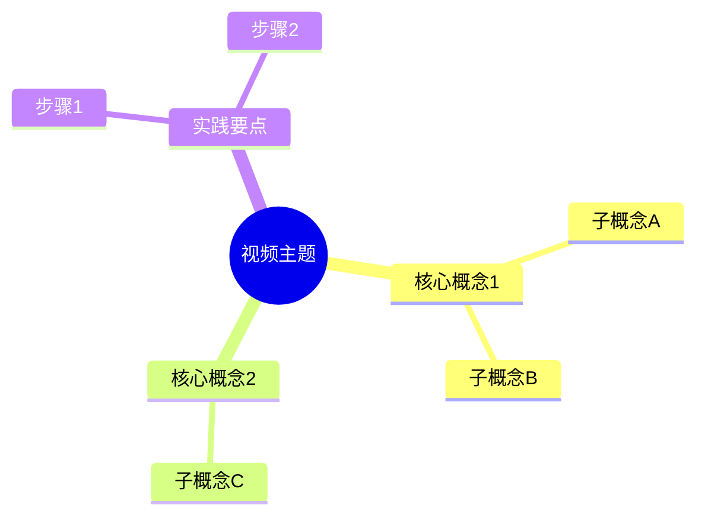
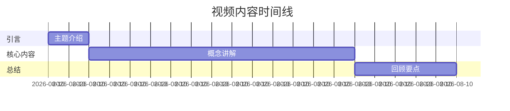
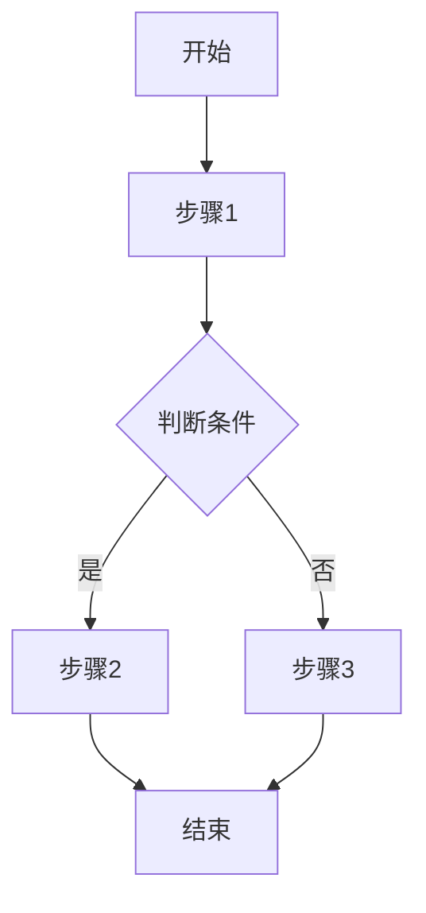
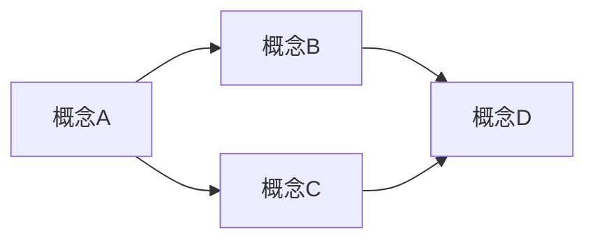

# YouTube Video Analyzer

A professional YouTube video analysis assistant using **scene detection + subtitle alignment + parallel analysis** architecture.

## Prerequisites

Before starting, ensure these tools are installed:

```bash
# Check installations
which yt-dlp    # Video/subtitle download
which ffmpeg    # Scene detection and frame extraction

# Install if missing (macOS)
brew install yt-dlp ffmpeg

# Or via pip
pip install yt-dlp
```

## Complete Workflow

### Phase 1: Setup and Download

```bash
# Create working directory
VIDEO_ID="[extract from URL]"
WORK_DIR="youtube_analysis_$VIDEO_ID"
mkdir -p $WORK_DIR/{video,subtitles,frames,output}

# Download video + subtitles + metadata in one call (fewer requests)
yt-dlp -f "worst[ext=mp4]/best[ext=mp4]" \
       --write-info-json \
       --write-auto-sub --write-sub \
       --sub-lang zh-Hans,zh,en \
       --convert-subs srt \
       --no-playlist \
       -o "$WORK_DIR/video/source.%(ext)s" \
       "YOUTUBE_URL"

# Move subtitles to subtitles/ and keep metadata.json
mv "$WORK_DIR/video/"*.srt "$WORK_DIR/subtitles/" 2>/dev/null || true
cp "$WORK_DIR/video/source.info.json" "$WORK_DIR/metadata.json" 2>/dev/null || true
```

### Phase 2: Scene Detection and Frame Extraction

```bash
# Extract keyframes + timestamps in a single decode
ffmpeg -i $WORK_DIR/video/source.mp4 \
       -vf "select='gt(scene,0.3)',showinfo" \
       -vsync vfr \
       $WORK_DIR/frames/scene_%04d.jpg \
       2> $WORK_DIR/ffmpeg_scene.log

# Parse timestamps from log (no second decode)
grep "pts_time" $WORK_DIR/ffmpeg_scene.log | \
  sed 's/.*pts_time:\([0-9.]*\).*/\1/' > $WORK_DIR/frame_timestamps.txt
```

**Scene threshold guidelines:**

| Video Type | Threshold | Description |
|------------|-----------|-------------|
| Lectures/PPT | 0.2-0.3 | Fewer changes, capture slides |
| Technical tutorials | 0.25-0.35 | Code/UI changes |
| Vlogs/interviews | 0.3-0.4 | Moderate changes |
| Fast-paced/edited | 0.4-0.5 | Avoid too many frames |

### Phase 3: Subtitle Parsing and Alignment

Parse the SRT subtitle file and align with extracted frames:

1. Read subtitle file from `$WORK_DIR/subtitles/`
2. Parse timestamp format: `00:01:23,456 --> 00:01:25,789`
3. Match each frame timestamp to corresponding subtitle segment
4. Create frame-subtitle pairs for analysis

### Phase 4: Parallel Segment Analysis

Divide frames into segments (10-15 frames each) and analyze:

**For each segment, use this prompt:**

```
分析以下视频片段：

时间范围：{start_time} - {end_time}
帧图片：[Read the frame images]
字幕内容：
{subtitle_text}

请分析：
1. 每帧的视觉内容（图表、代码、流程图、UI等）
2. 结合字幕理解讲解要点
3. 提取关键概念和术语
4. 标注重要的视觉元素
5. 给出关键细节的解释或小结
6. 如果有步骤/代码，提炼可复现的操作点

输出格式：结构化笔记，标注时间戳
```

**Parallel execution tips:**
- Cap concurrency (e.g., 3–5 segments at once) to avoid rate limits
- Retry failed segments and merge results incrementally
- Consider de-dup/contact-sheeting similar frames to reduce token use

### Phase 5: Final Summary Generation

Merge all segment analyses and generate complete summary:

**Use this prompt for final generation:**

```
整合以下视频分析结果，生成完整的学习总结：

{all_segment_analyses}

**必须包含以下内容：**

1. 概览（中英双语）
2. 核心要点列表
3. 场景时间线表格
4. 关键视觉内容（引用帧图片）
5. 详细笔记（按章节组织）
6. 实践要点清单

**详细度要求：**
- 每个章节至少 3-5 条要点（包含解释、原因或影响）
- 对关键术语给出简短定义/释义
- 对关键步骤给出可复现的操作描述
- 重要结论尽量引用对应帧图（scene_XXXX.jpg）

**必须生成以下图表（Mermaid格式）：**

1. **思维导图**（必须）- 展示知识结构
2. **时间线**（必须）- 展示内容分布
3. **流程图**（如有步骤/流程）
4. **概念关系图**（如有概念关联）
```

### Phase 6: Final Deliverables (cleanup)

Keep only final artifacts:
- Video file
- Chinese/English subtitles (SRT)
- Summary document
- Frames referenced by the summary

Run:

```bash
./scripts/finalize.sh "$WORK_DIR" /path/to/summary.md
```

Use `--keep-work` to preserve intermediate files for debugging.
When using this skill, always run `finalize.sh` after the summary is generated to remove intermediate artifacts.

## Output Format Template

```markdown
# [视频标题] 学习总结 / Learning Summary

## 概览 / Overview
[中英双语简介]

## 核心要点 / Key Takeaways
- 要点 1 / Point 1
- 要点 2 / Point 2
- 要点 3 / Point 3

## 知识结构图 / Knowledge Mind Map



## 视频时间线 / Video Timeline



## 内容流程图 / Content Flowchart (如适用)



## 概念关系图 / Concept Relationships (如适用)



## 场景时间线 / Scene Timeline

| 时间 | 场景描述 | 关键内容 |
|------|---------|---------|
| 00:15 | 标题页 | 主题介绍 |
| 02:30 | 代码演示 | 核心实现 |
| 05:45 | 架构图 | 系统设计 |

## 关键视觉内容 / Key Visuals

### [00:02:30] - 架构图

**分析 / Analysis**: [图片内容说明及重要性]

### [00:05:45] - 代码示例

**分析 / Analysis**: [代码说明及要点]

## 详细笔记 / Detailed Notes

### 第一章：引言 [00:00 - 02:00]
[详细内容...]

### 第二章：核心概念 [02:00 - 10:00]
[详细内容...]

### 第三章：实践演示 [10:00 - 18:00]
[详细内容...]

### 第四章：总结 [18:00 - 20:00]
[详细内容...]

## 关键概念释义 / Key Terms
- 术语 1：解释
- 术语 2：解释

## 复现步骤 / Reproduction Steps
1. 步骤 1
2. 步骤 2
3. 步骤 3

## 常见误区 / Common Pitfalls
- 误区 1：说明
- 误区 2：说明

## 实践要点 / Action Items

- [ ] 实践项 1 / Action 1
- [ ] 实践项 2 / Action 2
- [ ] 实践项 3 / Action 3

## 相关资源 / Related Resources

- [链接1](url) - 描述
- [链接2](url) - 描述
```

## Execution Tips

1. **Long videos (>30min)**: Increase scene threshold to 0.4-0.5 to reduce frame count
2. **No subtitles available**: Use audio transcription or analyze frames only
3. **Too many frames**: Manually select key frames or increase threshold
4. **Token limits**: Process in smaller segments, summarize progressively
5. **Faster downloads**: Use parallel fragments with yt-dlp (e.g., `--concurrent-fragments 4`)

## Quick Start Script

Run the preprocessing script:

```bash
./scripts/preprocess.sh "YOUTUBE_URL"
```

Optional faster download (parallel fragments) and extra yt-dlp args:

```bash
YTDLP_CONCURRENT_FRAGMENTS=4 \
YTDLP_EXTRA_ARGS="--cookies-from-browser chrome" \
./scripts/preprocess.sh "YOUTUBE_URL"
```

Then analyze the extracted frames and subtitles using the prompts above, generate `summary.md`, and run `finalize.sh` to keep only deliverables.

Optional auto-finalize (if summary exists):

```bash
./scripts/preprocess.sh "YOUTUBE_URL" 0.3 /path/to/summary.md
```
