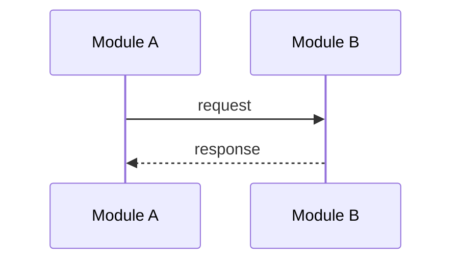
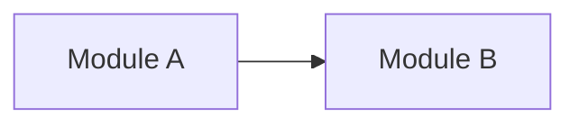

# Task Progress Tracker

## Goal
For each concrete requirement, keep one markdown task file under `docs/tasks/` and update it as work progresses.
The task file is also the interruption recovery anchor: after every meaningful change, create a git commit and write the commit id into the related step note.

## Use This Skill When
- The user wants the agent to make a plan before coding.
- The user wants TODOs, current status, or progress persisted in the repo.
- The user asks to keep updating task state while the agent is working.
- The user wants work to be resumable after interruption.

## File Rules
- Directory: `docs/tasks/`
- File name: `<task-description>.md`
- `task-description` should be a short kebab-case summary of the requirement.
- Prefer ASCII for `task-description`; if the request is in Chinese, convert it to a short English slug.
- Do not append fixed suffixes such as `-status-process`, `-task`, or `-todo` unless the user explicitly asks for them.
- If a matching task file already exists, update it instead of creating a duplicate.
- Never overwrite an unrelated task file.
- The task file must stay consistent with the real git checkpoint state of the work.

## Allowed Status Values
- `notrun`
- `running`
- `finished`
- `cancel`

## Git Checkpoint Rules
- Treat each meaningful change as a checkpoint. Before moving to the next change, create a `git commit`.
- Each step note must record the latest related commit id once a commit exists, using a short format such as `commit: abc1234`.
- If one step spans multiple commits, append them in order, for example `commits: abc1234, def5678`.
- Do not leave multiple unrelated edits uncommitted between task file updates.
- A task-file-only bookkeeping update that merely writes back an already-created commit id does not create a new step checkpoint by itself. Carry it in the next work commit, or in one final bookkeeping commit when the task stops.
- If the workspace is not a git repo, or a commit cannot be created, record the blocker in the current step note and update log, then tell the user before continuing more unrecoverable changes.
- When resuming interrupted work, read the latest matching task file, locate the latest recorded commit id in the relevant step note, and use that commit as the recovery baseline before making new changes.

## Workflow
1. Before substantial work, create or refresh the task file with:
   - requirement summary
   - completion conditions
   - step list
   - initial `status: notrun`
   - initial `process: 0%`
   - step notes prepared to carry commit ids
2. When actual execution starts, immediately update:
   - `status: running`
   - `process: 5%`
   - `current_step` to the first active step
   - verify the workspace can create git commits for checkpoint recovery
3. After each meaningful milestone, update the same file:
   - acceptance criteria checkboxes and any existing task checkboxes
   - step statuses
   - `current_step`
   - `process`
   - a short progress log entry
   - the related commit id after the commit is created, with the write-back carried by the next work commit or a final bookkeeping commit
4. Before the final reply, update the file one last time:
   - successful completion: `status: finished`, `process: 100%`, all meaningful changes committed, all completed acceptance criteria checked
   - append the final Mermaid diagram sections at the end of the file
   - user stopped or abandoned task: `status: cancel`
5. If the task is interrupted, resume by:
   - reading the latest matching task file under `docs/tasks/`
   - checking `current_step`, the latest step note, and the latest update log entry
   - continuing from the most recent recorded commit id instead of guessing state

## Progress Rules
- `process` must use percent format like `5%`, `35%`, `100%`.
- Keep progress monotonic; do not decrease it unless the user explicitly changes scope.
- Prefer increments that reflect real milestones, not fake precision.
- Do not set `100%` until implementation and validation are actually complete.

## Diagram Rules
- When the task is actually finished, append two sections at the very end of the task file: `## Sequence Diagram` and `## Module Relationship Diagram`.
- Both sections must use fenced Mermaid blocks in the form:

````md
## Sequence Diagram



## Module Relationship Diagram


````

- The sequence diagram should explain the real end-to-end interaction of the key modules touched by the task, not a generic placeholder flow.
- The module relationship diagram should show the key modules, dependencies, or data flow touched by the task. Prefer `flowchart LR` unless another Mermaid graph form is clearly better.
- If the task touches only a few modules, still draw a minimal but truthful diagram for those modules.
- Do not add these diagram sections before the task reaches a real finished state.

## Required Template
Use this structure unless the repo already has a stronger convention:

```md
# Task: <title>

## Requirement
<short requirement summary>

## Acceptance Criteria
- [ ] <condition 1>
- [ ] <condition 2>

## Overall Status
- status: notrun
- process: 0%
- current_step: not started

## Steps
| step | description | status | note |
| --- | --- | --- | --- |
| 1 | <step 1> | notrun | commit: pending |
| 2 | <step 2> | notrun | commit: pending |

## Update Log
| time | status | process | update |
| --- | --- | --- | --- |
| <timestamp> | notrun | 0% | task initialized |
```

## Update Rules
- The step list is the TODO list. Do not keep a second disconnected TODO section elsewhere.
- Treat markdown checkboxes as live state, not static text. When a criterion or TODO is actually completed, change `[ ]` to `[x]` in the same update cycle.
- If work is only partially complete or not yet validated, keep the checkbox unchecked and explain the remaining gap in the step note or update log.
- If a previously completed item becomes invalid because of scope change or regression, revert it to `[ ]` and record why in the update log.
- Before replying with success, make sure checkbox state matches the real implementation and validation state. Do not leave completed items unchecked.
- Before replying with success, make sure the Mermaid diagram sections are appended at the end of the file and match the real implementation.
- `current_step` should always match one row in `## Steps`, or `completed`.
- When a step reaches `finished`, its note should contain at least one commit id unless the user explicitly stopped before a checkpoint.
- If more commits are added to an existing step, update that same step note and the update log instead of leaving stale commit information.
- A bookkeeping-only task file edit that records an existing commit id does not require a new step entry; just make sure it is persisted in the next available commit.
- When scope changes, first update `## Requirement`, `## Acceptance Criteria`, and `## Steps`, then continue execution.
- If blocked, keep `status: running` and record the blocker in the step note and update log.
- For interruption recovery, make sure the latest step note and update log entry tell the next agent what to continue and which commit to continue from.
- Keep entries concise and factual.

## Response Behavior
- Mention the task file path in the working update or final response when helpful.
- If the user asks to continue an existing task, search `docs/tasks/` first and resume from the latest matching file and its latest recorded commit id.
- If work happens outside a git repo or a commit could not be created, state that constraint explicitly in the response.
