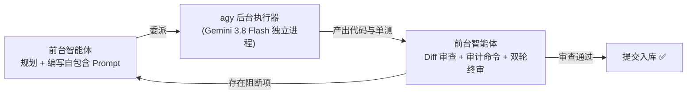

# agy 委派工作流规程 (agy Delegation Workflow)

## 概述 (Overview)

`agy`（Antigravity CLI）是专职的**后台执行工作流后端 (Execution-Only Backend)**。
前台智能体（负责高阶规划、架构决策与质量审查）将具体的代码编写、脚手架搭建、重构与单测任务委派给独立的 `agy` 无头进程（`agy -p`），形成清晰的 **"规划 -> 委派 -> 执行 -> 审查"** 闭环。



---

## 适用场景 (When to Use)

### 必须/推荐委派
* 将拆解好的独立功能特性、页面组件、后端 API 端点或工具函数委托给后台编写。
* 编写单元测试、Mock 数据体系搭建、批量代码重构。
* 多任务批次并行执行（批内并行，隔离上下文，避免前台 Token 拥挤）。

### 严禁委派（反触发条件）
* **宿主环境原生反触发（agy 宿主优先派发子智能体）**：当前 Agent **本身即运行于 Antigravity (agy) / Antigravity IDE 宿主环境**且具备 `invoke_subagent` 工具时，**严禁通过终端套娃调用 `agy` 命令行另起进程**，必须直接使用原生子智能体（`invoke_subagent`）进行委派。
* **架构与设计文档**：`IMPLEMENTATION_PLAN.md`、`task.md`、需求规格与设计总纲（前台核心职责，后台严禁越权）。
* **Git 写操作与破坏性操作**：`git commit`、`git push`、`git reset`、批量删除文件。
* **安全凭据与交互式决策**：密钥处理、权限变更、需求不确定时的用户交互澄清。

---

## 核心职责边界 (Scope Boundary)

| 前台智能体独占职责（严禁委派） | agy 后台执行职责 |
|---|---|
| 开发规划、阶段计划、任务拆解 | 生产代码实现（业务逻辑/核心模块/工具函数） |
| 接口契约与数据模型定义（类型定义/接口规范/领域模型） | 单元测试与集成测试编写 |
| 任务 Prompt 文件编写（`.agy-tasks/*.md`） | 代码重构与坏味道清理 |
| 测试基础设施前置检查（框架/脚本/配置就绪） | 运行本地测试并修复自身编译错误 |
| 产出全量审查、审计命令核验与提交入库 | 汇报执行摘要与修改文件清单 |

> **红线原则**：若 `agy` 越权生成了任何规划或设计文档（如在根目录生成了 `task.md`），前台智能体**必须立即删除**并由自身编写。

---

## 执行智能体优先级链与宿主自适应 (Priority Chain & Host Awareness)

前台在委派时必须遵循宿主自适应与降级保护原则（详见 [priority-fallback-chain.md](references/priority-fallback-chain.md)）：

1. **宿主环境原生派发（agy 宿主首选）**：
   * **适用条件**：当前 Agent **本身即运行于 Antigravity (agy) / Antigravity IDE 宿主环境**且具备 `invoke_subagent` 工具时。
   * **执行原则**：直接且强制调用 `invoke_subagent` 派发子智能体，严禁套娃调用 `agy` 命令行。
2. **无头命令行执行（非 agy 宿主首选）**：
   * **适用条件**：当宿主环境不是 agy（如 Claude Code、Cursor、外部无原生子智能体调度器的通用终端或纯命令行 CI/批处理环境）时，**优先使用 `agy` 命令行派发后台无头进程**。
   * **默认模型**：`Gemini 3.8 Flash (High)`，启动前彻底清除环境代理变量。
3. **兜底 前台直接编写 (Direct-Write)**：
   * 当连续 2+ 批次中 >50% 的产出需要完整重写，且前台已完全掌握目标上下文时，前台果断直接编写。

---

## 标准委派 SOP (5-Step Delegation Procedure)

### 1. 编写自包含任务 Prompt (Self-Contained Task Prompt)
* **技能优先联动**：若技能库中存在关于编写计划/任务的技能（如 `writing-plans`），前台智能体在进行任务规划与拆解时**必须优先激活并使用该技能**，并紧密结合 [task-prompt-template.md](templates/task-prompt-template.md) 编写实施计划。
* **自包含任务固化**：每个具体子任务必须落地为一个独立的 `.agy-tasks/<task-name>.md` 文件，严格遵循 [task-prompt-template.md](templates/task-prompt-template.md) 规定的 **7 维通用黄金要素**（工作目录与目标范围、数据契约与接口模型、依赖调用与 API 规范、数据源与测试夹具规范、行为规范与架构约束、自动化验收命令、严禁事项与安全红线）。

### 2. 清理环境代理并启动任务 (Dispatch)
使用辅助脚本或在命令中强制前置清除 WSL/Linux 代理变量，杜绝连接拒绝：
```bash
# 方式 A：使用辅助脚本（推荐，自动注入 Gemini 3.8 Flash 与代理清除）
bash skills/agy-delegation-workflow/scripts/dispatch-agy.sh -f .agy-tasks/task-a.md

# 方式 B：原生命令
unset HTTPS_PROXY HTTP_PROXY http_proxy https_proxy ALL_PROXY all_proxy; \
agy -p "$(cat .agy-tasks/task-a.md)" \
  --model 'Gemini 3.8 Flash (High)' \
  --dangerously-skip-permissions \
  --print-timeout 20m
```

### 3. 多任务编排与并行准则 (Batch Orchestration)
* **同文件任务必须合并**：若两个任务修改同一个文件，必须合并为一个 Prompt，严禁并行发起导致冲突竞态。
* **无依赖任务批内并行**：无文件冲突的任务可使用后台命令并行触发。
* **构建操作批间串行**：`pnpm build` 全局构建消耗巨大，严禁在后台并行跑 build，由前台在整批结束时统一执行一次。

### 4. 假失败排查与超时防御 (Silent Landing Check)
若 `agy` 报告 OAuth EOF 或超时退出，**切勿立即判定失败重跑**（详见 [infrastructure-troubleshooting.md](references/infrastructure-troubleshooting.md)）：
* 运行 `git status -s` 查看目标文件是否已在磁盘落盘（Silent Landing）；
* 运行单测命令验证功能是否已经实现；若通过，直接视为成功并进入审查。

### 5. 严格 6 步验收审查 (Mandatory Review Checklist)
在合并任何 `agy` 产出前，前台智能体必须逐项执行以下检查（详见 [failure-modes-audit.md](references/failure-modes-audit.md)）：
1. **Diff 范围**：`git diff --stat` 确认改动收敛，无越权规划文档混入；
2. **静态类型与 Lint**：运行对应技术栈的类型检查与代码检查器（如 `tsc --noEmit`, `mypy`, `cargo check`, `golangci-lint`），零警告零错误；
3. **失败模式审计**：运行专用 `grep` 命令检查自造 Fallback、编造 API、禁用调试残留等；
4. **单元测试**：全量测试全绿；
5. **全局构建**：执行项目全局编译/打包构建（如 `pnpm build`, `cargo build`, `go build`），捕获全局类型泛化断裂；
6. **双轮终审**：调用 `dual-round-review` 技能完成终审闭环。

---

## 参考与支持资源导航

### 规程与诊断指南
* [infrastructure-troubleshooting.md](references/infrastructure-troubleshooting.md) - WSL 代理污染、OAuth EOF 假失败与延迟落盘诊断
* [failure-modes-audit.md](references/failure-modes-audit.md) - 高频大模型失败模式与必跑 grep 审计命令清单
* [priority-fallback-chain.md](references/priority-fallback-chain.md) - 执行优先级链条、3-Tries 降级与直接编写决策标准

### 任务模板与工具脚本
* [task-prompt-template.md](templates/task-prompt-template.md) - 包含 7 维黄金标准的任务 Prompt 规范模板
* [dispatch-agy.sh](scripts/dispatch-agy.sh) - 一键清除代理、注入 Gemini 3.8 Flash 模型的后台委派辅助脚本
