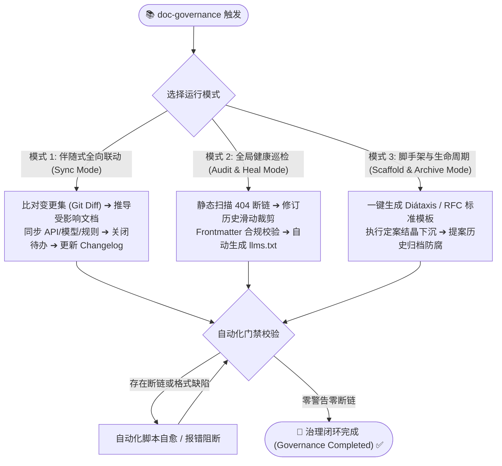

# 文档工程与知识库治理技能 (Documentation Governance Skill)

## 概述 (Overview)

在 AI 智能体软件研发时代，文档不再只是人类工程师的静态备忘录，更是**智能体执行架构推演、接口对齐与 TDD 编码的核心上下文（Context Window）与真理源**。

`doc-governance` 是面向现代软件工程与 AI 智能体协作的一体化文档治理体系，立足于四大理论基石：
1. **Diátaxis 四象限架构**：依据读者心智划分 Tutorials、How-To、Reference、Explanation，严禁职责混杂；
2. **RFC 提案孵化与结晶流转模型 (RFC-to-Crystallization Lifecycle)**：解决初期对齐高认知阻抗难题，初期单文件集中孵化，定案后解构结晶下沉；
3. **Docs-as-Code 与自动化 CI 门禁**：物理链接校验、5 条滑动窗口自愈、零 404 断链与机器可读索引生成；
4. **语言习惯继承与命名标准**：尊重工程主语言连续性，初期推荐 kebab-case 规范，杜绝割裂。



---

## 适用场景 (When to Use)

### 必须触发 (Mandatory)
* **API / 契约 / 模型变更**：任何新增、修改、废弃 API 接口、数据字段、枚举值或请求/响应信封时；
* **业务规则与状态机变更**：调整工作流状态机状态节点、权限校验矩阵或安全红线时；
* **核心架构与重大技术决策**：发生框架选型、分层解耦或基础设施演进，需产出 MADR 记录时；
* **项目初期需求与设计对齐**：发起新功能提案（RFC / Proposal），经历多轮审查并最终准备定案结晶时；
* **代码交付前与 PR 合并门禁**：版本交付或合并主干前，必须执行全局断链扫描与健康度巡检；
* **文档重构与既有项目迁移**：将历史瀑布生命周期目录（requirements, design, planning 等）渐进式迁移至标准 Diátaxis 目录。

### 无需触发 (When NOT to Use)
* 纯代码内部单行重构（未改变函数签名、数据模型、API 契约及业务状态流转）；
* 仅修复代码语法警告且不涉及任何外部行为契约变动。

---

## 目录拓扑与职责划分 (Directory Topology)

标准知识库根目录为 `docs/`，严禁在不同象限间混淆内容：

```text
docs/
├── index.md                 # 【全局人类总入口】全景知识库拓扑与分类索引
├── llms.txt                 # 【AI 智能体机器地图】精炼的机器可读知识拓扑与关键参考入口
├── GOVERNANCE.md            # 【知识库治理规程】文档分类、生命周期与 CI 门禁规则
│
├── proposals/               # 💡 0. 需求与设计孵化层 (Inception / RFC Proposals)
│   │                        # ⭐ 项目初期单文件聚焦对齐空间，定案后结晶下沉至 Diátaxis 稳态
│   ├── RFC-0001-xxx.md      # 初期对齐提案草案 (Draft -> In Review -> Accepted)
│   └── archive/             # 已结晶下沉的提案历史归档 (Implemented / Superseded)
│
├── tutorials/               # 🎓 1. 教程象限 (Learning-Oriented / Newcomer Success)
│   ├── quick-start.md       # 5 分钟上手开发与运行首个特性
│   └── onboarding.md        # 新成员/新智能体工作流与环境就绪向导
│
├── how-to/                  # 🛠️ 2. 操作指南象限 (Problem-Oriented / Task Recipes)
│   ├── deployment.md        # 生产环境容器化构建与服务发布 SOP
│   ├── local-setup.md       # 本地多服务联调与数据库初始装配
│   ├── testing-guide.md     # 单元/集成/E2E 测试套件执行与覆盖率校验
│   └── troubleshooting.md   # 隐蔽缺陷排查、异步死锁与框架踩坑手册 (SOP)
│
├── reference/               # 📖 3. 技术参考象限 (Information-Oriented / Machine Truth)
│   │                        # ⭐ AI 智能体生成代码的核心上下文真相源 (Single Source of Truth)!
│   ├── api/                 # 外部与内部 API 契约规格、统一错误信封、Endpoint 清单
│   ├── models/              # 领域数据模型、Schema 契约、数据库实体与 DTO 定义
│   ├── rules/               # 平台业务规则、状态机状态图、权限矩阵与智能体行为协议/提示词契约
│   └── ui/                  # 前端设计 Token、UI 基础组件规范、交互事件契约
│
├── explanation/             # 💡 4. 深度剖析象限 (Understanding-Oriented / The "Why")
│   ├── architecture/        # 系统总体代码架构总纲 (Hub) 与各子系统深度剖析 (Spokes)
│   ├── decisions/           # ADR 架构决策记录 (MADR 3.0 格式, 0001-xxx.md, Append-Only)
│   ├── analysis/            # 技术调研备忘录、第三方框架选型评估、可行性分析报告
│   └── concepts/            # 核心业务领域深层概念、设计哲学与数学/算法模型阐释
│
└── project/                 # 🚀 5. 工程演进与项目管理 (Project Management & Evolution)
    ├── roadmap.md           # 产品规划路线图与版本里程碑矩阵
    ├── changelog.md         # 版本发布日志与交付物归档
    └── backlog.md           # 统一待办事项、后续优化方向汇总与已关闭清单
```

---

## 核心运行模式 SOP (Operational Modes)

### 模式 1：伴随式全向联动治理 (Sync Mode)
当开发任务涉及功能演进或契约调整时执行：
1. **变更集逆向推导**：运行 `git diff --name-only` 检视所有修改的代码文件；
2. **对照《变更联动触发矩阵》**（见 [change-impact-matrix.md](./references/change-impact-matrix.md)）：
   - 修改后端 Controller/Service ➔ 联动同步 `reference/api/` 与 `reference/models/`；
   - 修改状态机枚举/守卫 ➔ 联动同步 `reference/rules/`；
   - 修改前端组件/样式 Token ➔ 联动同步 `reference/ui/`；
   - 核心架构演化 ➔ 编写一条 MADR 决策追加至 `explanation/decisions/`；
3. **项目演进记录闭环**：在 `project/changelog.md` 追加发版记录，并在 `project/backlog.md` 标记对应待办已关闭；
4. **版本号与修订历史**：按语义化规范提升受影响文档版本，遵循 **5 条滑动窗口** 追加修订行；
5. **门禁校验**：运行 `check-doc-links.py` 确保零断链。

### 模式 2：知识库全局巡检与自愈 (Audit & Heal Mode)
在版本发布前、大型重构后或定期维护时执行：
1. **断链静态审计**：运行 `python3 scripts/check-doc-links.py --root docs`，检查所有相对链接有效性、`.md` 后缀与锚点是否存在；
2. **修订历史自动裁剪**：运行 `python3 scripts/trim-revision.py --root docs --fix --keep 5`，自动将所有文档的修订历史截断在最近 5 条；
3. **健康度全面体检**：运行 `python3 scripts/audit-doc-health.py --root docs`，输出知识库覆盖率、孤儿文档与基线合规评分；
4. **机器地图生成**：运行 `python3 scripts/generate-llms-txt.py --root docs --output docs/llms.txt`，刷新供智能体消费的拓扑地图。

### 模式 3：脚手架与结晶归档 (Scaffold & Archive Mode)
1. **新建文档/提案**：运行 `scripts/scaffold-doc.sh <type> <name>`（如 `scaffold-doc.sh rfc canvas-collab`），基于规范模板创建脚手架，自动填入合规控制头；
2. **初期 RFC 对齐**：在 `docs/proposals/` 单文档中闭环业务故事、契约草案与选型权衡；
3. **定案结晶下沉**：方案批准后，遵循 [rfc-crystallization-lifecycle.md](./references/rfc-crystallization-lifecycle.md) 将接口、规则、架构解构沉淀至 Diátaxis 对应目录；
4. **提案归档防腐**：原 RFC 标记为 `Implemented` 并移至 `docs/proposals/archive/`，加注防腐历史备忘。

---

## ⛔ 核心红线与负向规范 (Negative Invariants)

1. **⛔ 严禁在 Reference 中混合教学或推演**：`reference/` 必须纯粹，只记录权威机械事实，严禁塞入“为什么要这样做”或“怎么操作”；
2. **⛔ 严禁未定型的实验草案污染 Reference**：未定案的设想必须保留在 `proposals/` 中对齐，定案结晶前绝不可作为权威真相写入 `reference/`；
3. **⛔ 严禁断链与隐式概念引用**：文档间引用必须显式保留 `.md` 后缀相对路径（如 `[规则.md](./rules/rule.md)`），严禁使用无后缀的裸路由或绝对物理路径；
4. **⛔ 严禁修订历史无限膨胀**：修订历史严格限制在最近 5 条之内，超额部分必须裁剪；
5. **⛔ 严禁破坏工程语言连续性**：既有中文项目必须使用中文撰写正文与解释，严禁中英文混乱杂糅；初期文件命名优先遵循全小写 kebab-case；
6. **⛔ 严禁单体巨石文档**：单份文档原则上不得超过 800 行，复杂系统必须采用“总纲-子册”拓扑分离。

---

## 📚 详细规程参考库 (Detailed References)

| 参考手册 | 核心内容概要 |
|:---|:---|
| [diataxis-standard.md](./references/diataxis-standard.md) | Diátaxis 四象限写作边界、分类决策树与反模式详析 |
| [rfc-crystallization-lifecycle.md](./references/rfc-crystallization-lifecycle.md) | 初期提案孵化、多轮对齐与定案结晶下沉完整 SOP |
| [language-naming-conventions.md](./references/language-naming-conventions.md) | 项目语言习惯继承铁律、文件命名规则与中英文正交分离标准 |
| [change-impact-matrix.md](./references/change-impact-matrix.md) | 代码修改与契约演进全向联动矩阵与门禁要求 |
| [adr-specification.md](./references/adr-specification.md) | MADR 3.0 架构决策记录格式规范与 Append-Only 演进流 |
| [legacy-migration-guide.md](./references/legacy-migration-guide.md) | 瀑布老目录（requirements, design, planning 等）平滑映射指引 |
