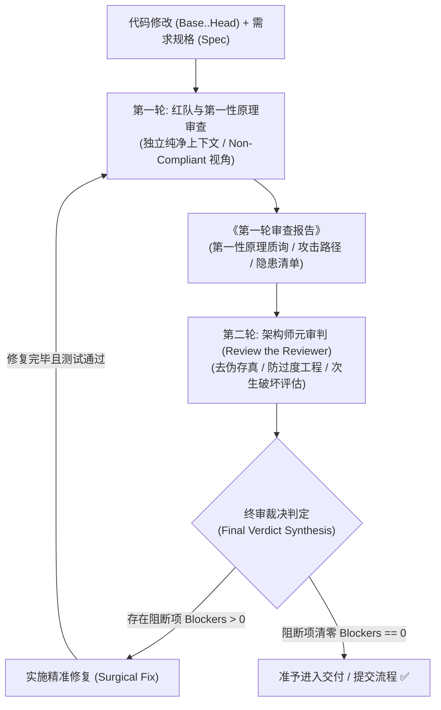

# 双轮对抗审查技能 (Dual-Round Adversarial Review)

## 概述 (Overview)

大模型编程面临三大核心陷阱：**“讨好型盲从（Sycophancy）”**、**“浅层打布丁（Palliative Patching）”** 以及 **“审查幻觉与过度工程（Over-engineering）”**。

本技能通过**辩证双轮级联对抗审查机制**，在代码交付入库前构建一道高置信度的质量防波堤：
* **第一轮 (Round 1)**：极度苛刻的红队破坏者与底层物理/业务本质探究者（Non-Compliant 视角），专攻第一性原理穿透与极限破坏。
* **第二轮 (Round 2)**：务实严谨的资深系统架构师——**专门审判第一轮审查者（Review the Reviewer）**，去伪存真、拦截过度工程，合成终审定性裁决。



---

## 铁律 (Invariants)

1. **上下文隔离**：R1、R2 各自在独立子智能体中运行，只接收 Spec、Diff 与（R2 额外）R1 报告；主会话聊天历史不传入。
2. **真实产出优先**：主智能体在子智能体真实返回前不输出任何审查结论；终审裁决只根据 R2 的真实结果生成。
3. **范围锁定**：候选缺陷必须标注是否由当前变更引入；历史技术债记入 Suggestion/Backlog。
4. **证据支撑**：驳回或降级 R1 的评级必须附 `文件:行` 级反证据；无证据的降级不生效。
5. **状态落盘**：每轮结论写入 `.review-context/review-<baseline-sha>.md`；再循环读取 `Previous Blockers` 与迭代计数。
6. **有界收敛**：同一模块连续 3 次双轮循环未清零阻断项时，产出争议焦点报告并升级人类裁决；修复收敛在最小改动范围。
7. **派发即登记**：派发 R1/R2 前在 `.goal-loop/dispatch-ledger.md` 维护派发账本明细（角色、后端句柄、基线 SHA、**派发次数**、状态），并在计划检查点保留一行派生摘要。预算内未返回即按 `goal-loop` 技能的 `references/host-adapters.md` §5 收口；**同一角色对同一基线的重派上限 2 次**，超期中断计入铁律 6 的循环计数。跨会话恢复时先读账本明细，明细已丢失则以计划摘要为锚点，禁止凭记忆重建派发状态。

---

## 审查模式 (Review Modes)

| 模式 | 轮次 | 适用场景 | 产出 |
|---|---|---|---|
| **Full（默认）** | R1 红队 → R2 元审判 | Heavy Track / 核心架构 / 关键业务链路 / Pre-Merge | 终审裁决明细表 |
| **Light（单轮）** | 仅 R1 红队 + 轻量裁决 | Fast-Track / 局部定向改动 / 未触及公共契约与核心链路 | R1 报告 + 轻量裁决表 |
| **Delta（再循环）** | Full 或 Light 的再循环 | 阻断项修复后，以修复提交为新基线 | 更新后的审查记录与终审 |

**Light Mode 规程**：
1. 仅派发 R1（使用 [round-1-red-team.md](references/round-1-red-team.md) 模板，`Review Mode: LIGHT_REVIEW`）；
2. 主智能体对照 [verdict-rubric.md](references/verdict-rubric.md) 直接裁决，输出裁决明细表（复用 §4 的 7 列结构，"原始 R1 评级"与"终审裁决"由同一裁决者填写）；
3. 阻断项修复后按 Delta 再循环；**升级为 Full 的触发条件**：改动触及公共契约、核心业务链路、鉴权/并发/数据一致性，或即将合并 PR/发布；
4. Light 的豁免依据与升级决定写入审查记录（步骤 1.5）；若由 `goal-loop` 驱动，同步写入其计划检查点。

---

## 适用场景 (When to Use)

### 必须触发 (Mandatory)
* **核心架构改动**：涉及全局数据流、状态机、多模块契约或跨域架构调整。
* **关键业务逻辑实现**：鉴权与授权、支付交易、并发调度、复杂算法等核心主干链路。
* **高风险缺陷修复**：排查并修复隐蔽并发死锁、内存/句柄泄漏、以及多次尝试未解的问题。
* **交付与合并准入 (Pre-Merge Gate)**：PR 最终合并或版本发布前。

### 无需触发 (When NOT to Use)
* 纯文案调整、拼写错误修正、无业务逻辑的样式微调。
* 临时探索脚本（Scratch scripts）或投机性 Prototype 原型验证。
* 规则工具（Linter/Prettier/TypeChecker）已经完全覆盖并自动修复的机械约束。

---

## 核心流程规范 (Process Workflow)

作为主调度智能体（Main Agent），请严格按照以下 5 个步骤执行审查：

### 1. 锁定审查基线与规格上下文 (Pin Baseline & Context)
确定审查模式（未提交改动、暂存区或 Commit 区间），并运行辅助脚本提取结构化上下文：
```bash
# 技能目录随安装方式而定（源码仓库通常为 skills/dual-round-review，安装后通常为 .agents/skills/dual-round-review）
SKILL_DIR="<dual-round-review 技能实际所在目录>"

# 智能模式（优先未提交改动，无改动则检查最近一次 Commit）
bash "$SKILL_DIR/scripts/prepare-review-context.sh"

# 或指定提交区间
bash "$SKILL_DIR/scripts/prepare-review-context.sh" [BASE_SHA] [HEAD_SHA]
```
* 确保准备好：① Git Diff 内容与变更统计；② 需求设计或任务描述（Spec）；③ 仓库编码标准；④ **（条件）前端产物交付时：`frontend-qa-gate`《前端验收报告》的结论必须为 PASS（以 `check-qa-report.sh --require-verdict=PASS --min-assertions=15` 机械校验为准）；FAIL / BLOCKED（含未验证项）时先按该技能回流路由处理，不得进入审查放行。**

### 1.5 审查记录锚点 (Review Record Anchor)
审查循环的短周期状态必须落盘，避免上下文截断后丢失 `Previous Blockers` 与迭代计数。每个基线创建一个记录文件 `.review-context/review-<baseline-sha>.md`（该目录已在 `.gitignore` 中忽略），schema 固定如下：

```markdown
# 审查记录 · <baseline-sha>
- **模式**: [full | light | delta]
- **基线**: <BASE_SHA>..<HEAD_SHA>
- **轮次**: [1 | 2 | ...]
- **迭代计数**: [n/3]
- **Previous Blockers**: [上一轮坐实的 Blocker 稳定 ID 列表，或 无]
- **Round 1 结论**: [报告摘要或报告文件路径]
- **终审裁决**: [🔴 阻断交付 | ✅ 准予交付 | 未定]
- **阻断项统计**: [🔴 X / 🟡 Y / ⚪ Z]
```

**恢复规则**：进入审查前若已存在同基线记录，先读取该文件恢复轮次、`Previous Blockers` 与迭代计数，再决定继续、再循环或升级。记录文件由 `prepare-review-context.sh` 生成，或按上述 schema 手工创建。

### 2. 委派第一轮审查：红队与第一性原理 (Dispatch Round 1)
**上下文隔离红线**：分发独立的子智能体，**严禁传入主会话的聊天历史**。使用 [round-1-red-team.md](references/round-1-red-team.md) 提示词模板：
* **派发能力（宿主无关）**：使用当前宿主实际的子智能体派发能力，按能力语义选择，不绑定具体工具名或平台（以本会话声明的工具为准）。
* **派发模式判定**：
  * **同步派发**（调用即在本次返回结果）：在当前回合直接取回 R1 报告后继续步骤 3；
  * **异步派发**（先返回句柄、稍后以消息唤醒）：启动后结束当前回合等待唤醒，收到真实报告后再继续；
  * 判定依据是工具的返回语义，而不是平台名称。
* **角色预设**：极度苛刻、不讲客气（Non-Compliant）、预设代码必定有隐蔽缺陷。
* **审查重点**：
  1. **Diff 范围边界锁 (Diff-Scope Boundary Lock)**：完整规则见 [verdict-rubric.md](references/verdict-rubric.md) §3；派发给 R1 的提示词中必须内联该规则（子智能体上下文隔离，无法自行读取本文件）。
  2. **第一性原理穿透**：是否为浅层修补？是否存在原生极简解法？
  3. **运行时现实维度（条件激活）**：仅当 diff 触及客户端/SSR 代码时激活（判定条件与细则见 [round-1-red-team.md](references/round-1-red-team.md) 的条件维度块）；非前端改动跳过该维度。
  4. **红队对抗压力测试**：构造极限并发竞态、异常注入、资源泄漏、契约破坏路径。
  5. **定向再循环核验 (Delta Re-Loop)**：若属于 Blocker 修复后的再循环，重点审计上一轮 Blocker 是否被根治，以及修复补丁本身是否引入次生缺陷。
* **真实产出纪律**：在 R1 真实报告返回前，不输出任何审查预判或假想报告，也不提前派发 R2；异步派发时结束回合并等待唤醒。
* **派发预算 (Dispatch Budget)**：R1 的等待预算为 **1 个检查点周期**。超期未返回即判定为超期事件，按 `goal-loop` 技能的 `references/host-adapters.md` §5 收口（中断 → 落盘记录 `.review-context/review-<baseline-sha>.md` → 替代路径 → 更新派发账本），**严禁无限期等待**。中断并如实记录不违反真实产出纪律；用空报告冒充审查结论才是违规。
* **落盘审查记录**：拿到 R1 报告后，立即写入 `.review-context/review-<baseline-sha>.md` 的 Round 1 字段（见步骤 1.5），再进入步骤 3。
* 获取子智能体返回的《第一轮对抗审查报告》。

### 3. 委派第二轮审查：元架构师审判 (Dispatch Round 2)
在 **完整收到第一轮审查子智能体的真实输出报告后**，方可分发第二个独立的子智能体，使用 [round-2-meta-architect.md](references/round-2-meta-architect.md) 模板：
* **派发能力与模式**：沿用步骤 2 的宿主无关派发规则与同步/异步判定（同步则本回合取回，异步则结束回合等唤醒）。
* **传入内容**：Spec + Git Diff + **第一轮审查报告全文（必须使用 R1 真实返回的内容，严禁主智能体臆造）**。
* **角色预设**：务实严谨的资深系统架构师——**专门审判第一轮审查者（Review the Reviewer）**。
* **审查重点**：
  1. **边界越界拦截 (Boundary Enforcement)**：核实 R1 的候选 Blocker 是否由当前变更引入；历史技术债降级为 Suggestion/Dismissed（规则见 [verdict-rubric.md](references/verdict-rubric.md) §3）。
  2. **去伪存真**：排查 R1 是否因缺乏上下文而产生幻觉误报。
  3. **防过度工程 (YAGNI)**：否决 R1 提出的过度抽象、复杂分层或脱离实际的教条化建议。
  4. **次生破坏评估**：评估采纳修复建议是否会诱发更大范围的破坏性重构。
  5. **批量降级红旗**：R2 将 R1 的多个 P0/P1 一次性降级或驳回时，必须逐条给出 `文件:行` 级反证据；主智能体抽检，证据不足者退回 R2 重审。
* **真实产出纪律**：在 R2 真实裁决返回前，不输出“终审裁决书”；终审裁决必须基于 R2 的真实结果生成（异步派发时结束回合等待唤醒）。
* **派发预算**：同 R1（等待预算 1 个检查点周期）；超期按 `goal-loop` 技能的 `references/host-adapters.md` §5 收口并落盘。
* **落盘审查记录**：拿到 R2 裁决后写入 `.review-context/review-<baseline-sha>.md` 的终审字段（见步骤 1.5），再进入步骤 4。
* 获取终审输出的《最终裁决明细表》。

### 4. 裁决分流与定性处理 (Verdict Triage)
严格对照 [verdict-rubric.md](references/verdict-rubric.md) 判定结论：
* 🔴 **阻断项 (Blockers, P0/P1)**：
  * **结论**：审查不通过。
  * **状态机锁死**：任务状态强制维持“进行中/未通过”，**严禁在修改代码后自行宣布通过**。
  * **动作**：立即实施精准根因修复（Surgical Fix），**绝不顺手修改无关代码**。修复后运行全量测试确认通过并执行原子提交。
  * **定向再循环规程 (Delta Re-Loop Protocol)**：以修复提交为新基线，并在提示词中传入 `Previous Blockers`（稳定 ID 列表）。
    - **Full-Delta**：从第 2 步重新派发 R1 → R2 完整闭环；R1 聚焦 Blocker 修复证据与直接次生退化，R2 终审放行；
    - **Light-Delta**：仅重新派发 R1 并按 Light 规程重新裁决（无 R2），适用于 Light 模式命中 Blocker 的修复后；
    - 两者都从审查记录读取迭代计数，防止基线漂移与发散。
* 🟡 **优化建议 (Suggestions, P2/P3)**：
  * **结论**：准予放行。
  * **动作**：记入项目待办或后续优化清单，不阻断本次交付。
* ⚪ **驳回项 (Dismissed)**：
  * **动作**：直接丢弃，无需任何代码修改。

### 5. 防死锁收敛机制 (Convergence Guardrails)
* **精准收敛原则**：修改阻断项时，严格收敛修改范围，防止因顺带重构引入新变量导致审查循环发散。
* **困境突破法则 (The 3-Tries Rule)**：若针对同一模块连续 **3 次** 双轮循环未能清零阻断项，或 R1/R2 陷入无法调和的哲学争议：
  1. 立即停止自动循环。
  2. 整理《双轮审查争议焦点报告》（含分歧代码、两轮观点与潜在风险）。
  3. 升级交由人类工程师（用户）进行最终裁决。

---

## 常见借口与反模式排查 (Rationalizations & Pitfalls)

| 典型借口 / 侥幸心理 | 现实危害与应对规程 |
|:---|:---|
| “改动只有几行，不需要跑双轮” | 多数灾难性死锁或内存泄漏恰恰来自 1-2 行未捕获的异步状态变更。越短的代码越要看是否属于“浅层创可贴”。 |
| “第一轮提的意见很多，我都照着改” | **严禁照单全收！** R1 容易出现脱离实际的过度工程建议，必须经由 R2 架构师元审判过滤伪需求。 |
| “R1 挑出了很多历史遗留问题，统统作为 Blocker 修复” | **⛔ 严重违规（审查范围蔓延与历史越界）**！非本次变更引入的历史技术债按 [verdict-rubric.md](references/verdict-rubric.md) §3 降级为 Suggestion 记入待办，否则 PR 无法收敛并引入次生回归。 |
| “jsdom 单测全绿了，不会有运行时问题”（仅前端/SSR 项目） | **⛔ 忽视真实运行环境**！jsdom 不会检查 Next.js SSR 水合分歧、Safari 无痕模式下的 `SecurityError` 或条件早退调用 Hook 导致的生产构建/运行时崩溃。必须执行专项检查。 |
| “我自己在主会话里把两轮想一遍就行了” | 单一上下文存在不可避免的**自我确认偏差**与讨好倾向。必须通过子智能体实现上下文隔离。 |
| “修复了一个阻断项，只复核第二轮就行” | 修复补丁可能引入新的次生缺陷，必须重跑 R1；Full 模式还须重跑 R2 完成闭环。 |
| “按架构师意见改完且单测全绿了，不需要再走双轮了” | **⛔ 严重违规（自验偏差与次生缺陷盲区）**！修复代码本身极易引入更致命的次生灾难（如数据清空、状态死锁）。单测全绿绝不能替代外部双轮对抗，必须将修复提交作为输入重新委派 R1 启动再循环。 |
| “发起子智能体后，我顺便把裁决写出来给用户看” | **⛔ 严重违规（虚假抢答）**！子智能体尚未真实推演完毕，主智能体擅自脑补输出会导致审查流于形式甚至掩盖真正缺陷。异步派发时结束回合等待；同步派发时也在本次调用返回报告后再输出结论。 |
| “把两轮审查子智能体同时并行启动” | **⛔ 违背级联第一性原理**！R2 的本质使命是审判 R1（Review the Reviewer），没有 R1 的完整输出，R2 根本无从审判，严禁并行发起。 |
| “R1 迟迟不返回，我先把 R2 派出去并行推进”“既然 R2 拿不到 R1 报告，我就把它的独立意见当作终审” | **⛔ 违规（并发规避 + 空报告冒充）**！前者违反级联顺序，后者把“无输入的独立核查”偷换为“双轮对抗结论”。正确处置：按派发预算收口该子智能体——中断 → 落盘记录中断原因 → 选择替代路径（原后端重派收窄范围 / 切换至隔离后端；**审查类无法保证隔离时必须升级人类裁决——内联自审不构成任何一轮审查**）→ 更新派发账本（**执行类派发另有内联例外，见 `goal-loop` 技能的 `references/host-adapters.md` §5.4(d)**，但其结果不得用于任何审查轮次）；R2 必须接收 R1 的**真实报告全文**后方可派发。 |

---

## 参考文档与实战案例导航

### 规程与提示词参考
* [verdict-rubric.md](references/verdict-rubric.md) - 裁决分级标准与严重级别判定细则
* [failure-modes-catalog.md](references/failure-modes-catalog.md) - 大模型代码生成与审查高频失败模式库
* [round-1-red-team.md](references/round-1-red-team.md) - 第一轮红队与第一性原理子智能体任务模板
* [round-2-meta-architect.md](references/round-2-meta-architect.md) - 第二轮元审判资深架构师子智能体任务模板

### 实战演练案例
* [case-1-palliative-patch.md](examples/case-1-palliative-patch.md) - 案例 1: 浅层修补（打布丁）识别与阻断
* [case-2-over-engineering.md](examples/case-2-over-engineering.md) - 案例 2: 过度工程与纸上谈兵甄别（驳回项）
* [case-3-concurrency-race.md](examples/case-3-concurrency-race.md) - 案例 3: 隐蔽异步竞态与资源泄漏识别（坐实阻断项）
* [case-4-clean-pass.md](examples/case-4-clean-pass.md) - 案例 4: 第一性原理合规实现（阻断项清零，准予交付）


