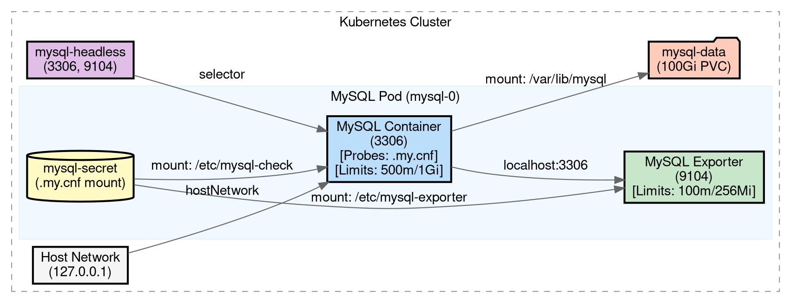

# MySQL Skill

This skill provides a standardized framework for MySQL lifecycle management: deployment, monitoring, benchmarking, and visualization.

## Mandatory Configuration
- **StatefulSet Name**: `mysql` (Pods: `mysql-0`)
- **Service Name**: `mysql-headless`
- **Secret Name**: `mysql-secret`
- **Network**: `hostNetwork: true`
- **Replicas**: 1
- **Health Checks**: Mandatory `livenessProbe` and `readinessProbe`.
- **Resources**: Explicit `requests` and `limits` for CPU/Memory.
- **Grace Period**: `terminationGracePeriodSeconds: 30`.

## Visualization Standards (Graphviz/dot)

When generating diagrams, use the following standardized Graphviz template to ensure consistency and high contrast.

### Design Principles:
1. **Progressive Disclosure**: Group components into clusters. Highlight Probes and Resources in the detailed view.
2. **Visual Style**: Pastel/Light palette, dark borders (#333333), Arial/Helvetica font.
3. **Command**: Convert to JPG using: `dot -Tjpg input.dot -o output.jpg`

### Standard DOT Template:


## Deployment Workflow

1. **Generate Root Password**: Create a random 16-character alphanumeric string.
2. **Generate Secret Manifest**: Name `mysql-secret`. Must include `MYSQL_ROOT_PASSWORD` AND a `.my.cnf` key.
    - **.my.cnf Template**:
      ```ini
      [client]
      user=root
      password=${MYSQL_ROOT_PASSWORD}
      host=127.0.0.1
      ```
3. **Generate Headless Service Manifest**: Name `mysql-headless`, Ports 3306 and 9104.
4. **Generate StatefulSet Manifest**:
    - **Volumes**:
        - `check-config`: Secret `mysql-secret`, items: `key: .my.cnf, path: .my.cnf`.
        - `exporter-config`: Secret `mysql-secret`, items: `key: .my.cnf, path: .my.cnf`.
    - **Container 1 (mysql)**:
        - Image: `mysql:8.0`
        - Resources: Request `250m/512Mi`, Limit `500m/1Gi`.
        - VolumeMounts: `check-config` to `/etc/mysql-check` (readOnly).
        - Liveness: `exec: ["mysqladmin", "--defaults-extra-file=/etc/mysql-check/.my.cnf", "ping"]`, initialDelay: 30s.
        - Readiness: `exec: ["mysql", "--defaults-extra-file=/etc/mysql-check/.my.cnf", "-e", "SELECT 1"]`, initialDelay: 10s.
    - **Container 2 (exporter)**:
        - Image: `prom/mysqld-exporter:v0.15.1`
        - Resources: Limit `100m/256Mi`.
        - VolumeMounts: `exporter-config` to `/etc/mysql-exporter` (readOnly).
        - Args: `["--config.my-cnf=/etc/mysql-exporter/.my.cnf"]`.
    - **Pod Spec**: `hostNetwork: true`, `terminationGracePeriodSeconds: 30`.
    - **VolumeClaimTemplates**: Default 100Gi.

## Stress Testing Workflow (sysbench)
... (Same as previous, ensure $MYSQL_ROOT_PASSWORD is used correctly) ...

## Reporting & Cleanup Workflow

1. **Architecture Diagram**: Generate `mysql-arch.jpg`.
2. **Performance Report**: Markdown with JPG, K8s manifests, and sysbench results.
3. **Cleanup (Standard Deletion)**:
   - Provide command: `kubectl delete sts mysql && kubectl delete svc mysql-headless && kubectl delete secret mysql-secret`.
   - Optional: `kubectl delete pvc -l app=mysql` (Warning: deletes data).

## Example Usage
- "Generate a production-ready MySQL report."
- "Show me the deployment and cleanup commands for mysql-skill."

When asked to perform a stress test, follow these steps:

1. **Prerequisites**: Ensure the MySQL pod is running and the `mysql-secret` is accessible.
2. **Prepare Test Data**:
   - Run a temporary pod with `sysbench` or exec into the mysql pod if it has sysbench installed.
   - Command: `sysbench oltp_read_write --db-driver=mysql --mysql-host=127.0.0.1 --mysql-user=root --mysql-password=$MYSQL_ROOT_PASSWORD --mysql-db=test --tables=10 --table-size=100000 prepare`
3. **Run Stress Test**:
   - Execute the benchmark for a specific duration (e.g., 60s).
   - Command: `sysbench oltp_read_write --db-driver=mysql --mysql-host=127.0.0.1 --mysql-user=root --mysql-password=$MYSQL_ROOT_PASSWORD --mysql-db=test --tables=10 --table-size=100000 --threads=16 --time=60 --report-interval=10 run`
4. **Report Results**:
   - Summarize the Transactions Per Second (TPS), Queries Per Second (QPS), and Latency (95th percentile).
5. **Cleanup**:
   - Remove test data.
   - Command: `sysbench oltp_read_write --db-driver=mysql --mysql-host=127.0.0.1 --mysql-user=root --mysql-password=$MYSQL_ROOT_PASSWORD --mysql-db=test --tables=10 cleanup`

## Output Format
- **Manifests**: A single multi-document YAML file.
- **Stress Test**: A summary table of results and the commands used.

## Example Usage
- "Generate the standard mysql manifests for my cluster."
- "Perform a stress test on my mysql instance."
- "Benchmarking mysql using sysbench."
