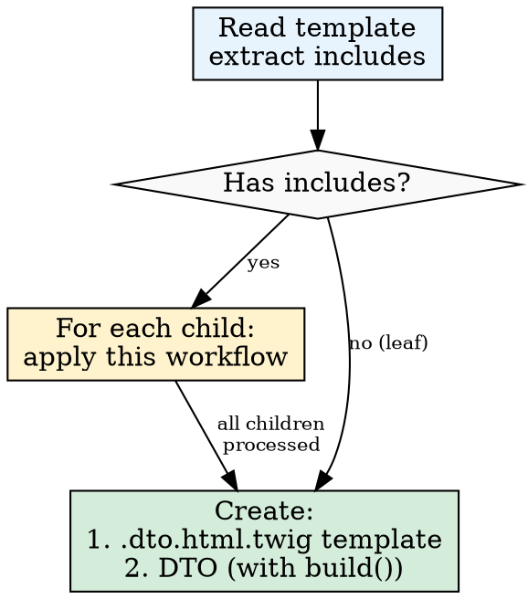

# Dayuse Mail — DTO Pattern

## Overview

Modernization pattern for Dayuse transactional emails: replace unstructured arrays (`reservationData`, `array<string, mixed>`) with strictly typed PHP DTOs (`final readonly class`) with a static `build()` method, and `.dto.html.twig` templates with zero business logic.

## When to Use This Skill

- Refactoring legacy transactional email templates (`.html.twig`).
- Migrating templates to the `.dto.html.twig` extension.
- Replacing the global unstructured array `reservationData` (and other `array<string, mixed>` arrays) with specific DTOs with typed properties.
- Updating Notifiers (`ConfirmationEmailNotifier`, etc.) to use DTOs and their `build()` method.

### When NOT to Use

- Marketing emails or newsletters (handled by another system).
- Purely static templates (no Twig variables: no `{{ var }}`, no ``, no parameters received via `include`).
- Modifying an existing `.html.twig` template that is not being migrated (do not break existing emails).

## Current Migration Status

The migration is **in progress**. The new pattern is applied to child templates (`_parts/`); root templates still follow the old pattern.

| Component | Status | Notes |
|-----------|--------|-------|
| Part DTOs (`PartDTO/`) | Done | `BookingHeaderBlockDTO`, `BookingInfosReinsuranceDTO`, `BookingInfosReinsuranceItemDTO` — **reference patterns** |
| Part Templates (`.dto.html.twig`) | Done | `booking_header_block.dto.html.twig`, `reinsurance.dto.html.twig`, `reinsurance_item.dto.html.twig` — **reference patterns** |
| Root DTOs (`DTO/`) | Legacy | `R7OrderConfirmedHotelEmailDTO`, etc. — old naming, `__toArray()`, `reservationData: array`. **Do not use as reference.** |
| Root Templates (`.dto.html.twig`) | To create | Root templates still in `.html.twig` |
| Notifiers | To migrate | Still using `$dto->__toArray()` |

**Important**: legacy root DTOs (`R7OrderConfirmedHotelEmailDTO`, `R9CancellationEmailDTO`, `R11OrderUpdateCustomerEmailDTO`, `R12OrderUpdateHotelEmailDTO`) use the old pattern (`private` properties, `__toArray()`, `reservationData: array<string, mixed>`). **Never** use them as reference for creating new DTOs. Only use Part DTOs as reference.

## Reference Models

Existing files to use as models when creating new DTOs/Templates:

| Type | Reference File |
|------|---------------|
| Child DTO | `src/Email/DTO/PartDTO/BookingHeaderBlockDTO.php` |
| Child Template | `templates/transactional-emails/_parts/booking_header_block.dto.html.twig` |
| Root DTO | See `ressources/exemple.md` (no reference in the codebase yet) |

Complete code examples in `ressources/exemple.md`.

## Context: Old vs New Pattern

| Criterion | Old pattern | New pattern (target) |
|---|---|---|
| Template extension | `.html.twig` | `.dto.html.twig` |
| Twig variable | `reservationData.xxx`, `language`, etc. (flat variables) | `data.xxx` (single typed variable) |
| Passing to template | `$dto->__toArray()` | `['data' => $dto]` |
| DTO properties | `reservationData: array<string, mixed>` | Typed properties (e.g.: `bookingNumber: string`) |
| Logic in Twig | Complex conditions possible | Zero business logic, pre-computed boolean results |
| DTO construction | Manual in the Notifier | Static `build()` method in the DTO |
| `build()` parameters | `array $reservationData` (untyped) | Business objects: `Order`, `Hotel`, `Language`, etc. |

## Quick Reference

| Element | Convention |
|---------|-----------|
| Template extension | `.dto.html.twig` |
| Outer Twig variable | `data` (only) |
| Template typing | `{# @var data \Dayuse\Email\DTO\XxxDTO #}` |
| Root DTO | `src/Email/DTO/` |
| Child DTO | `src/Email/DTO/PartDTO/` |
| Passing to template | `['data' => $dto]` |
| DTO class | `final readonly class` |
| DTO properties | `public` only |
| DTO construction | `public static function build(...)` in the DTO |
| `build()` parameters | Business objects (`Order`, `Hotel`, etc.) or scalars — **never** `array` |

## Core Principles & Workflow

### 0. Depth-First Strategy (Leaves First)

**Cardinal principle: always scan recursively THEN process leaves before parents.**

**BEFORE creating any file**, recursively scan the given template: read its content, extract all `include` directives, descend into each child, and build the complete tree. **Display the tree before starting any work.** Without this scan, the parent DTO will be incomplete (missing children).

**Eligibility rule: any template containing Twig variables must be processed (`.dto.html.twig` + DTO pair).**

A template is eligible as soon as it **receives or uses Twig variables**, regardless of their origin:
- Variables from `reservationData` or other PHP arrays.
- Variables passed via `include` parameters (e.g.: `{ imgUrl: ..., text: ... }`).
- Variables from the parent scope.

> **Common pitfall**: a "leaf" template like `reinsurance_item.html.twig` may seem not to require migration (no `include`, no `reservationData`), but if it receives variables (`imgUrl`, `text`, `isBlack`) via `include` parameters, it **must** be processed.

Start with leaves (templates without `include`) and work up to the root.



**This order applies to each layer:**

| Step | Order |
|------|-------|
| Templates | Leaf `.dto.html.twig` -> ... -> Root `.dto.html.twig` |
| DTOs | Leaf DTO -> ... -> Root DTO (which nests children) |

**Recursive workflow for a given template:**

1. Read the template: list all `include` directives **AND** all Twig variables used (`{{ var }}`, ``, parameters received via `include`).
2. For each included child, recursively apply this same workflow (step 1).
3. Once **all children are processed** (`.dto.html.twig` template + DTO created), process the parent:
   - Create the parent `.dto.html.twig` template (which `include`s the already-migrated children).
   - Create the parent DTO (which references child DTOs as typed properties and whose `build()` method calls `ChildDTO::build()` for each child).

**Example — 3-level tree:**

```
r7-confirmed.html.twig                          <- root (reservationData, language, ...)
  +-- _parts/booking_header_block.html.twig      <- child (title, subtitle, ...)
  |     +-- _parts/reinsurance.html.twig         <- child (reservationData, ...)
  |           +-- _parts/reinsurance_item.html.twig <- leaf xN (imgUrl, text, isBlack)
  +-- _parts/payment_summary.html.twig           <- leaf (totalPrice, currency)
```

**xN** means the template is included **multiple times** in its parent with different data each time. See the section [Child DTO instantiated multiple times](#child-dto-instantiated-multiple-times-n-instances).

**Processing order:**
1. `reinsurance_item` (leaf xN) -> `BookingInfosReinsuranceItemDTO`
2. `reinsurance` (its children are done) -> `BookingInfosReinsuranceDTO`
3. `booking_header_block` (its children are done) -> `BookingHeaderBlockDTO`
4. `payment_summary` (leaf) -> `PaymentSummaryDTO`
5. `r7-confirmed` (all its children are done) -> `R7DTO`

**Forbidden (depth-first):**
- Creating a file (template, DTO) without having recursively scanned the `include` directives first.
- Ignoring an `include` found in a template.
- Ignoring a child template on the grounds that it does not contain `reservationData` — if it has variables, it must be processed.
- Creating a parent DTO before its child DTOs exist.
- Creating a `.dto.html.twig` template that `include`s a child **with variables** that has not yet been migrated (`.html.twig`). Static templates (without Twig variables) remain as `.html.twig`.

### 1. Templating (`.dto.html.twig`)

- **Naming convention**: `.dto.html.twig` suffix (e.g.: `r7-confirmed.dto.html.twig`, `manage_cb_block.dto.html.twig`).
- **Never modify** or **delete** the original `.html.twig` templates — create the new ones alongside them as `.dto.html.twig`.
- **Structural fidelity**: The `.dto.html.twig` template must preserve the same HTML structure and display logic as the original. Replace `reservationData.xxx` accesses with `data.xxx`, PHP constant comparisons (`constant(...)`) with DTO booleans, and flat variables with DTO properties — but do not rewrite the template structure. `include`s remain `include`s (pointing to `.dto.html.twig` versions), loops remain loops, etc.
- **PHP DocBlock typing**: Always type `data` on the first line of the file:

```twig
{# @var data \Dayuse\Email\DTO\PartDTO\BookingHeaderBlockDTO #}
```

- One typing per template. The variable is **always** named `data`.
- **Zero business logic**: No computation, no complex conditions. Twig formatting filters are allowed (`format_date`, `formatPrice`, `trans`, etc.).
- **Data access**: `data.bookingNumber`, `data.hotelName`, `data.isPrepaid`, etc.
- **Logic moved to PHP**: Complex Twig conditions become booleans on the DTO.
- Templates are responsible for translating translation keys.
- All data used in the template is declared in the template's DTO, or initialized in the template itself (via `` with computed logic).
- Variables declared with `` must be used in the template.
- Forbidden: initializing a variable without added logic.

```twig
{# OK — set with computed logic #}


{# FORBIDDEN — set without added value #}

```

### 2. Nesting & Child Templates

When a parent template includes a child component, explicitly pass the nested DTO:

```twig
{{ include('@emails/_parts/booking_header_block.dto.html.twig', { data: data.bookingHeader }) }}
```

- Duplicate `_parts/xyz.html.twig` -> `_parts/xyz.dto.html.twig` and refactor the new one.
- Never modify the original to avoid breaking existing emails that depend on it.

#### Child DTO Instantiated Multiple Times (N Instances)

When a parent template includes the **same child template N times** with different data, the parent DTO declares **one typed property per instance** of the child DTO (nullable if conditional). The parent DTO's `build()` method calls `ChildDTO::build()` **once per instance**.

The rule "one DTO = one template" applies to the DTO **type**, not the number of instances. `ReinsuranceItemDTO::build()` can be called N times to produce N instances of `ReinsuranceItemDTO`.

See `ressources/exemple.md` section "Child DTO instantiated N times" for the complete example (DTO + template).

### 3. Data Transfer Objects (DTOs)

**Two types of DTO:**
- **Root DTO** — applied to the template called from a PHP class.
- **Child DTO** — declared by a root DTO or another child DTO.

**Locations:**
- Root DTO (main template): `src/Email/DTO/`
- Child DTO (`_parts/` template): `src/Email/DTO/PartDTO/`

**Required structure:**

```php
// Simplified example — see ressources/exemple.md for the complete example

/**
 * @see templates/transactional-emails/hotel/reservation/r7-confirmed.dto.html.twig
 */
final readonly class R7DTO
{
    public function __construct(
        public string $bookingNumber,
        public bool $isPrepaid,
        public BookingHeaderBlockDTO $bookingHeader,
        public ?string $taxInformation,
    ) {
    }

    public static function build(Order $order, Hotel $hotel, Language $language): self
    {
        // ... data assembly
        return new self(
            bookingNumber: $order->getBookingNumber(),
            isPrepaid: $order->isPrepaid(),
            bookingHeader: BookingHeaderBlockDTO::build($order, $hotel, $language),
            taxInformation: $hotel->willCollectLocalSalesTax() ? 'email.tax.information' : null,
        );
    }
}
```

See `ressources/exemple.md` for complete root and child DTO examples.

**Rules:**
- `final readonly class` — always.
- **`public` properties** — required so Twig can access them via `data.property`.
- Native PHP typing on each property. No `array<string, mixed>`, no `mixed`.
- Property names match exactly the names used in the template.
- No translation in the DTO — only translation keys as `string`. The `build()` method constructs these keys and their parameters; the template translates them with `|trans`.
- One DTO = one template.
- Includes a `@see` comment referencing the template it applies to.
- No arrays, only objects, which go in the `src/Email/DTO/` directory.

#### Static `build()` Method

Each DTO contains a `public static function build(...)` method that assembles the DTO from business objects.

**`build()` rules:**
- Parameters: business objects (`Order`, `Hotel`, `DomainConfig`, `Language`, `OrderItem`, etc.) or scalars without prior computation.
- **Prefer whole objects over pre-extracted scalars** — when a `build()` needs multiple properties from the same object, pass the whole object. It is the DTO's `build()` that extracts what it needs, not the caller. Scalars are reserved for values that do not come from a single business object (flags, computed URLs, translation keys).
- **Recursive depth-first construction**: the parent DTO's `build()` method calls `ChildDTO::build()` for each child DTO. A DTO **never** constructs a child DTO directly via `new ChildDTO(...)` — it always delegates to `ChildDTO::build()`.
- **No translation in `build()`** — never call `->trans()`. However, `build()` **can and should** construct translation keys (`string`) and their parameters so the template can translate them with `|trans`.
- **Duplicate computations accepted**: if two distinct DTOs need the same computed information (e.g.: `isPrepaidPayment`), each `build()` computes it independently. Computed data is not shared between DTOs.

#### Prefer Whole Objects Over Pre-Extracted Scalars

When a DTO needs multiple properties from the same business object, pass **the whole object** to `build()`. Each DTO is responsible for extracting the data it needs — it is not the parent's role to decompose the object into scalars.

```php
// BAD — parent pre-extracts all scalars
HotelInformationDTO::build(
    hotelName: $hotel->getName(),
    hotelAddress: $hotel->getAddress(),
    hotelRating: $hotel->getStarRating(),
    hotelUrl: $hotel->getUrl(),
    contactPhoneNumber: $domainConfig->getContactPhoneNumber(),
);

// GOOD — pass objects, the DTO extracts itself
HotelInformationDTO::build(
    hotel: $hotel,
    domainConfig: $domainConfig,
);
```

**Why:**
- **Clean signatures**: 2 parameters instead of 6. The parent does not need to know the child DTO's internal details.
- **Encapsulation**: if the child DTO needs an additional field tomorrow, only its `build()` changes — not all callers.
- **Avoids the array temptation**: when the parent must pre-extract 10+ scalars, the temptation to pass an `array` instead is strong. Passing the whole object eliminates this need.

**When to use scalars:**
- Values that do not come from a single object: flags (`isForHotel`, `isActive`), computed URLs, translation keys (`$title`, `$subtitle`).
- Value from a single isolated getter (e.g.: `string $locale` extracted from `Language::getLocale()`).

#### FORBIDDEN — `reservationData` and Untyped Arrays in `build()`

**No DTO (root OR child) may accept `array $reservationData` or `array<string, mixed>` as a `build()` parameter.** This is the exact problem this migration solves — an unstructured, untyped array. Replacing it with another unstructured array solves nothing.

**This applies to ALL DTOs — including the root DTO.** The fact that the Notifier uses `reservationData` internally does not justify passing it to the DTO. The root DTO must receive business objects and extract data itself.

```php
// FORBIDDEN — untyped array as parameter
public static function build(array $reservationData, string $locale): self
{
    return new self(
        bookingNumber: $reservationData['bookingNumber'],     // <- no typing
        hotelName: $reservationData['hotel']['name'],          // <- fragile nested access
    );
}

// FORBIDDEN — even if the array is enriched/transformed
$reservationDataEnriched = $reservationData;
$reservationDataEnriched['checkinDateFormatted'] = $formatted;
BookingDetailsBlockDTO::build(reservationData: $reservationDataEnriched);

// FORBIDDEN — even a subset of the array
public static function build(array $hotelData): self  // <- still an array<string, mixed>

// CORRECT — typed business objects
public static function build(Order $order, Hotel $hotel, Language $language): self
{
    $orderItem = $order->getParentOrderItem();
    return new self(
        bookingNumber: $order->getBookingNumber(),
        hotelName: $hotel->getName(),
    );
}
```

**Common rationalizations (all invalid):**

| Excuse | Reality |
|--------|---------|
| "The Notifier already uses `reservationData`, it's simpler to pass it" | The goal of the migration is precisely to eliminate `reservationData`. The root DTO receives `Order`, `Hotel`, `Language` from the Notifier. |
| "The root DTO is different, it can accept the array" | No. No DTO — root or child — accepts an array. The root DTO is the migration entry point: it receives entities and distributes them to children. |
| "I'm just passing the array through, I'm not the one calling `getInfo()`" | `$reservationData` IS the result of `getInfo()`. Passing it through perpetuates the old pattern. |
| "It's temporary, we'll refactor later" | No. The DTO is created once, correctly, with business objects. |
| "There are too many fields to extract from entities" | Entities expose typed getters. It's more initial code, but that's the point: replacing `['key']` accesses with typed calls. |

**Red flags — STOP and fix:**
- `array $reservationData` in a `build()` signature
- `array<string, mixed>` in a `@param` of `build()`
- `$reservationData['xxx']` in a `build()` body
- A parent DTO that enriches an array before passing it to a child
- A `build()` that takes an array and extracts sub-keys (`$data['hotel']['name']`)

#### Naming

The DTO takes the name of the template it applies to, in PascalCase, suffixed with `DTO`.

| Template | DTO |
|---|---|
| `hotel/reservation/r7-confirmed.dto.html.twig` | `R7DTO` |
| `customer/reservation/r9-cancelled.dto.html.twig` | `R9CancelledDTO` |
| `_parts/booking_header_block.dto.html.twig` | `BookingHeaderBlockDTO` |
| `_parts/payment/_parts/inclusive_taxes.dto.html.twig` | `PaymentInclusiveTaxesDTO` |

> **Legacy warning**: existing root DTOs (`R7OrderConfirmedHotelEmailDTO`, `R9CancellationEmailDTO`, etc.) follow old verbose naming. **New** DTOs must follow the convention above. When fully migrating a root template, create a new DTO with the correct naming.

### 4. Notifiers

Replace passing `$dto->__toArray()` with `['data' => $dto]`:

```php
// Before: $dto->__toArray() + .html.twig template
->withBody('@emails/.../r7-confirmed.html.twig', $dto->__toArray())

// After: DTO::build() + .dto.html.twig template
$dto = R7DTO::build($order, $hotel, $language);
->withBody('@emails/.../r7-confirmed.dto.html.twig', ['data' => $dto])
```

- See `ressources/exemple.md` section "Notifier — Before / After" for the complete example.

## Email Migration Checklist

### Phase 1 — Mapping (top-down) — MANDATORY BEFORE ANY CODE

**Apply the recursive scan described in the "Depth-First Strategy" section above.**

1. [ ] Recursively scan the root template (`.html.twig`) and **display the complete tree** (with each template's variables and the xN notation if a child is included multiple times).
2. [ ] Identify all Twig variables used in **each** template in the tree (including `reservationData`, variables passed via `include`, and parent scope variables). Every template with variables must be processed.

### Phase 2 — Recursive Construction (bottom-up, leaves first)

**For each template, starting from leaves and working up to the root:**

3. [ ] Create the `.dto.html.twig` template (refactored copy) — do not modify the original.
4. [ ] Create the corresponding DTO with its static `build()` method (`src/Email/DTO/PartDTO/` for children, `src/Email/DTO/` for the root).
5. [ ] If the template has children: verify the DTO references child DTOs as typed properties and its `build()` method calls `ChildDTO::build()` for each child.

**Repeat steps 3-5, working up the tree to the root template.**

### Phase 3 — Integration

6. [ ] Update the Notifier to call `RootDTO::build(...)` and pass `['data' => $dto]`.
7. [ ] Verify PHPStan level 10 (`inv phpstan`).
8. [ ] Verify Twig lint (`inv lint`).

## Common Mistakes

| Mistake | Fix |
|---------|-----|
| `private string $bookingNumber` in the DTO | `public string $bookingNumber` — Twig cannot access private properties |
| Using legacy root DTOs (`R7OrderConfirmedHotelEmailDTO`) as reference | These DTOs follow the old pattern (`__toArray()`, `reservationData: array`). Use Part DTOs (`BookingHeaderBlockDTO`) as reference |
| `build()` calls `OrderInfoViewModelBuilder::getInfo()` | `build()` receives `Order`, `Hotel`, `Language` as direct parameters |
| `build(array $reservationData)` — untyped array as parameter | **Forbidden.** `build()` receives business objects (`Order`, `Hotel`, etc.) — never `array<string, mixed>`. See "FORBIDDEN — `reservationData`" section |
| `$reservationData['hotel']['name']` in a `build()` | Replace with `$hotel->getName()`. Array key access is the problem this migration solves |
| Root DTO accepting `array $reservationData` "because the Notifier uses it" | The root DTO receives entities from the Notifier and extracts data via getters. The Notifier no longer passes `reservationData` to the DTO |
| `build(string $hotelName, string $hotelAddress, int $hotelRating, ...)` — pre-extracted scalars from the same object | Pass the whole object: `build(Hotel $hotel, ...)`. The DTO extracts itself via `$hotel->getName()`, etc. See "Prefer whole objects" section |
| Child template included without passing the sub-DTO | `{ data: data.bookingHeader }` — always pass the child DTO explicitly |
| `` without logic | Remove — `` without added value is forbidden |
| Guessed entity method (e.g.: `getStars()`) | Check the actual entity — e.g.: `$hotel->getStarRating()` |
| Parent DTO's `build()` constructs a child DTO with `new ChildDTO(...)` | Always delegate to `ChildDTO::build()` — never `new ChildDTO(...)` in the parent's `build()` |
| `.dto.html.twig` template restructured (display logic rewritten) | Preserve the same HTML structure as the original — replace `reservationData` accesses with `data.xxx` and `constant(...)` with booleans, without rewriting the structure |
| Child DTO created but never instantiated in PHP | Every DTO must be instantiated by its `build()` method and referenced as a typed property in the parent DTO |
| Child template with variables not migrated (e.g.: `reinsurance_item.html.twig` ignored) | Every template receiving variables (even via `include` parameters) must be migrated — create `.dto.html.twig` + DTO |
| Child DTO used once when the template is included N times | Declare one typed property **per instance** in the parent DTO — `ChildDTO::build()` is called N times |
| `.dto.html.twig` template includes a child **with variables** that is not migrated (`.html.twig`) | All children with variables must be migrated first. Static templates (without variables) remain as `.html.twig` |
| Inline Twig hash instead of a child DTO: `{ data: { imgUrl: '...', text: '...' } }` | Pass a DTO instance: `{ data: data.childProperty }`. Inline hashes bypass PHP typing and the `ChildDTO::build()` pattern |
