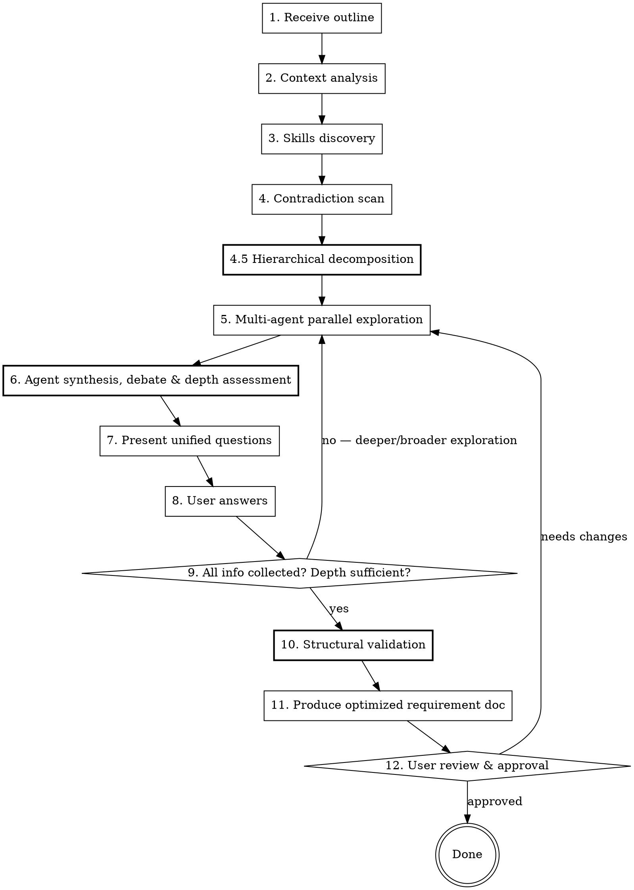

# Auto-Requirement: Multi-Agent Requirement Design

## Overview

Transform product requirement outlines into complete, optimized requirement documents through **multi-agent parallel exploration**, **self-debate**, and **iterative user clarification**.

**Core principle:** Multiple perspective agents think independently → debate and synthesize → present unified questions to user → iterate until complete → produce optimized requirement document.

### Pipeline Positioning

Auto-Requirement is the **first step** in a three-stage development pipeline:

```
auto-requirement → auto-todo → auto-dev
(产品决策层)        (工程任务层)   (代码实现层)
```

- **auto-requirement**: 面向产品决策 — 为什么做、做什么、优先级、范围边界、风险取舍
- **auto-todo**: 面向工程分解 — 怎么拆解、任务依赖、技术方案选型
- **auto-dev**: 面向代码实现 — TDD 流水线、门控开发

因此，本 skill 的输出应侧重**战略对齐、范围决策、优先级排序和风险评估**，而非底层技术实现细节。

<HARD-GATE>
Do NOT produce the final requirement document until ALL `[NEEDS CLARIFICATION]` markers are resolved and user has confirmed the requirements are complete. No shortcutting. No assuming.
</HARD-GATE>

## vs. Brainstorming

| Dimension | Brainstorming | Auto-Requirement |
|-----------|--------------|------------------|
| Direction | Open exploration | Directed by user's outline |
| Thinking | Single-threaded Q&A | Multi-agent parallel debate |
| Skills | Not discovered | Autonomously find related skills |
| Questions | One at a time | Batched after agent synthesis |
| Structure | Flat design doc | **Top-down hierarchical** requirement document |
| Depth | Surface-level | **Adaptive depth** with domain-specific artifacts |
| Output | Design doc | Optimized requirement document for product decision-making |

## Process Flow



## Checklist

Create a TodoWrite task for each item:

1. **Receive & parse outline** — understand user's product direction
2. **Context analysis** — explore project files, docs, recent commits
3. **Skills discovery** — use find-skills to discover domain-relevant skills, read best ones
4. **Contradiction scan** — detect logical conflicts in the outline before deep analysis
5. **Hierarchical decomposition** — build top-down goal tree with adaptive depth
6. **Multi-agent parallel exploration** — dispatch 4 core agents with goal tree (+ domain expert if recommended)
7. **Agent synthesis, debate & depth assessment** — resolve conflicts, build unified hierarchy, assess depth per branch
8. **Present unified questions** — batched questions following top-down order (strategic → structural → behavioral → constraints)
9. **Iterate** — repeat steps 6-8 until requirements complete AND depth sufficient; if new domain detected, run find-skills before next round
10. **Structural validation** — verify hierarchy completeness, cross-reference consistency, depth adequacy
11. **Produce requirement document** — write optimized `docs/requirements/YYYY-MM-DD-<topic>-requirement.md`
12. **User review & approval** — present for final approval

## Phase 1: Receive & Parse Outline

When user provides their requirement outline:

1. **Acknowledge** the outline and summarize your understanding back
2. **Identify key dimensions**: target users, core problem, proposed solution direction, constraints
3. **Flag obvious gaps** with `[NEEDS CLARIFICATION]` markers
4. **Do NOT assume** anything unstated — mark as TBD

## Phase 2: Context Analysis

Explore the current project to understand constraints:

- Read project files, docs, README, existing specs
- Check recent git history for related work
- Identify technical stack and architectural patterns
- Note existing features that may interact with new requirements

## Phase 3: Skills Discovery

**Autonomously** search for domain-relevant skills:

```bash
npx skills find "<domain keywords from outline>"
```

1. Search 2-3 different keyword combinations related to the requirement domain
2. Read the top-ranked skills' content (fetch from skills.sh)
3. Extract useful patterns, frameworks, or checklists from discovered skills
4. Integrate relevant insights into your exploration strategy

**Purpose:** Borrow domain-specific thinking frameworks others have already built.

## Phase 4: Contradiction Scan

**Before deep analysis**, scan the outline for:

- **Explicit conflicts**: mutually exclusive goals (e.g., "real-time" + "batch processing")
- **Impossible combinations**: (e.g., "offline-first" + "always up-to-date")
- **Unacknowledged trade-offs**: (e.g., "simple" + "handle every edge case")
- **Scope ambiguity**: terms with multiple interpretations

Present contradictions to user FIRST. Resolve before proceeding.

## Phase 4.5: Hierarchical Decomposition (Top-Down Skeleton)

**After resolving contradictions, before dispatching agents**, build a top-down goal tree from the user's outline.

### Purpose

The goal tree becomes the **structural skeleton** that all agents flesh out. Without it, agents produce flat, unanchored analysis. With it, every finding, question, and recommendation maps to a specific node in the hierarchy.

### Decomposition Process

1. **Identify Strategic Goals (SG)**: Extract 2-5 top-level business/product goals from the outline. Each goal answers "Why are we building this?"
2. **Identify Capability Domains (CD)**: For each goal, identify 1-4 capability domains needed. Each domain is a functional area or module.
3. **Identify Key Features (FR)**: For each domain, list the key features at headline level (not detailed yet — agents will flesh these out).
4. **Assess Complexity**: For each domain branch, assign initial complexity:
   - **Light** (1-3 features, well-understood) → 3-level depth sufficient
   - **Standard** (4-8 features, some unknowns) → 4-level depth (add acceptance criteria)
   - **Deep** (complex business logic, multiple states, cross-cutting) → 5-level depth (add decision trees, state machines, computation rules)

### Output Format

```markdown
## Goal Tree (Draft)

SG-1: [Strategic Goal]
  CD-1.1: [Capability Domain] [complexity: Standard]
    FR-001: [Feature headline]
    FR-002: [Feature headline]
  CD-1.2: [Capability Domain] [complexity: Deep]
    FR-003: [Feature headline]
    FR-004: [Feature headline]
SG-2: [Strategic Goal]
  CD-2.1: [Capability Domain] [complexity: Light]
    FR-005: [Feature headline]
```

### Adaptive Depth Rules

- **Minimum**: Always produce at least 3 levels (SG → CD → FR)
- **Default**: 4 levels for Standard complexity (add acceptance criteria in Phase 5+)
- **Maximum**: 5 levels for Deep complexity (add domain-depth artifacts)
- The Synthesis Agent can **deepen** specific branches in later rounds based on its depth assessment
- The goal tree is a **living structure** — updated each iteration round

### ID Scheme

Use category-prefix IDs with lightweight cross-references:

| Type | Prefix | Example |
|------|--------|---------|
| Strategic Goal | `SG` | `SG-1` |
| Capability Domain | `CD` | `CD-1.1` |
| Functional Requirement | `FR` | `FR-001` |
| Non-Functional Requirement | `NFR` | `NFR-001` |
| Data Contract | `DC` | `DC-001` |
| Architecture Decision | `AR` | `AR-001` |
| Risk | `RSK` | `RSK-001` |
| Open Question | `OQ` | `OQ-001` |

Each requirement includes:
- `depends_on: [FR-xxx, NFR-xxx]` — what this requirement needs
- `traces_to: [SG-x, CD-x.x]` — which goal/domain this serves

## Phase 5: Multi-Agent Parallel Exploration

This is the core differentiator. Dispatch **4+ perspective agents in parallel** using the Agent tool.

**Key change from previous version**: Agents now receive the **goal tree** from Phase 4.5 and must organize their analysis by tree nodes.

### Core Agent Roles (Always Present)

See [references/perspective-prompts.md](references/perspective-prompts.md) for complete prompt templates.

| Agent | Perspective | Focus |
|-------|-----------|-------|
| **Product Agent** | Business value & decision framing | Goal validation, value proposition per domain, MoSCoW prioritization, success metrics, scope trade-offs |
| **Technical Agent** | Feasibility & depth detection | Architecture fit, integration points, identify where decision trees/state machines/computation rules are needed |
| **UX Agent** | User experience & journey mapping | User journeys mapped to features, interaction flows, edge cases, information architecture |
| **Adversary Agent** | Devil's advocate & depth audit | Challenge assumptions, question necessity, audit hierarchy quality, challenge depth adequacy per branch |

### Dynamic Domain Expert Agent (Conditional)

In iteration rounds (Phase 5 re-entry from Phase 9 or 12), a **5th Domain Expert Agent** may be added when the Synthesis Agent in the previous round detected a new domain that exceeds the 4 core agents' expertise.

| Agent | Perspective | Focus |
|-------|-----------|-------|
| **Domain Expert Agent** | Domain-specific | Deep expertise in the newly identified domain (e.g., data analysis, security compliance, ML/AI, payments, blockchain) |

The Domain Expert Agent:
- Is spawned **only when the Synthesis Agent explicitly recommends it** in Phase 6
- Receives domain-specific skill insights from a **targeted find-skills search** (see Phase 6)
- Runs in parallel alongside the 4 core agents
- Uses the same output format as core agents
- Is scoped to a single domain per agent; if multiple new domains emerge, spawn one agent per domain (max 2 additional agents per round to avoid noise)

### Dispatch Pattern

```
Agent(subagent_type="general-purpose", prompt="[role-specific prompt from template]")
```

Each agent receives:
1. The original user outline
2. Context analysis results
3. **The goal tree** from Phase 4.5 (with complexity annotations)
4. Any insights from discovered skills (core agents get Phase 3 insights; domain expert gets targeted new insights)
5. Previous round's Q&A history (if iterating)
6. Their specific role instructions

Each agent returns (**organized by goal tree nodes**, not flat bullets):
1. **Per-Node Analysis** — findings anchored to specific SG/CD/FR nodes
2. **Cross-Cutting Findings** — observations that span multiple nodes
3. **Questions** — what they need clarified (with suggested options and node reference)
4. **Risks** — what could go wrong (with node reference)
5. **Recommendations** — specific suggestions (with node reference)
6. **Depth Signals** — where they see need for decision trees, state machines, computation rules, or impact matrices

**All agents run in parallel** — use a single message with 4-6 Agent tool calls.

## Phase 6: Agent Synthesis, Debate & Depth Assessment

After all agents return, dispatch a **Synthesis Agent**:

```
Agent(subagent_type="general-purpose", prompt="[synthesis prompt]")
```

The Synthesis Agent:
1. **Reads all agent outputs** (4 core + any domain expert agents)
2. **Identifies agreements** — things all agents align on (confirmed as requirements)
3. **Identifies conflicts** — where agents disagree (e.g., Product wants feature X, Adversary questions its necessity)
4. **Resolves where possible** — using evidence and reasoning
5. **Escalates to user** — unresolvable conflicts become questions
6. **Deduplicates questions** — merge similar questions from different agents
7. **Prioritizes questions** — most impactful first, max 10 per round; follow top-down order (strategic → structural → behavioral → constraints)
8. **Builds unified hierarchy** — merge agent outputs into a single updated goal tree with requirements organized by capability domain
9. **Assesses depth per branch** — for each CD branch, evaluate:
   - **Completeness score** (1-5): How many requirements have acceptance criteria?
   - **Depth adequacy**: Does the branch need decision trees, computation rules, state machines?
   - **Recommendation**: "Sufficient" / "Needs deeper analysis in [specific area]"
10. **Detects new domains** — if user answers or agent findings reveal a domain not covered by the current agent roster, recommend spawning a Domain Expert Agent for the next round

### Question Ordering (Top-Down)

Questions must follow a strict priority order within each round:

1. **Strategic questions** first — scope, goals, prioritization ("Should we include X in v1?")
2. **Structural questions** next — domain boundaries, feature grouping ("Is payment processing a separate module?")
3. **Behavioral questions** after — specific flows and rules ("What happens on failed payment?")
4. **Constraint questions** last — non-functional limits ("What latency is acceptable?")

Never ask a constraint question before the user has defined the behavior it constrains.

### Depth Assessment Protocol

For branches marked as **Deep** or scoring low on completeness, the Synthesis Agent outputs:

```markdown
### Depth Assessment
| Branch | Completeness | Needs |
|--------|-------------|-------|
| CD-1.1: Payment Processing | 2/5 | Decision tree for payment states; computation rule for fee calculation |
| CD-1.2: User Auth | 4/5 | Sufficient |
| CD-2.1: Reporting | 1/5 | State machine for report lifecycle; impact matrix for data sources |
```

In the next iteration round (Phase 5 re-entry), agents receive the flagged branches specifically for deep analysis.

### Domain Expert Spawn Protocol

When the Synthesis Agent detects a new domain (step 10), it must output:

```markdown
### Domain Expert Recommendation
- **Domain**: [e.g., "Data Analytics", "Payment Compliance"]
- **Reason**: [Why existing agents can't cover this adequately]
- **Skill search keywords**: [Suggested keywords for find-skills]
```

Upon receiving this recommendation:
1. Run `find-skills` with the suggested keywords
2. Read and extract insights from the top-ranked skills
3. In the next Phase 5 round, dispatch a Domain Expert Agent with these insights + the domain expert prompt template

## Phase 7: Present Unified Questions

Present the synthesized questions to the user:

- Use **AskUserQuestion** with 2-4 options when choices are clear
- Use **open-ended questions** when reasoning/context is needed
- Group related questions logically, following top-down order
- Show WHY each question matters (which agent raised it, what it impacts)
- Show **which goal tree node** the question relates to
- Limit to **5-10 questions per round** to avoid overwhelming
- **Provide sensible defaults** where common patterns exist (mark as "Recommended")

Format:

```markdown
## Round N Questions

### Q1: [Question title]
**Node:** SG-1 > CD-1.1 (Payment Processing)
**Raised by:** Product Agent + Adversary Agent
**Impact:** Affects scope of feature X and success metrics
**Options:**
- A) ... (trade-off: ...) — Recommended
- B) ... (trade-off: ...)

### Q2: ...
```

### Progress Indicator

After each round, show a coverage summary:

```markdown
## Coverage Status
| Domain | Goal Defined | Features Listed | Depth Adequate | Risks Identified |
|--------|:---:|:---:|:---:|:---:|
| CD-1.1: Payment | yes | yes | partial | yes |
| CD-1.2: Auth | yes | yes | yes | yes |
| CD-2.1: Reporting | yes | partial | no | no |
```

## Phase 8: Iteration Check

After each round of user answers:

1. Update the requirement understanding and **goal tree**
2. Check remaining `[NEEDS CLARIFICATION]` markers
3. **Check for Domain Expert recommendation** from Phase 6 — if present, run find-skills and prepare domain expert context before returning to Phase 5
4. **Check depth assessment** — if any branches are flagged as needing deeper analysis, prepare targeted prompts for the next Phase 5 round
5. Assess completeness across all dimensions:
   - **Strategic**: goals defined, success metrics measurable?
   - **Scope**: features, non-goals, boundaries clear per capability domain?
   - **Functional**: key requirements with acceptance criteria per domain?
   - **Domain depth**: decision trees/computation rules/state machines produced where needed?
   - **Cross-cutting**: non-functional requirements, dependencies between domains addressed?
   - **Risks**: identified per domain with mitigation strategies?
   - **Technical architecture**: macro-level technical decisions (database, service architecture, key technology choices) settled?
   - **Constraints**: timeline, budget, tech stack settled?

**Stop iterating when:** All critical dimensions have concrete, measurable answers AND depth assessment shows all branches at 3/5 or higher. "Good enough" — don't pursue perfection at the cost of user fatigue.

**Continue iterating when:** Core requirements still have TBD markers, unresolved contradictions, branches flagged for deeper analysis, or a Domain Expert Agent has been recommended but not yet dispatched.

## Phase 9: Structural Validation

**Before producing the final document**, run a validation pass:

1. **Hierarchy completeness**:
   - Every SG has at least one CD
   - Every CD has at least one FR
   - Every Must-priority FR has at least one acceptance criterion
2. **Cross-reference consistency**:
   - Every `depends_on` reference points to an existing ID
   - Every `traces_to` reference points to an existing SG or CD
   - No orphan requirements (FRs that no domain claims)
3. **Depth adequacy**:
   - Branches marked as "Deep" have their domain-depth artifacts (decision trees, computation rules, state machines)
   - No "Deep" branch is missing its required artifacts
4. **Priority coverage**:
   - All Must-priority items have complete specifications
   - Should/Could items at minimum have clear descriptions and rationale
5. **Consistency check**:
   - No conflicting requirements across different domains
   - No requirements that contradict stated non-goals
6. **Architecture decision completeness** (if applicable):
   - Technical architecture decisions (AR-xxx) are captured when Technical Agent identified them
   - Each AR has rationale and downstream impact documented
   - No AR contradicts stated NFRs

If validation finds issues, resolve them before proceeding to document production. Minor issues can be noted in the Open Questions section.

## Phase 10: Produce Optimized Requirement Document

When all info is collected and validation passes, write the final document.

See [references/requirement-template.md](references/requirement-template.md) for the complete template.

**Output path:** `docs/requirements/YYYY-MM-DD-<topic>-requirement.md`

### Document Orientation: Product Decision Layer

The document is written for **product decision-making**, not engineering implementation:

- **Emphasize**: strategic alignment, scope decisions with rationale, priority trade-offs, risk assessment, success metrics
- **Include**: domain-depth artifacts (decision trees, state machines) only where they clarify business logic for decision-makers
- **Include**: technical architecture decisions (database choice, service architecture, frontend/backend separation) — these are macro-level technical requirements that constrain downstream engineering work
- **Defer to auto-todo/auto-dev**: implementation details (API endpoint design, DDL schemas, code interfaces, library-level choices)

### Key Sections (Hierarchical)

1. **Executive Summary** — problem, solution, success metrics (measurable KPIs)
2. **Strategic Goals & Traceability** — top-level goals with traces to capability domains
3. **User Personas & Scenarios** — who, why, how (linked to goals)
4. **Capability Domains & Feature Hierarchy** — organized by domain, not flat list
   - Each domain contains its features, acceptance criteria, and domain-depth artifacts
5. **Non-Functional Requirements** — performance, security, scalability, and technical architecture decisions (if applicable)
6. **Scope & Boundaries** — explicit in-scope, out-of-scope, non-goals with rationale
7. **Dependency Summary** — auto-generated from cross-references
8. **Risks & Mitigations** — per-domain and cross-cutting risks
9. **Open Questions** — remaining TBDs for future resolution
10. **Appendix** — Decision Log, Glossary, Domain-Depth Artifacts (if too detailed for main body)

### Domain-Depth Artifacts (Include If Applicable)

When the depth assessment identifies need, include these within the relevant capability domain section or in the appendix:

| Artifact | When to Include | Format |
|----------|----------------|--------|
| **Decision Tree / Classification Rules** | When a feature involves branching classification logic | Markdown table with conditions → outcomes |
| **Computation Specification** | When a feature involves non-trivial calculations with specific rules | Step-by-step algorithm with examples |
| **State Machine** | When an entity has 3+ states with defined transitions | Mermaid `stateDiagram-v2` or Markdown table |
| **Impact Matrix** | When actions affect multiple data entities or downstream systems | Cross-reference table showing action → affected entities |
| **Data Flow** | When data transformation logic is complex | Input → process → output description |

### Quality Standards

- Every requirement must be **concrete and measurable** (no "fast", "easy", "intuitive")
- Every Must-priority feature must have **acceptance criteria**
- Every assumption must be **explicitly stated**
- Priority marked using **MoSCoW** (Must/Should/Could/Won't) at the **domain level and feature level**
- Every feature must have `traces_to` and `depends_on` fields
- Domain-depth artifacts must include **concrete examples** (numerical examples for computations, specific scenarios for decision trees)

## Phase 11: User Review & Approval

Present the document section by section:
1. Show the **goal tree** first for structural validation
2. Walk through each capability domain
3. Highlight key decisions and their rationale
4. If user wants changes → go back to Phase 5 with new context
5. If approved → commit the document

## Common Mistakes

| Mistake | Fix |
|---------|-----|
| Asking too many questions per round | Max 10, prioritize by impact |
| Assuming unstated requirements | Mark as `[NEEDS CLARIFICATION]` or TBD |
| Skipping contradiction scan | Always scan before deep analysis |
| Running agents sequentially | Always dispatch in parallel |
| Ignoring Adversary Agent | Devil's advocate perspective is essential |
| Generating vague requirements | Enforce measurable criteria |
| Over-iterating | Use "good enough" stopping criteria |
| Ignoring new domains from user answers | Synthesis Agent must detect and recommend domain expert |
| Spawning too many domain experts | Max 2 additional agents per round |
| **Producing flat FR list without hierarchy** | **Always organize FRs under capability domains from the goal tree** |
| **Skipping depth assessment** | **Synthesis Agent must evaluate depth adequacy per branch** |
| **Asking constraint questions before behavioral ones** | **Follow top-down question order: strategic → structural → behavioral → constraints** |
| **Including engineering implementation details** | **Defer DDL, API design, code interfaces to auto-todo/auto-dev** |
| **Missing domain-depth artifacts for Deep branches** | **Structural validation catches this before document production** |
| **Producing cross-references without validation** | **Phase 9 validates all depends_on/traces_to references** |

## Red Flags — STOP and Reassess

- You're generating requirements without user confirmation
- You skipped the multi-agent exploration
- You skipped the hierarchical decomposition (Phase 4.5)
- You're asking the same question twice
- Questions don't have clear impact explanation
- Questions don't reference goal tree nodes
- The Adversary Agent raised no concerns (it should ALWAYS find something)
- You're producing the final doc with `[NEEDS CLARIFICATION]` markers still present
- The final document has a flat FR list instead of domain-organized hierarchy
- A "Deep" branch has no decision trees, state machines, or computation rules
- Cross-references point to non-existent IDs
