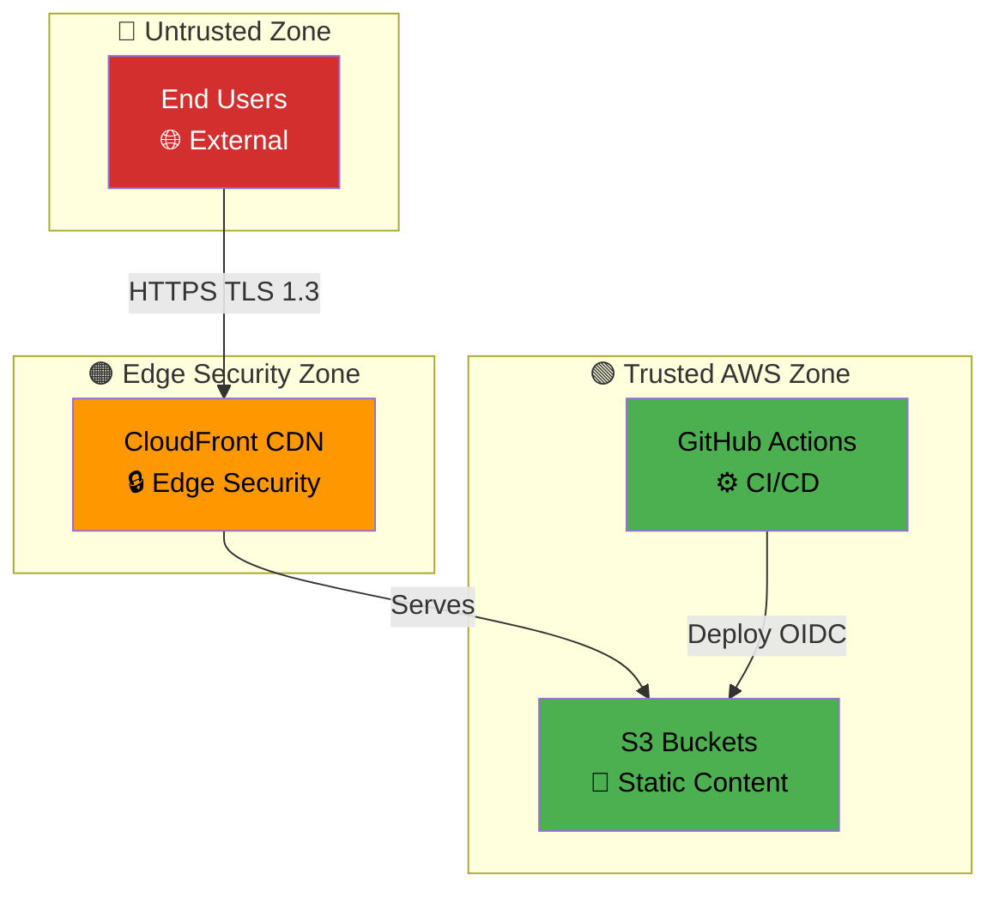

# Threat Modeling Skill

## Purpose

This skill embodies the complete Hack23 AB threat modeling methodology as defined in [ISMS Threat_Modeling.md](https://github.com/Hack23/ISMS-PUBLIC/blob/main/Threat_Modeling.md). It provides systematic threat identification, risk quantification, and security control validation for proactive security assurance across all Hack23 projects.

**Key Philosophy**: "Security through transparency" - All threat models are publicly documented to demonstrate security excellence to clients, regulators, and the open-source community.

## Hack23 Threat Modeling Process (ISMS § 4)

Per [ISMS Threat_Modeling.md](https://github.com/Hack23/ISMS-PUBLIC/blob/main/Threat_Modeling.md), Hack23 employs a **five-strategy integrated approach**:

### 1. 🎯 Attacker-Centric (ISMS § 4.1)
**MITRE ATT&CK Framework Integration**
- Map attack tactics and techniques to system components
- Identify threat agents (Nation-state APTs, Cybercriminals, Hacktivists, Malicious Insiders)
- Analyze attack scenarios based on current threat intelligence (ENISA Threat Landscape 2024)
- Red team perspective: "How would I compromise this system?"

**Required Outputs:**
- MITRE ATT&CK technique mapping per system component
- Threat agent capability and motivation analysis
- Attack scenario documentation

### 2. 🏰 Asset-Centric (ISMS § 4.2)
**Crown Jewel Protection**
- Identify critical assets from Asset Register
- Apply Data Classification Policy (Public, Internal, Confidential, Restricted)
- Map data flows and asset dependencies
- Prioritize threats by asset criticality

**Required Outputs:**
- Asset inventory with CIA triad classification
- Data flow diagrams (DFDs) showing trust boundaries
- Crown jewel identification and protection strategies

### 3. 🏗️ Architecture-Centric (ISMS § 4.3)
**STRIDE Per Element Analysis**
- Apply STRIDE framework to each system component
- Identify trust boundaries and crossing points
- Analyze external entity, process, data store, data flow threats
- Validate security controls per architectural layer

**Required Outputs:**
- Complete DFD with trust boundaries
- STRIDE threat enumeration per DFD element
- Control gap identification

### 4. 📖 Scenario-Centric (ISMS § 4.4)
**Use Case Abuse Modeling**
- Develop misuse cases from legitimate use cases
- Model attacker goals and sub-goals
- Identify abuse scenarios specific to business logic
- Analyze social engineering attack paths

**Required Outputs:**
- Misuse case diagrams
- Business logic abuse scenarios
- Social engineering attack paths

### 5. 📊 Risk-Centric (ISMS § 4.5)
**Quantitative Risk Assessment**
- Calculate risk scores: **Risk = Likelihood × Impact**
- Use Classification Framework for impact scoring
- Apply risk matrix for prioritization
- Document risk treatment decisions (Avoid, Mitigate, Transfer, Accept)

**Required Outputs:**
- Quantitative risk scores per threat
- Risk matrix visualization
- Risk treatment plan with ownership

## Security Foundations

### CIA Triad
| Principle | Definition | Key Controls | Threat Categories |
|-----------|------------|--------------|------------------|
| **Confidentiality** | Information accessible only to authorized entities | Encryption, access control, authentication | Information disclosure, credential theft |
| **Integrity** | Data protection from unauthorized modification | Checksums, digital signatures, version control | Tampering, data corruption |
| **Availability** | Reliable and timely access to systems | Redundancy, DR, DDoS mitigation | DoS, outages, resource exhaustion |

### AAA Framework
| Component | Definition | Integration |
|-----------|------------|-------------|
| **Authentication** | Identity verification | Access Control Policy |
| **Authorization** | Permitted actions | RBAC, ABAC implementation |
| **Accounting** | Activity tracking | Security monitoring, audit logs |

## STRIDE Threat Modeling Framework

### STRIDE Categories

**S - Spoofing Identity**
- **Definition**: Attacker gains access using false identity
- **Controls**: Multi-factor authentication, certificate pinning, identity verification
- **Static Site Threats**: Domain hijacking, DNS spoofing, certificate spoofing
- **Mitigations**: HTTPS enforced, DNSSEC, Certificate Transparency monitoring

**T - Tampering with Data**
- **Definition**: Data modification during application flow
- **Controls**: Digital signatures, checksums, integrity monitoring
- **Static Site Threats**: Repository compromise, unauthorized commits, content injection
- **Mitigations**: Branch protection, required PR reviews, GPG signed commits, GitHub audit logs

**R - Repudiation**
- **Definition**: Attacker denies actions without proof capability
- **Controls**: Audit logging, digital signatures, non-repudiation mechanisms
- **Static Site Threats**: Unauthorized changes without attribution
- **Mitigations**: Git commit history (immutable), GitHub audit logs, signed commits required

**I - Information Disclosure**
- **Definition**: Unauthorized access to private or sensitive data
- **Controls**: Encryption, access controls, data classification
- **Static Site Threats**: Accidental secret commits, source code exposure
- **Mitigations**: Secret scanning enabled, .gitignore for sensitive files, public repository classification

**D - Denial of Service**
- **Definition**: System availability reduction or service crash
- **Controls**: Rate limiting, DDoS protection, redundancy
- **Static Site Threats**: DDoS attacks, resource exhaustion
- **Mitigations**: GitHub Pages CDN, rate limiting, global distribution

**E - Elevation of Privilege**
- **Definition**: Attacker assumes privileged user identity
- **Controls**: Least privilege, RBAC, privilege separation
- **Static Site Threats**: Unauthorized admin access, workflow manipulation
- **Mitigations**: Minimal workflow permissions, protected branches, required reviews

## MITRE ATT&CK Integration

### Tactics & Techniques

| Tactic | Description | Common Techniques |
|--------|-------------|-------------------|
| **Reconnaissance** | Information gathering | Active scanning, OSINT |
| **Resource Development** | Establishing resources | Compromise accounts, infrastructure setup |
| **Initial Access** | Network entry | Phishing, drive-by compromise, supply chain |
| **Execution** | Malicious code execution | Command interpreters, malicious input |
| **Persistence** | Foothold maintenance | Account manipulation, backdoors |
| **Privilege Escalation** | Higher permissions | Exploitation, process injection |
| **Defense Evasion** | Detection avoidance | Obfuscation, bypass controls |
| **Credential Access** | Credential theft | Brute force, token stealing |
| **Discovery** | Environment reconnaissance | Cloud discovery, network mapping |
| **Lateral Movement** | Environment traversal | Remote services, credential reuse |
| **Collection** | Data gathering | Local data, cloud storage |
| **Command & Control** | System communication | Application layer protocols |
| **Exfiltration** | Data theft | C2 channel, cloud storage |
| **Impact** | System destruction | Data destruction, resource hijacking |

## Threat Agent Classification

| Threat Agent | Category | Risk Level | MITRE Tactics |
|--------------|----------|------------|---------------|
| **Accidental Insiders** | Internal | Medium | Execution, Privilege Escalation |
| **Malicious Insiders** | Internal | High | Initial Access, Impact |
| **Cybercriminals** | External | High | Reconnaissance, Collection |
| **Nation-State APTs** | External | Critical | Persistence, Defense Evasion |
| **Hacktivists** | External | Medium | Impact, Privilege Escalation |
| **Service Providers** | External | Medium | Initial Access, Defense Evasion |
| **Cyber Vandals** | External | Low | Impact, Execution |

## Current Threat Landscape (ENISA 2024)

| Priority | Threat Category | Business Impact | Mitigation Priority |
|----------|----------------|-----------------|-------------------|
| **1** | Threats Against Availability | Revenue protection | Critical |
| **2** | Ransomware | Business continuity | Critical |
| **3** | Threats Against Data | Risk reduction | High |
| **4** | Malware | Operational excellence | High |
| **5** | Social Engineering | Trust enhancement | High |
| **6** | Information Manipulation | Competitive advantage | Medium |
| **7** | Supply Chain Attacks | Partnership value | High |

## Attack Tree Analysis (ISMS § 4.6)

Attack trees are **mandatory** for all Hack23 threat models per ISMS policy. They provide:

### Purpose
- Visual decomposition of attack paths from goal to sub-goals
- AND/OR relationship mapping between attack steps
- Success probability calculation for attack paths
- Critical path identification for mitigation prioritization

### Attack Tree Structure

```
Root: Attack Goal (e.g., "Compromise Application")
├── OR Gate: Any child succeeds → parent succeeds
│   ├── AND Gate: All children must succeed → parent succeeds
│   │   ├── Leaf: Individual attack step (Likelihood: 40%, Impact: High)
│   │   └── Leaf: Individual attack step (Likelihood: 60%, Impact: Medium)
│   └── AND Gate: Alternative attack path
│       ├── Leaf: Attack step 1
│       └── Leaf: Attack step 2
└── OR Gate: Second major attack vector
    └── Leaf: Direct attack
```

### Example: Static Website Compromise (from Riksdagsmonitor)
```
Root: Compromise Riksdagsmonitor Platform
├── OR: Infrastructure Attack
│   ├── AND: DNS Hijacking
│   │   ├── Compromise Route 53 credentials (Likelihood: 10%, Impact: Critical)
│   │   └── Modify DNS records (Likelihood: 95%, Impact: Critical)
│   └── AND: S3 Bucket Compromise
│       ├── Find misconfigured bucket (Likelihood: 5%, Impact: High)
│       └── Upload malicious content (Likelihood: 90%, Impact: High)
└── OR: Supply Chain Attack
    ├── AND: Compromise GitHub Account
    │   ├── Steal developer credentials (Likelihood: 15%, Impact: Critical)
    │   └── Bypass MFA (Likelihood: 20%, Impact: Critical)
    └── AND: Malicious Dependency Injection
        ├── Compromise npm package (Likelihood: 5%, Impact: High)
        └── Inject malicious code (Likelihood: 80%, Impact: Critical)
```

### Attack Tree Analysis Steps
1. **Goal Identification**: Define attacker objectives
2. **Path Decomposition**: Break down into AND/OR sub-goals
3. **Leaf Node Likelihood**: Assign success probability (1-100%)
4. **Impact Assessment**: Use Classification Framework
5. **Path Calculation**: Calculate cumulative success likelihood
6. **Critical Path**: Identify highest risk paths
7. **Mitigation Priority**: Focus on high-likelihood, high-impact leaves

### Integration with STRIDE
Each STRIDE threat should have corresponding attack tree showing exploitation paths.

## Data Flow Diagrams (DFD)

### DFD Elements
- **External Entity**: Sources/sinks of data (users, external systems)
- **Process**: Data transformation or computation
- **Data Store**: Persistent storage
- **Data Flow**: Movement between elements
- **Trust Boundary**: Security domain separation

### STRIDE per DFD Element
| Element | Applicable STRIDE Threats |
|---------|--------------------------|
| **External Entity** | Spoofing, Repudiation |
| **Process** | All 6 STRIDE categories |
| **Data Store** | Tampering, Information Disclosure, DoS |
| **Data Flow** | Tampering, Information Disclosure, DoS |
| **Trust Boundary** | Elevation of Privilege |

## Quantitative Risk Assessment

### Risk Calculation
```
Risk = Likelihood × Impact
```

### Likelihood Scoring
- **Critical (5)**: Near certain (>90%)
- **High (4)**: Likely (60-90%)
- **Medium (3)**: Possible (30-60%)
- **Low (2)**: Unlikely (10-30%)
- **Negligible (1)**: Rare (<10%)

### Impact Scoring (per Classification Framework)
- **Critical (5)**: >$10K daily, complete outage, criminal charges
- **High (4)**: $5K-10K daily, major degradation, significant fines
- **Medium (3)**: $1K-5K daily, moderate impact, compliance violations
- **Low (2)**: $500-1K daily, minor impact, warnings
- **Negligible (1)**: <$500 daily, minimal impact, no regulatory

### Risk Matrix
| Likelihood → Impact | Negligible (1) | Low (2) | Medium (3) | High (4) | Critical (5) |
|--------------------|----------------|---------|------------|----------|--------------|
| **Critical (5)** | Medium | High | High | Critical | Critical |
| **High (4)** | Medium | Medium | High | High | Critical |
| **Medium (3)** | Low | Medium | Medium | High | High |
| **Low (2)** | Low | Low | Medium | Medium | High |
| **Negligible (1)** | Low | Low | Low | Medium | Medium |

## Threat Model Document Structure

Every repository **MUST** maintain **THREAT_MODEL.md** with:

### 1. System Overview
- Architecture description
- Key components and dependencies
- Trust boundaries
- Data flows

### 2. Asset Inventory
- Critical assets from Asset Register
- Data classification (per Classification Framework)
- Crown jewel identification

### 3. STRIDE Analysis
- Threat per component
- Likelihood and impact ratings
- Attack vectors
- Existing controls

### 4. MITRE ATT&CK Mapping
- Applicable tactics and techniques
- Attack scenarios
- Detection opportunities

### 5. Attack Trees
- Visual attack path decomposition
- Success probabilities
- Critical attack steps

### 6. Risk Assessment
- Quantitative risk scores
- Risk matrix visualization
- Risk treatment decisions

### 7. Security Controls
- Current control implementation
- Control effectiveness
- Control gaps

### 8. Residual Risk
- Accepted risks with justification
- Risk owners
- Monitoring requirements

### 9. Recommendations
- Short-term improvements (0-3 months)
- Medium-term enhancements (3-12 months)
- Long-term roadmap (12+ months)

## Threat Modeling Workflow (ISMS § 6)

Follow this structured 7-phase process for all Hack23 threat models:

### Phase 1: Planning (Week 1)
- [ ] Define scope (What systems/components are in scope?)
- [ ] Identify stakeholders (Who needs to be involved?)
- [ ] Select modeling strategies (Which of 5 strategies apply?)
- [ ] Schedule threat modeling session (2-4 hours for initial, 1-2 hours for updates)
- [ ] Gather prerequisites (Architecture diagrams, Asset Register, Classification Framework)

### Phase 2: Data Collection (Week 1-2)
- [ ] Review architecture documentation (ARCHITECTURE.md, SECURITY_ARCHITECTURE.md)
- [ ] Create/update Data Flow Diagrams (DFDs) with trust boundaries
- [ ] Identify assets and apply classifications (per Classification Framework)
- [ ] Map data flows and external dependencies
- [ ] Document system components and interfaces

### Phase 3: Threat Identification (Week 2-3)
- [ ] Apply STRIDE per DFD element (External Entity, Process, Data Store, Data Flow)
- [ ] Map MITRE ATT&CK tactics to system components
- [ ] Develop attack trees for major threat scenarios (minimum 3-5)
- [ ] Brainstorm attack scenarios (misuse cases, business logic abuse)
- [ ] Identify threat agents and capabilities

### Phase 4: Risk Assessment (Week 3)
- [ ] Calculate likelihood per threat (1-5 scale per ISMS § 3.5.1)
- [ ] Calculate impact per threat (1-5 scale per Classification Framework)
- [ ] Compute risk scores (Risk = Likelihood × Impact)
- [ ] Plot risks on risk matrix
- [ ] Identify critical attack paths in attack trees
- [ ] Prioritize threats by risk score

### Phase 5: Mitigation Planning (Week 3-4)
- [ ] Review existing controls from SECURITY_ARCHITECTURE.md
- [ ] Assess control effectiveness against identified threats
- [ ] Identify control gaps
- [ ] Recommend new controls (prioritized by risk reduction)
- [ ] Document risk treatment decisions (Avoid, Mitigate, Transfer, Accept)
- [ ] Assign risk owners

### Phase 6: Documentation (Week 4)
- [ ] Create/update THREAT_MODEL.md per mandatory structure (§ 5)
- [ ] Update SECURITY_ARCHITECTURE.md with new controls
- [ ] Update Risk_Register.md in ISMS repository
- [ ] Cross-reference documents (Related Documents section)
- [ ] Add Mermaid diagrams with ISMS color palette
- [ ] Include business value quantification

### Phase 7: Review & Continuous Improvement (Ongoing)
- [ ] CEO approval (James Pether Sörling)
- [ ] Quarterly threat landscape review (ENISA, MITRE ATT&CK updates)
- [ ] Post-incident threat model update (within 1 week of incidents)
- [ ] Architecture change triggers (new components, trust boundaries)
- [ ] Annual comprehensive review (full STRIDE re-analysis)
- [ ] Lessons learned integration

## Best Practices & Quality Standards

### ✅ Do's
1. **Start Early**: Threat model during design phase, not after implementation
2. **Use All 5 Strategies**: Attacker, Asset, Architecture, Scenario, Risk-centric
3. **Quantify Risk**: Use likelihood × impact matrix, not just qualitative assessment
4. **Document Visually**: Mermaid DFDs, attack trees, risk matrices
5. **Link Everything**: Cross-reference SECURITY_ARCHITECTURE.md, Risk_Register.md
6. **Business Value**: Quantify cost avoidance, competitive advantage
7. **Public Transparency**: All threat models public (security through transparency)
8. **Continuous Updates**: Threat landscape evolves, models must too
9. **Attack Trees Mandatory**: Minimum 3-5 trees per ISMS § 4.6
10. **MITRE ATT&CK Required**: Map tactics/techniques per ISMS § 4.6

### ❌ Don'ts
1. **Skip Attack Trees**: ISMS § 4.6 requires attack tree analysis
2. **Generic Threats**: Customize to actual system architecture
3. **Ignore Low Risks**: Document all risks, even accepted ones
4. **One-Time Activity**: Threat modeling is continuous, not one-and-done
5. **Missing Controls**: Every threat needs control or risk acceptance
6. **No Quantification**: Risk scores required, not just High/Medium/Low
7. **Siloed Analysis**: Integrate with ISMS policies (Access Control, Crypto, Network)
8. **Forget Business Value**: Security is business enabler, quantify benefits
9. **Incomplete Documentation**: Follow mandatory structure § 5 completely
10. **No CEO Approval**: All threat models require CEO sign-off

## Integration with Hack23 ISMS

### Required Policy Cross-References
Every THREAT_MODEL.md must reference and align with:

1. **[Information_Security_Policy.md](https://github.com/Hack23/ISMS-PUBLIC/blob/main/Information_Security_Policy.md)**
   - Overall security governance framework
   - Management commitment to security

2. **[Access_Control_Policy.md](https://github.com/Hack23/ISMS-PUBLIC/blob/main/Access_Control_Policy.md)**
   - Authentication threats → MFA requirements
   - Authorization threats → RBAC design
   - Credential threats → Password policies

3. **[Data_Classification_Policy.md](https://github.com/Hack23/ISMS-PUBLIC/blob/main/Data_Classification_Policy.md)**
   - Asset classification (Public, Internal, Confidential, Restricted)
   - Data handling requirements per classification
   - Information disclosure threat impact assessment

4. **[Network_Security_Policy.md](https://github.com/Hack23/ISMS-PUBLIC/blob/main/Network_Security_Policy.md)**
   - Network-based threats and controls
   - Zero-trust architecture requirements
   - TLS 1.3 enforcement

5. **[Cryptography_Policy.md](https://github.com/Hack23/ISMS-PUBLIC/blob/main/Cryptography_Policy.md)**
   - Encryption requirements for data in transit/rest
   - Key management threats
   - Cryptographic algorithm standards

6. **[Secure_Development_Policy.md](https://github.com/Hack23/ISMS-PUBLIC/blob/main/Secure_Development_Policy.md)**
   - Application security threats → SAST/DAST requirements
   - Supply chain threats → Dependency scanning (Dependabot, FOSSA)
   - Code injection threats → Secure coding standards
   - Security architecture documentation requirements

7. **[Vulnerability_Management.md](https://github.com/Hack23/ISMS-PUBLIC/blob/main/Vulnerability_Management.md)**
   - Vulnerability scanning requirements (SonarCloud, Trivy, OWASP ZAP)
   - Remediation SLAs per severity
   - Patch management process

8. **[Incident_Response_Plan.md](https://github.com/Hack23/ISMS-PUBLIC/blob/main/Incident_Response_Plan.md)**
   - Detection requirements → SIEM/monitoring configuration
   - Response procedures → Playbook development
   - Recovery objectives → RTO/RPO alignment

9. **[Business_Continuity_Plan.md](https://github.com/Hack23/ISMS-PUBLIC/blob/main/Business_Continuity_Plan.md)**
   - Availability threats → Redundancy design
   - Disaster scenarios → DR procedures
   - Service criticality → Priority ranking

10. **[CLASSIFICATION.md](https://github.com/Hack23/ISMS-PUBLIC/blob/main/CLASSIFICATION.md)**
    - CIA triad definitions (Confidentiality, Integrity, Availability)
    - RTO/RPO classifications for availability impact
    - Business impact analysis for risk quantification

11. **[Risk_Register.md](https://github.com/Hack23/ISMS-PUBLIC/blob/main/Risk_Register.md)**
    - Enterprise-wide risk tracking
    - Risk treatment decisions
    - Risk ownership and accountability

### Compliance Framework Mapping
Map all threats and controls to:

**ISO 27001:2022 Annex A Controls:**
- A.5.7: Threat Intelligence
- A.8.1-8.34: Technology Controls (per threat category)
- A.5.12: Classification of Information
- A.5.24: Information Security Risk Assessment
- A.5.25: Information Security Risk Treatment

**NIST CSF 2.0 Functions:**
- **ID**: Asset identification, threat intelligence
- **PR**: Security architecture, access control
- **DE**: Monitoring, anomaly detection
- **RS**: Incident response, communications
- **RC**: Recovery planning, improvements

**CIS Controls v8.1:**
- Control 1: Inventory and Control of Enterprise Assets
- Control 4: Secure Configuration of Enterprise Assets
- Control 5: Account Management
- Control 10: Malware Defenses
- Control 13: Network Monitoring and Defense
- Control 16: Application Software Security

### AWS Well-Architected Framework (for AWS projects)
- **Security Pillar**: Identity, detective controls, infrastructure protection
- **Reliability Pillar**: Fault isolation, DR planning
- **Performance Efficiency**: Monitoring, selection

## Mermaid Diagram Standards for Threat Models

Use ISMS color palette (per STYLE_GUIDE.md v2.3):

### Classification Colors
```yaml
Critical/Extreme:  #D32F2F  # Red
High/Very High:    #FF9800  # Orange  
Medium/Moderate:   #FFC107  # Amber
Low/Standard:      #4CAF50  # Green
Public/Minimal:    #9E9E9E  # Grey
```

### Trust Boundary Colors
```yaml
External (Untrusted):  #D32F2F  # Red
DMZ (Partially Trusted): #FF9800  # Orange
Internal (Trusted):    #4CAF50  # Green
Secure (Highly Trusted): #2196F3  # Blue
```

### Example DFD with Trust Boundaries


## Remember: Hack23 Threat Modeling Philosophy

1. **🔍 Proactive Not Reactive**: Identify threats before they materialize
2. **🏰 Defense in Depth**: Multiple security layers reduce single point of failure
3. **📊 Risk-Based Prioritization**: Focus resources on high-impact threats first
4. **🔄 Continuous Process**: Threat landscape evolves, models must evolve too
5. **📝 Documentation Essential**: THREAT_MODEL.md is mandatory, not optional
6. **🔗 Integration Critical**: Align with all ISMS policies for consistency
7. **🌟 Transparency Advantage**: Public threat models demonstrate security expertise
8. **💹 Quantitative Assessment**: Numbers drive decisions, not gut feelings
9. **🎯 Business Value**: Security enables business, quantify the benefits
10. **✅ CEO Accountability**: James Pether Sörling approves all threat models

**"Security through transparency" - Hack23 AB**

## Hack23 Threat Model Examples

Per ISMS Threat_Modeling.md § 7, all Hack23 projects maintain comprehensive threat models demonstrating security excellence through transparency.

### 1. 🏛️ Citizen Intelligence Agency (CIA)
**Repository**: [Hack23/cia](https://github.com/Hack23/cia)  
**Threat Model**: [THREAT_MODEL.md](https://github.com/Hack23/cia/blob/master/THREAT_MODEL.md)  
**Architecture**: Full-stack web application (Java/Spring Boot + PostgreSQL + AWS)

**Key Characteristics:**
- **System Type**: Multi-tier web application with database and external integrations
- **Data Classification**: Public (parliamentary data) + Internal (system credentials)
- **Threats**: STRIDE analysis across 6 layers (Frontend, Backend, Database, AWS, CI/CD, Supply Chain)
- **MITRE ATT&CK**: 14 tactics mapped with 40+ techniques
- **Attack Trees**: 8 comprehensive trees for major attack scenarios
- **Risk Level**: MEDIUM (6.5/10.0) after controls, 92.3% risk reduction
- **Controls**: Defense-in-depth with AWS Well-Architected Framework alignment

**Notable Sections:**
- Comprehensive DFD with 5 trust boundaries
- Quantitative risk matrix (Likelihood × Impact)
- PostgreSQL-specific tampering and DoS threats
- Supply chain attack trees (npm, Maven dependencies)
- Detailed MITRE ATT&CK technique mapping per component
- Business value integration (€200K+ cost avoidance through proactive security)

**Use CIA as reference for:**
- Multi-tier application threat modeling
- Database security threat analysis
- Complex supply chain threat modeling
- Comprehensive MITRE ATT&CK integration

### 2. 🎮 Black Trigram (흑괘)
**Repository**: [Hack23/blacktrigram](https://github.com/Hack23/blacktrigram)  
**Threat Model**: [THREAT_MODEL.md](https://github.com/Hack23/blacktrigram/blob/main/THREAT_MODEL.md)  
**Architecture**: Frontend-only gaming application (React + Vite + Phaser.js)

**Key Characteristics:**
- **System Type**: Client-side gaming application with no backend
- **Data Classification**: Public (game content) + Internal (GitHub credentials)
- **Threats**: STRIDE analysis focused on frontend, CI/CD, and CDN
- **MITRE ATT&CK**: 12 tactics with gaming-specific techniques
- **Attack Trees**: 6 trees covering game hacking, cheating, and infrastructure
- **Risk Level**: LOW (4.2/10.0) after controls, 95.8% risk reduction
- **Controls**: CSP, SRI, no sensitive data storage, immutable game state

**Notable Sections:**
- Game-specific threats (cheating, save game manipulation, asset theft)
- Client-side security analysis (XSS, prototype pollution, memory manipulation)
- React and Vite supply chain risks
- Browser-based attack scenarios
- Phaser.js framework-specific vulnerabilities

**Use Black Trigram as reference for:**
- Frontend-only application threat modeling
- Gaming application security analysis
- Client-side attack scenarios
- No-backend architecture threats

### 3. 🗳️ Riksdagsmonitor (Current Project)
**Repository**: [Hack23/riksdagsmonitor](https://github.com/Hack23/riksdagsmonitor)  
**Threat Model**: [THREAT_MODEL.md](https://github.com/Hack23/riksdagsmonitor/blob/main/THREAT_MODEL.md)  
**Architecture**: Static HTML/CSS website with Chart.js/D3.js dashboards + AWS CloudFront CDN

**Key Characteristics:**
- **System Type**: Static website with interactive JavaScript dashboards
- **Data Classification**: Public (all content, Swedish Parliament data)
- **Threats**: STRIDE analysis for static hosting, CDN, and external data links
- **MITRE ATT&CK**: 11 tactics focusing on infrastructure and supply chain
- **Attack Trees**: Required expansion per this issue
- **Risk Level**: LOW (5.52/10.0) after controls, 99.7% risk reduction
- **Controls**: HTTPS-only, CSP, SRI, GitHub Pages DR, CloudFront distribution

**Notable Sections:**
- Static site-specific threats (domain hijacking, CDN compromise, typosquatting)
- Multi-language website security (14 languages)
- Chart.js/D3.js dashboard vulnerabilities
- CSV data integrity threats (CIA platform data)
- AWS CloudFront and S3 infrastructure threats
- Agentic workflow threats (Claude Opus 4.6 news generation)

**Use Riksdagsmonitor as reference for:**
- Static website threat modeling
- CDN security analysis
- Multi-language site threats
- Data visualization security
- AI agentic workflow security

### 4. 📊 CIA Compliance Manager
**Repository**: [Hack23/cia-compliance-manager](https://github.com/Hack23/cia-compliance-manager) (referenced in ISMS policy)  
**Threat Model**: [THREAT_MODEL.md](https://github.com/Hack23/cia-compliance-manager/blob/main/THREAT_MODEL.md)  
**Architecture**: Static HTML/CSS compliance dashboard

**Key Characteristics:**
- **System Type**: Static compliance visualization platform
- **Data Classification**: Public (compliance frameworks) + Internal (API tokens)
- **Threats**: Similar to riksdagsmonitor but focused on compliance data integrity
- **Risk Level**: LOW (targeted at auditors and compliance teams)
- **Controls**: Read-only public data, no user authentication

**Use CIA Compliance Manager as reference for:**
- Compliance dashboard threat modeling
- Read-only platform security
- Framework mapping security

## ❌ WRONG STRUCTURE (Do NOT Use)

**NEVER use numbered sections (1-10) like this:**
```markdown
## 1. System Boundary and Assets
## 2. STRIDE Threat Analysis
## 3. Attack Trees
## 4. MITRE ATT&CK Mapping
## 5. Risk Quantification
## 6. Threat Scenarios
## 7. Security Metrics
## 8. Assumptions and Constraints
## 9. Recommendations
## 10. Approval and Review
```

**Why wrong**: This generic structure is NOT aligned with Hack23 ISMS Threat_Modeling.md policy and does NOT demonstrate the 5-strategy integrated approach or domain expertise.

---

## ✅ CORRECT STRUCTURE: Hack23 Thematic Sections

All Hack23 threat models use **thematic sections** (not numbered) that demonstrate comprehensive threat modeling maturity. Structure varies by project domain but core sections are mandatory.

## Mandatory Core Sections (All Projects)

### 1. Header Section (per STYLE_GUIDE.md v2.3)
```markdown
<p align="center">
  
</p>

<h1 align="center">🎯 [Project Name] — Threat Model</h1>

<p align="center">
  <strong>🛡️ Proactive Security Through Structured Threat Analysis</strong><br>
  <em>🔍 STRIDE • MITRE ATT&CK • [Architecture Type] • [Key Security Focus]</em>
</p>

<p align="center">
  <a href="#"></a>
  <a href="#"></a>
  <a href="#"></a>
  <a href="#"></a>
</p>

**📋 Document Owner:** CEO | **📄 Version:** 1.0 | **📅 Last Updated:** YYYY-MM-DD (UTC)  
**🔄 Review Cycle:** Quarterly | **⏰ Next Review:** YYYY-MM-DD  
**🏢 Owner:** Hack23 AB (Org.nr 5595347807) | **🏷️ Classification:** Public
```

### 2. CEO Purpose Statement
Quote from CEO James Pether Sörling connecting threat modeling to Hack23's transparency and security excellence principles:

> *"At Hack23, we believe that true security comes through transparency and demonstrable practices. This threat model is publicly available to showcase our proactive security posture, allowing clients and stakeholders to verify our commitment to security excellence. By openly documenting our threat analysis, we demonstrate not just what we protect, but how we protect it."*

### 3. Executive Summary
- High-level threat overview
- Key risk metrics (High/Medium/Low threat counts)
- Residual risk level
- Major findings and recommendations

### 4. System Boundary and Assets (ISMS § 5.1)
- **System Components**: Mermaid diagram showing architecture with trust boundaries
- **Assets**: Table with Asset, Type, Classification (per Classification Framework), Value
- **Trust Boundaries**: List all trust boundary crossings

### 5. STRIDE Threat Analysis (ISMS § 5.2)
For each STRIDE category (Spoofing, Tampering, Repudiation, Information Disclosure, DoS, Elevation of Privilege):
- **Threat Description**: What the threat is
- **Attack Vector**: How it's exploited
- **Likelihood**: Low/Medium/High/Critical (1-5 score)
- **Impact**: Based on Classification Framework (1-5 score)
- **Risk Score**: Likelihood × Impact
- **Current Controls**: Existing mitigations
- **Residual Risk**: After controls
- **Recommendations**: Additional mitigations needed

### 6. Attack Tree Analysis (ISMS § 5.3) - **MANDATORY**
Minimum 3-5 attack trees showing major attack scenarios:
- Root goal (e.g., "Compromise Application")
- AND/OR gate structure
- Leaf nodes with success likelihood
- Visual representation in Mermaid or text format
- Critical path identification

### 7. MITRE ATT&CK Mapping (ISMS § 5.4) - **MANDATORY**
Map applicable tactics and techniques:
- **Tactic**: MITRE ATT&CK tactic (e.g., Initial Access, Execution)
- **Technique**: Specific technique ID (e.g., T1566 - Phishing)
- **Sub-Technique**: If applicable
- **System Component**: Where it applies
- **Detection**: How to detect
- **Mitigation**: How to prevent

### 8. Risk Assessment Summary (ISMS § 5.5)
- **Risk Matrix**: Visual Likelihood × Impact matrix
- **Risk Distribution**: Count of Critical/High/Medium/Low risks
- **Risk Treatment Decisions**: Per threat (Avoid, Mitigate, Transfer, Accept)
- **Residual Risk Justification**: Why remaining risk is acceptable

### 9. Security Controls (ISMS § 5.6)
Reference **SECURITY_ARCHITECTURE.md** with:
- Control categories (Preventive, Detective, Corrective)
- Implementation status
- Control effectiveness rating
- Control gaps and roadmap

### 10. Business Value Integration (ISMS § 5.7) - **REQUIRED**
Quantify security business value:
- 🏆 **Competitive Advantage**: Market differentiation through transparent security
- 🤝 **Customer Trust**: Demonstrable security posture
- 💰 **Cost Avoidance**: Prevented incident costs (quantify)
- 🔄 **Operational Excellence**: Reduced security overhead
- 💡 **Innovation Enablement**: Secure experimentation
- 🛡️ **Risk Reduction**: Quantitative risk reduction percentage

### 11. Compliance Mapping (ISMS § 5.8)
Map threats and controls to:
- **ISO 27001:2022**: Relevant Annex A controls
- **NIST CSF 2.0**: Functions and categories
- **CIS Controls v8.1**: Applicable controls
- **AWS Well-Architected**: For AWS projects

### 12. Related Documents (ISMS § 5.9)
```markdown
## 📚 Related Documents

- [🏛️ Architecture](./ARCHITECTURE.md) - System architecture with C4 models
- [🔐 Security Architecture](./SECURITY_ARCHITECTURE.md) - Security controls implementation
- [📊 Data Model](./DATA_MODEL.md) - Data entities and relationships
- [🔄 Workflows](./WORKFLOWS.md) - CI/CD security workflows
- [📋 ISMS Threat Modeling Policy](https://github.com/Hack23/ISMS-PUBLIC/blob/main/Threat_Modeling.md) - Comprehensive methodology
- [🏷️ Classification Framework](https://github.com/Hack23/ISMS-PUBLIC/blob/main/CLASSIFICATION.md) - Business impact analysis
- [📉 Risk Register](https://github.com/Hack23/ISMS-PUBLIC/blob/main/Risk_Register.md) - Enterprise risk management
- [🛠️ Secure Development Policy](https://github.com/Hack23/ISMS-PUBLIC/blob/main/Secure_Development_Policy.md) - SDLC security requirements

**Reference Implementations:**
- [🏛️ CIA Threat Model](https://github.com/Hack23/cia/blob/master/THREAT_MODEL.md) - Full-stack web application
- [🎮 Black Trigram Threat Model](https://github.com/Hack23/blacktrigram/blob/main/THREAT_MODEL.md) - Frontend gaming application
- [📊 CIA Compliance Manager](https://github.com/Hack23/cia-compliance-manager/blob/main/THREAT_MODEL.md) - Compliance dashboard
```

### 13. Document Control Footer (ISMS § 5.10)
```markdown
---

**📋 Document Control:**  
**✅ Approved by:** James Pether Sörling, CEO  
**📤 Distribution:** Public  
**🏷️ Classification:** [](https://github.com/Hack23/ISMS-PUBLIC/blob/main/CLASSIFICATION.md#confidentiality-levels)  
**📅 Effective Date:** YYYY-MM-DD  
**⏰ Next Review:** YYYY-MM-DD  
**🎯 Framework Compliance:** [](https://github.com/Hack23/ISMS-PUBLIC/blob/main/CLASSIFICATION.md) [](https://github.com/Hack23/ISMS-PUBLIC/blob/main/CLASSIFICATION.md) [](https://github.com/Hack23/ISMS-PUBLIC/blob/main/CLASSIFICATION.md)
```

## References

### Hack23 ISMS Documentation
- [Threat Modeling Policy](https://github.com/Hack23/ISMS-PUBLIC/blob/main/Threat_Modeling.md) - Comprehensive methodology
- [Classification Framework](https://github.com/Hack23/ISMS-PUBLIC/blob/main/CLASSIFICATION.md) - Business impact analysis
- [Risk Register](https://github.com/Hack23/ISMS-PUBLIC/blob/main/Risk_Register.md) - Enterprise risk management
- [Secure Development Policy](https://github.com/Hack23/ISMS-PUBLIC/blob/main/Secure_Development_Policy.md) - SDLC integration

### External Frameworks
- [STRIDE (Wikipedia)](https://en.wikipedia.org/wiki/STRIDE_(security)) - Threat categorization
- [MITRE ATT&CK](https://attack.mitre.org/) - Adversary tactics and techniques
- [ENISA Threat Landscape 2024](https://www.enisa.europa.eu/publications/enisa-threat-landscape-2024) - Current threats
- [OWASP Threat Modeling](https://owasp.org/www-community/Threat_Modeling) - Best practices

## Remember

- **Proactive Not Reactive**: Identify threats before they materialize
- **Defense in Depth**: Multiple security layers
- **Risk-Based Prioritization**: Focus on high-impact threats
- **Continuous Process**: Threat landscape evolves
- **Documentation Essential**: THREAT_MODEL.md is mandatory
- **Integration Critical**: Align with ISMS policies
- **Transparency Advantage**: Public threat models demonstrate expertise
- **Quantitative Assessment**: Numbers drive decisions
