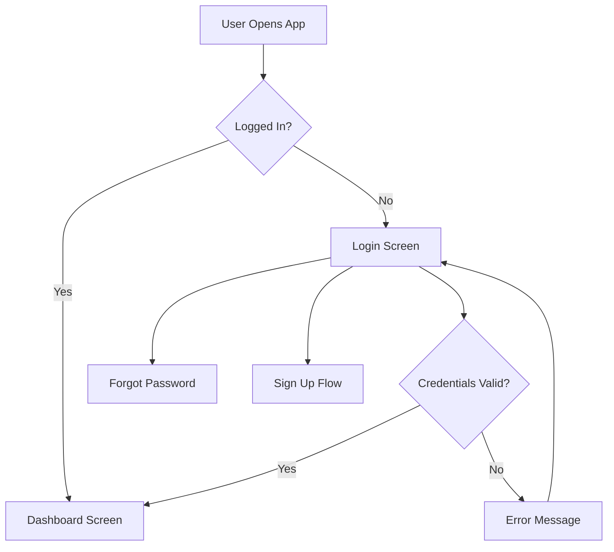

# User Flow Design

Guide for creating user flow diagrams (wireflows) that map navigation paths and screen-to-screen transitions in digital products.

## Process Overview

User flow design follows this sequence:

1. Gather context and understand objectives
2. Conduct pre-design research (if needed)
3. Define flow structure and decision points
4. Create the flow diagram
5. Validate and iterate

## Step 1: Gather Context

Ask targeted questions to understand the product and user needs:

**Product context**
- What product/feature are you designing?
- What problem does it solve?
- Who are the users?

**Flow scope**
- What user action or journey needs mapping?
- Where does the flow start and end?
- Are there existing flows to reference or update?

**Constraints**
- Platform (web, mobile, desktop)?
- Technical limitations?
- Business rules or requirements?

## Step 2: Pre-Design Research

Before creating flows, gather foundational elements. Reference `references/research-checklist.md` for detailed guidance on:

- User research (personas, pain points, use cases)
- Information architecture (hierarchy, navigation structure)
- User stories and jobs-to-be-done
- Flow logic (decision points, conditions, edge cases)
- Content requirements (copy, data, states)
- Technical constraints

**When to skip:** If the user has already completed research or provided sufficient context, proceed to Step 3.

## Step 3: Define Flow Structure

Map out the flow before visualizing:

**Identify key components**
- Entry points (how users enter the flow)
- Core screens/states (main interaction points)
- Decision points (where paths split)
- Actions (user interactions, system responses)
- Exit points (success states, error states, abandonment)

**Consider edge cases**
- Error states and failure paths
- Empty states (no data, first use)
- Loading states
- Permission requirements
- Authentication needs

**Example structure**
```
Entry: App launch
├─ Already logged in? → Dashboard
└─ Not logged in → Login screen
   ├─ Success → Dashboard
   ├─ Forgot password → Password reset flow
   └─ No account → Signup flow
```

## Step 4: Create Flow Diagram

Generate the visual representation using appropriate format:

**Format options**
- Mermaid diagram (for code-based flows)
- Text-based outline (for simple flows)
- Detailed description (for complex flows requiring nuance)

**Mermaid syntax for user flows**


Use `scripts/generate_flow.py` to create Mermaid diagrams programmatically when working with complex flows or multiple variations.

**Flow documentation**
Include for each screen/state:
- Screen name and purpose
- User actions available
- System responses
- Next possible states
- Notes on special conditions

## Step 5: Validate and Iterate

Review the flow for completeness:

**Validation checklist**
- All user paths lead to logical outcomes
- Error states are handled
- Back/cancel actions are defined
- Edge cases are covered
- Flow matches user mental model
- Technical constraints are respected

**Common issues**
- Dead ends (states with no exit)
- Missing error handling
- Unclear decision criteria
- Overly complex paths
- Skipped permission checks

Ask user for feedback and iterate based on real scenarios.

## Flow Types

**Linear flow**
Single path from start to finish. Use for onboarding, tutorials, checkout processes.

**Branching flow**
Multiple paths based on conditions. Use for personalized experiences, multi-role systems.

**Cyclical flow**
Users can loop through states. Use for dashboards, content feeds, iterative processes.

**Hub-and-spoke flow**
Central hub with multiple branches. Use for navigation-heavy apps, settings, multi-feature products.

## Best Practices

**Keep it focused**
- One flow per user goal
- Break complex journeys into sub-flows
- Don't mix different user types in one flow

**Be specific**
- Use concrete screen names, not generic labels
- Define exact conditions for decision points
- Specify system responses, not just user actions

**Show reality**
- Include failure states and errors
- Account for loading times and async operations
- Consider partial data or empty states

**Make it readable**
- Group related screens
- Use consistent naming
- Add annotations for complex logic
- Keep visual hierarchy clear

## Resources

### scripts/generate_flow.py
Python script to generate Mermaid flow diagrams from structured input. Useful for creating consistent flows across multiple features or variations.

### references/research-checklist.md
Comprehensive guide for pre-design research including user research methods, information architecture principles, and content strategy frameworks.
