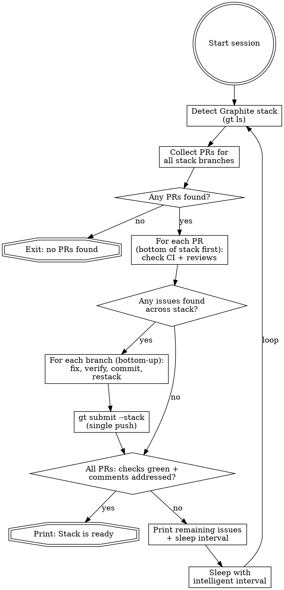

# Babysit PR

Autonomously monitor a PR (or an entire Graphite stack), fix CI failures, respond to review comments, and push verified fixes. Runs as a **long-running session** — loops internally with intelligent sleep intervals until all PRs are ready or the user stops the session.

## Invocation

```
/babysit-pr
```

## Session Loop

The skill runs in a continuous loop:

1. Detect if the current branch is part of a Graphite stack
2. Check PR status (CI + reviews) across all PRs in the stack
3. Fix issues starting from the lowest affected branch
4. If all PRs are ready → print success and exit
5. Otherwise → sleep for an intelligent interval, then repeat



### 1. Detect Graphite Stack

Determine if the current branch is part of a stack:

```bash
gt ls
```

This shows the full stack structure. Parse the output to get the ordered list of branches from bottom (closest to trunk) to top.

If the branch is standalone (not part of a stack), treat it as a single-branch stack — the rest of the flow works the same way.

### 2. Collect PRs Across the Stack

For each branch in the stack (bottom to top), find its PR:

```bash
gh pr view <branch> --json number,url,headRefOid
```

Build a list of `(branch, pr_number, headRefOid)` tuples. Skip branches that don't have PRs yet.

If no PRs exist for any branch, print an error and exit.

### 3. Check CI and Reviews Across All PRs

For **each PR** in the stack (processing bottom-up), run the CI and review checks described in steps 4a–4c below.

Collect all issues into a list tagged by branch, so you know which branch to fix first. Then fix bottom-up per step 4.

#### 3a. Check Required CI

```bash
gh pr checks <pr_number> --json name,state,bucket,link,required
```

- Only act on checks for the **HEAD commit** — verify via `headRefOid`.
- **Fix failures immediately** — don't wait for all checks to finish. If some checks have already failed while others are still pending, fix the failed ones right away. The push will trigger a fresh CI run for everything anyway.
- For each **failing** check (required and optional):
  1. Get logs: `gh run view <run-id> --log-failed`
  2. Investigate the root cause
  3. Fix the code
- If checks are `pending` or `in_progress`, note how long they've been running (use `gh run view <run-id> --json createdAt`) to inform sleep interval.
- Optional check failures are best-effort — fix them if possible, but they do not block the exit condition.

#### 3b. Inline Review Threads

```bash
gh api graphql -f query='
  query($owner: String!, $repo: String!, $pr: Int!) {
    repository(owner: $owner, name: $repo) {
      pullRequest(number: $pr) {
        reviewThreads(first: 100) {
          nodes {
            id
            isResolved
            comments(first: 10) {
              nodes { body author { login } path line }
            }
          }
        }
      }
    }
  }
'
```

#### 3c. General Review Comments

These are top-level review comments — the body text of a review submission, not tied to any specific file or line. They often contain important high-level feedback, architectural concerns, or summary requests.

```bash
gh api repos/{owner}/{repo}/pulls/{pr}/reviews --jq '.[] | select(.body != "" and .body != null) | {id, body, state, user: .user.login}'
```

Also fetch standalone PR comments (conversation tab, not part of a review):

```bash
gh api repos/{owner}/{repo}/issues/{pr}/comments --jq '.[] | {id, body, user: .user.login}'
```

#### Processing Rules

**Skip** any thread/comment that:
- Is resolved (for threads)
- Has already been addressed by the babysitter (last reply is from the bot / starts with 🤖)

**Classify and act on each remaining thread or comment.**

**All replies MUST start with 🤖 to identify as AI-assisted.**

| Type | Signals | Action |
|------|---------|--------|
| Real issue | Bug, correctness problem, missing edge case, security concern | Fix code. Reply: "🤖 Fixed — [description of change]". Resolve thread (if applicable). |
| Scope change | Feature request, style preference, behavioral change | Reply: "🤖 This is outside the scope of this PR. [brief explanation]". Leave open. |
| Non-issue | Misunderstanding, already handled, factually incorrect | Reply: "🤖 [explanation of why this isn't an issue]". Leave open. |

For general review comments, reply using the appropriate API:
- Review comments: `gh api repos/{owner}/{repo}/pulls/{pr}/reviews/{review_id}/comments` or reply to the review
- Issue comments: `gh api repos/{owner}/{repo}/issues/{pr}/comments -f body="..."`

### 4. Fix Issues Bottom-Up

When issues are found across multiple PRs in the stack, **always fix the lowest branch first**. A fix in a lower branch may resolve issues in higher branches after restacking.

**Important: only push once per loop iteration.** Apply all fixes locally, then push the entire stack at the end.

For each branch with issues (bottom to top):

1. **Checkout the branch:** `gt checkout <branch>`
2. **Fix all CI failures and review comments for that branch** (per step 3 rules)
3. **Run targeted local verification** — lint and typecheck the changed files, and run only the tests that exercise the changed code (not the full suite). Use the project's CLAUDE.md/AGENTS.md to determine how to run scoped tests (e.g., passing specific test files, directories, or filter patterns). If verification fails, fix the issue and re-verify until it passes.
4. **Commit locally:** `gt modify --commit`
5. **Restack** so higher branches pick up the changes: `gt restack`
6. Continue to the next branch with issues

After all branches have been fixed:

7. **Push the entire stack once:**
   ```bash
   gt submit --stack
   ```

### 5. Sleep Interval Logic

After each iteration, choose a sleep duration based on current state:

| Situation | Sleep Duration | Rationale |
|-----------|---------------|-----------|
| Just pushed new code, CI not started yet | **2 minutes** | CI needs time to pick up the new commit |
| Some checks failed (already fixed & pushed), others still running | **3 minutes** | Fresh push will re-run everything, check back soon |
| All checks still running, started < 5 min ago | **3 minutes** | Checks are fresh, check back soon |
| All checks still running, started 5-15 min ago | **5 minutes** | Give checks time to complete |
| All checks still running, started > 15 min ago | **5 minutes** | Long-running checks, keep polling steadily |
| All CI green, waiting on reviewer | **10 minutes** | Human response times are slower |
| No actionable items but PR not fully ready | **5 minutes** | Default polling interval |

When babysitting a stack, base the interval on the **most urgent** situation across all PRs (i.e., use the shortest applicable sleep).

Print the chosen interval and reason before sleeping: `"Sleeping {N} minutes — {reason}"`

Use shell `sleep` for the wait (e.g., `sleep 300` for 5 minutes).

### 6. Exit Condition

**All PRs in the stack** are ready when:
- All **required** CI checks are passing on HEAD for every PR
- All review threads across all PRs are either resolved OR have a babysitter reply as the last comment
- All general review comments across all PRs have been addressed (babysitter reply exists)

Optional check failures do **not** block this exit condition. If optional checks are still failing when the exit condition is met, note them in the output but still declare the stack ready.

Print: **"All required checks passing and all review comments addressed across the stack. PRs are ready."**

## Common Mistakes

- **Acting on stale CI results** — Always verify checks are for the HEAD commit before investigating failures. If checks are pending, wait.
- **Replying to the same comment twice** — Check if the last reply in a thread is already from the babysitter before responding.
- **Pushing without local verification** — Always run the project's verification commands before `gt modify --commit`.
- **Resolving threads you shouldn't** — Only resolve threads where you fixed a real issue. Leave scope-change and non-issue threads open for the reviewer.
- **Missing general review comments** — Don't only check inline threads. Always also fetch top-level review bodies and issue comments — reviewers often put their most important feedback there.
- **Sleeping too long after pushing** — After pushing a fix, use a short interval so you catch CI results quickly.
- **Fixing the wrong branch in a stack** — Always fix the lowest branch that has the issue. Fixing higher up can cause merge conflicts or get overwritten by a restack.
- **Pushing multiple times per loop** — Fix all branches locally first (`gt modify --commit` + `gt restack` for each), then push once with `gt submit --stack`. Multiple pushes waste CI cycles and create race conditions.
- **Forgetting to restack after fixing** — After modifying a branch in the middle of a stack, always `gt restack` before moving to the next branch so higher branches pick up the changes.
- **Assuming higher branches are unaffected** — After fixing and restacking, re-check all PRs from scratch. The restack may introduce new CI failures in higher branches.
