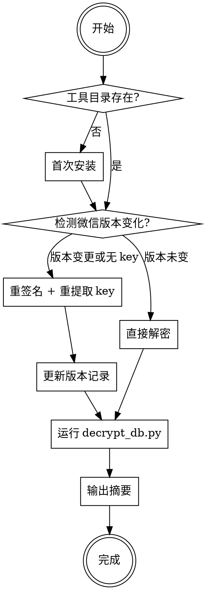

# wechat-exporter

导出、解密微信聊天记录，输出结构化 SQLite 数据库，供 MCP 工具查询使用。

## 决策流程



---

## 路径常量

| 变量 | 路径 |
|------|------|
| 工具目录 | `~/wechat-decrypt-macos/` |
| Python | `~/wechat-decrypt-macos/.venv/bin/python` |
| 扫描器 | `~/wechat-decrypt-macos/find_all_keys_macos` |
| 密钥文件 | `~/wechat-decrypt-macos/all_keys.json` |
| 版本记录 | `~/wechat-decrypt-macos/.wechat_version` |
| config | `~/wechat-decrypt-macos/config.json` |
| 解密输出 | `~/wechat-decrypt-macos/decrypted/` |

---

## Step 1：检查工具目录

```bash
ls ~/wechat-decrypt-macos/
```

若目录不存在或缺少关键文件（`.venv/`、`find_all_keys_macos.c`、`decrypt_db.py`），执行首次安装流程。

---

## Step 2：首次安装（仅首次需要）

```bash
# 2.1 安装系统依赖
brew install sqlcipher

# 2.2 克隆主仓库
git clone https://github.com/cocohahaha/wechat-decrypt-macos.git ~/wechat-decrypt-macos
cd ~/wechat-decrypt-macos

# 2.3 下载解密脚本（ylytdeng/wechat-decrypt）
curl -sL https://raw.githubusercontent.com/ylytdeng/wechat-decrypt/main/find_all_keys_macos.c -o find_all_keys_macos.c
curl -sL https://raw.githubusercontent.com/ylytdeng/wechat-decrypt/main/decrypt_db.py -o decrypt_db.py
curl -sL https://raw.githubusercontent.com/ylytdeng/wechat-decrypt/main/config.py -o config.py
curl -sL https://raw.githubusercontent.com/ylytdeng/wechat-decrypt/main/key_utils.py -o key_utils.py

# 2.4 创建 Python 虚拟环境并安装依赖
python3 -m venv .venv
.venv/bin/pip install "mcp[cli]>=1.0.0" pycryptodome

# 2.5 编译内存扫描器
cc -O2 -o find_all_keys_macos find_all_keys_macos.c -framework Foundation

# 2.6 修改 server.py 读取明文数据库（见"server.py 必要修改"一节）

# 2.7 注册 MCP Server
claude mcp add -s user wechat \
  ~/wechat-decrypt-macos/.venv/bin/python \
  ~/wechat-decrypt-macos/server.py
```

**首次安装后还需要**：
1. 系统设置 → 隐私与安全性 → 完全磁盘访问权限 → 添加当前终端
2. 继续执行 Step 3

---

## Step 3：检测微信版本变化

```bash
CURRENT=$(defaults read /Applications/WeChat.app/Contents/Info.plist CFBundleShortVersionString)
STORED=$(cat ~/wechat-decrypt-macos/.wechat_version 2>/dev/null || echo "")
echo "当前版本: $CURRENT  存档版本: $STORED"
```

- 若 `CURRENT == STORED` 且 `all_keys.json` 存在 → 跳到 Step 5（直接解密）
- 否则 → 执行 Step 4（重签名 + 重提取）

---

## Step 4：重签名 + 提取密钥（版本变更时）

```bash
# 4.1 确认微信已登录
pgrep -l WeChat  # 必须有进程，否则提示用户先登录

# 4.2 重签名（如果是微信更新后第一次运行）
# ⚠️ 重签名前需退出微信，然后重新启动登录
sudo codesign --force --deep --sign - /Applications/WeChat.app
# 重新启动微信并等待用户登录

# 4.3 提取密钥（需要 sudo，必须让用户手动在终端执行）
cd ~/wechat-decrypt-macos
sudo ./find_all_keys_macos
# 输出 all_keys.json，包含各数据库的加密密钥

# 4.4 更新版本记录
echo "$CURRENT" > ~/wechat-decrypt-macos/.wechat_version
```

> ⚠️ `sudo ./find_all_keys_macos` 需要用户手动在终端执行（需要密码），Agent 无法替代。
> 提示用户执行后粘贴输出内容确认成功。

---

## Step 5：确定账号目录并更新 config.json

```bash
# 找到最近活跃的账号目录（当前登录账号）
ls -lt ~/Library/Containers/com.tencent.xinWeChat/Data/Documents/xwechat_files/ | \
  grep -v "^total\|Backup\|all_users\|old_backup" | head -5
```

选择 `db_storage/message/message_0.db` 修改时间最新的目录，写入 config.json：

```bash
ACCOUNT_DIR="<确认的账号目录名>"  # 例如 robbinfankai_f79d
cat > ~/wechat-decrypt-macos/config.json << EOF
{
    "db_dir": "$HOME/Library/Containers/com.tencent.xinWeChat/Data/Documents/xwechat_files/${ACCOUNT_DIR}/db_storage",
    "keys_file": "$HOME/wechat-decrypt-macos/all_keys.json",
    "decrypted_dir": "$HOME/wechat-decrypt-macos/decrypted",
    "wechat_process": "WeChat"
}
EOF
```

---

## Step 6：运行解密

```bash
cd ~/wechat-decrypt-macos
.venv/bin/python decrypt_db.py
```

期望输出：`结果: N 成功, 1 失败` 或类似（1 失败为正常，`migrate/unspportmsg.db` 无密钥）。

---

## Step 7：输出导出摘要

解密完成后查询以下内容并展示给用户：

```bash
# 个人好友数（local_type=1 = 真实好友，排除公众号和群）
/usr/bin/sqlite3 ~/wechat-decrypt-macos/decrypted/contact/contact.db \
"SELECT count(*) FROM contact
 WHERE delete_flag=0 AND local_type=1
 AND username NOT LIKE 'gh_%'
 AND username NOT LIKE '%@chatroom';"

# 消息数据库文件数及总大小
ls ~/wechat-decrypt-macos/decrypted/message/message_[0-9]*.db | wc -l
du -sh ~/wechat-decrypt-macos/decrypted/message/

# 最新消息时间（从 session.db 查，比从 Msg_ 表查更可靠）
/usr/bin/sqlite3 ~/wechat-decrypt-macos/decrypted/session/session.db \
"SELECT datetime(max(last_timestamp), 'unixepoch', '+8 hours') FROM SessionTable;"
```

**输出摘要格式示例**：
```
✅ 微信聊天记录导出完成
━━━━━━━━━━━━━━━━━━━━━━━━
个人联系人：2,540 人
消息数据库：12 个分片
数据库总大小：约 380MB
最新消息时间：2026-04-17 11:28
━━━━━━━━━━━━━━━━━━━━━━━━
MCP 工具已就绪，可直接查询。
```

---

## 数据库结构说明

### 消息分片（message_*.db）

分片按**时间段**切割，不是按联系人。`message_0.db` 是主力库（含最近一年大多数会话），编号越大一般越老，但**不是严格线性**——某些编号（如 message_4.db）可能存放最近新建会话的溢出数据，反而比 message_0.db 更新：

| 分片 | 时间范围（实测示例） |
|------|---------------------|
| message_4.db | 2026-04（最新溢出，28 个新会话） |
| message_0.db | 2025-04 ~ 2026-04（主力库，629 个会话） |
| message_1.db | 2024-04 ~ 2025-04 |
| message_2.db | 2023-06 ~ 2024-02 |
| message_5~7.db | 2019~2022 年的历史数据 |

统计最新消息时间应查 `session.db`，不要只取某张 Msg_ 表（该表可能是老会话）。

### Msg_ 表名与联系人的映射关系

`message_*.db` 中每个联系人的消息存在独立的表里，命名为 `Msg_<hash>`。

- `<hash>` = 联系人 `username` 的 **MD5**
- `Name2Id` 表只存 `user_name`（无 hash 列），需自行计算反查：

```python
import hashlib, sqlite3

conn = sqlite3.connect("message_0.db")
cur = conn.cursor()
cur.execute("SELECT user_name FROM Name2Id")
md5_to_user = {
    hashlib.md5(row[0].encode()).hexdigest(): row[0]
    for row in cur.fetchall()
}
# md5_to_user["6925d39..."] → "wxid_bc95l9h68t6z22"
```

### contact 表 local_type 含义

| local_type | 含义 |
|------------|------|
| 1 | 真实好友（双向添加） |
| 3 | 有过消息往来但未必是好友（含群聊中的非好友） |
| 0 | 服务号、系统通知 |

统计"个人好友"用 `local_type=1`，再排除 `gh_` 开头（公众号）和 `@chatroom`（群）。

---

## server.py 必要修改

首次安装时需修改 `~/wechat-decrypt-macos/server.py`，让其读取明文数据库而非加密库：

**修改点 1**：配置区（文件顶部约第15行）
```python
# 改为：
SQLCIPHER_PATH = "/usr/bin/sqlite3"
DECRYPTED_DIR = os.path.join(os.path.dirname(__file__), "decrypted")
```

**修改点 2**：`_load_key()` 函数
```python
def _load_key() -> str:
    return ""
```

**修改点 3**：`_find_data_dir()` 函数
```python
def _find_data_dir() -> str:
    if not os.path.isdir(DECRYPTED_DIR):
        raise FileNotFoundError(f"解密目录不存在: {DECRYPTED_DIR}")
    return DECRYPTED_DIR
```

**修改点 4**：`_preamble()` 函数
```python
def _preamble(key: str) -> str:
    return ""
```

**修改点 5**：`_test_key()` 函数
```python
def _test_key(key: str, db_path: str) -> bool:
    if not os.path.exists(db_path):
        return False
    try:
        result = subprocess.run(
            [SQLCIPHER_PATH, db_path, "SELECT count(*) FROM sqlite_master;"],
            capture_output=True, timeout=5,
        )
        return result.returncode == 0
    except Exception:
        return False
```

**修改点 6**：`_get_message_dbs()` 函数（支持 message_10/11 等多位数）
```python
def _get_message_dbs() -> list[str]:
    data_dir = _find_data_dir()
    pattern = os.path.join(data_dir, "message", "message_*.db")
    dbs = [
        db for db in glob.glob(pattern)
        if os.path.basename(db).replace("message_", "").replace(".db", "").isdigit()
    ]
    return sorted(dbs, key=lambda p: int(os.path.basename(p).replace("message_", "").replace(".db", "")))
```

---

## 常见问题

| 问题 | 原因 | 处理方式 |
|------|------|---------|
| `HMAC 验证失败` | config.json 指向错误账号目录 | 重新确认当前登录账号，更新 db_dir |
| `0/N keys found` | 微信版本更新改变内存布局 | 重签名 + 重新运行扫描器 |
| `lldb attach 失败` | 微信未重签名 | `sudo codesign --force --deep --sign - /Applications/WeChat.app` |
| 消息查询为空 | server.py 未修改 | 按"server.py 必要修改"一节重新修改 |
| MCP 工具无法调用 | 未重启 Claude Code | 重启后 MCP 自动加载 |
| 扫描结果有大量 `(unknown)` key | 本机有多个微信账号，扫描器发现所有账号的 key，但只能对应主账号的文件路径 | 正常现象，不影响主账号解密 |
