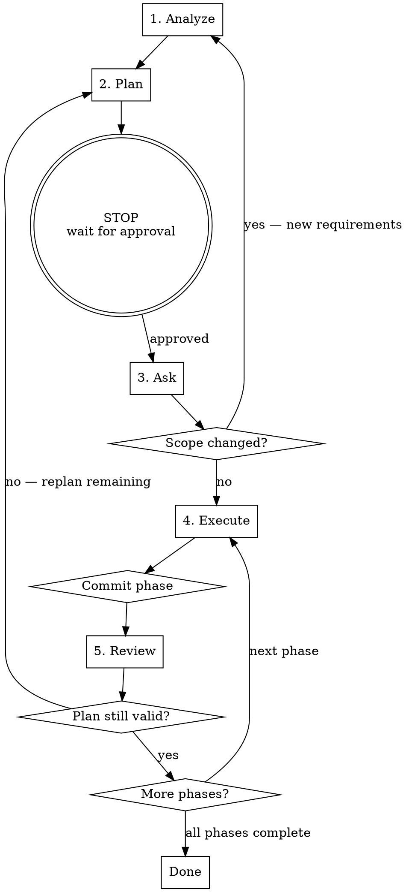

# Spec-Driven Development

## Overview

**Think First, Prompt Second.** Enforces a structured 5-phase cycle that prevents vibe coding: **Analyze -> Plan -> Ask -> Execute -> Review**. Every implementation starts from a spec, respects existing codebase patterns, and delivers small, reviewable, committed phases.

## When to Use

- Feature implementation from a spec or requirements doc
- Multi-phase work spanning multiple files or architectural layers
- Any task where "just start coding" leads to drift, over-scoping, or pattern violations

**Do NOT use for:** single-line fixes, typos, config changes, pure research, or tasks with very specific line-level instructions. If the user asks a direct question or gives a specific fix, respond directly — don't invoke this workflow.

## Required Input

You need a **spec** — not loose tickets or vague descriptions. Minimum viable spec:
- **What** to build (feature description, acceptance criteria)
- **Why** it matters (context, user value)
- **Constraints** (tech stack, patterns to follow, performance requirements)

If the user provides a loose request, ask them to clarify into a spec before proceeding.

## The 5-Phase Workflow



---

### Phase 1 — Analyze

**Goal:** Understand the spec AND the codebase before touching anything.

1. **Understand the spec** — read it fully, restate in your own words, list acceptance criteria (explicit and implied), note gaps
2. **Analyze the codebase** — map architecture, directory structure, key modules, conventions (naming, error handling, test patterns), tech stack
3. **Find similar implementations** — search for existing code doing something similar. Note file paths + line numbers for anything to reuse or follow. Check if the feature partially exists already. **This is critical — search before writing.**
4. **Identify integration points** — where does this connect to existing code? APIs, schemas, shared state, internal/external dependencies
5. **Assess risks** — what could break? Performance, security, breaking changes, missing test coverage

**Output — Analysis Summary:**
```
### Spec Understanding
[Restated spec + acceptance criteria list]

### Codebase Findings
- Architecture: [overview]
- Conventions: [naming, patterns, structure]
- Tech stack: [frameworks, tools]

### Similar Implementations Found
- [file:line] — [what it does, relevance]

### Integration Points
- [module/file] — [how the feature connects]

### Risks & Concerns
- [risk] — [severity, mitigation]

### Open Questions
- [questions needing clarification]
```

**Rules:**
- DO NOT write implementation code
- DO NOT suggest solutions — that's for the planning phase
- DO search thoroughly — find existing patterns before anything else
- DO note file paths with line numbers

---

### Phase 2 — Plan

**Goal:** Break work into small, ordered, committable phases.

1. **Define phases** — each must change <200 lines, be independently committable (no broken state), build on previous phases, have a testable outcome. Order by dependency: foundational first, integration last.
2. **Detail each phase** — scope (one sentence), files to modify/create (exact paths), patterns to follow (reference file:line from analysis), tests to write/update, pre-written commit message
3. **Identify dependencies** — which phases block which? Any parallelizable?

**Keep the plan concise.** One-line scope per phase. No prose.

**Output — Implementation Plan:**
```
### Overview
[1-2 sentence summary. Total phases: N]

### Phase 1: [Short Title]
- Scope: [one sentence]
- Files: modify [path], create [path]
- Pattern: [path:line] — [follow this for...]
- Tests: [what to test]
- Commit: `feat(scope): description (phase 1/N)`

### Phase 2: [Short Title]
...

### Dependencies
- Phase 2 depends on Phase 1
- Phases 3-4 can run in parallel
```

**Rules:**
- DO NOT write implementation code — only describe what to do
- DO reference existing patterns by file path + line
- DO keep phases small — >200 lines means split
- DO pre-write commit messages (subject line only)
- Plan must cover the full spec — no acceptance criteria left unaddressed
- If the analysis has open questions, flag them — don't plan around assumptions

**STOP and wait for user approval before executing.**

---

### Phase 3 — Ask

No special process — this is a natural conversation pause.

Surface:
- Spec ambiguities or contradictions
- Architectural decisions with multiple valid approaches (present options)
- Missing acceptance criteria
- Edge cases the spec doesn't cover

**Rule: Never assume. If uncertain, ask.** If nothing is ambiguous, state "No open questions" and proceed.

**Loop-back rule:** If the user's answers reveal new requirements or significantly change scope, go back to **Phase 1 — Analyze** to re-assess the codebase with the new context. If answers only affect the plan (not the analysis), go back to **Phase 2 — Plan** to adjust.

---

### Phase 4 — Execute

**Goal:** Implement one phase at a time, following existing patterns.

1. **Review the phase** — re-read scope, files, pattern references. Check referenced pattern files before writing
2. **Implement** — follow existing codebase patterns (naming, structure, error handling, style). Before writing new code, verify no existing utility already does it. Write only what the phase requires. Write tests as specified
3. **Self-check** — does implementation match phase scope? Did I follow referenced patterns? Tests passing? Only planned files changed? Unintended side effects?
4. **Commit** — subject-line only: `feat(<scope>): <description> (phase N/M)`

**Rules:**
- **ONE phase only** — do not bleed into the next phase
- **Follow existing patterns** — read referenced files first, match their style
- **Minimal changes** — if it's not in the phase scope, don't touch it
- **No refactoring** — unless the plan explicitly includes it
- **Search before writing** — check if a utility/helper already exists
- If you discover something outside phase scope, note it but don't do it — flag for a future phase

---

### Phase 5 — Review

**Goal:** Verify the phase against spec acceptance criteria.

1. **Spec compliance** — does this phase meet its acceptance criteria? Does implementation match spec intent, not just the letter?
2. **Code quality** — bugs, edge cases (empty inputs, boundaries, error states), error handling, type safety, naming consistency
3. **Architecture** — follows referenced patterns? No drift from plan? Code in right layer/module? Dependencies flowing correctly?
4. **Test coverage** — tests cover new behavior? Edge cases tested? Tests follow existing patterns? Tests are meaningful?
5. **Scope** — changes stayed within phase scope? Files match the plan? No bonus refactors?

**Output — Phase Review:**
```
### Status: PASS | ISSUES FOUND

### Spec Compliance
- [criterion]: PASS/FAIL — [details]

### Issues (if any)
1. [severity]: [description] — [file:line] — [fix]

### Scope: [OK | drift details]

### Recommendation: PROCEED | FIX [list]
```

**Rules:**
- Be specific — cite file paths and line numbers
- Prioritize — critical first, notes last
- Don't nitpick style that matches codebase conventions
- Review against the plan, not personal preference
- Flag any scope creep as an issue
- Critical issues must be fixed before proceeding

**Loop-back rule:** If review reveals architectural issues or plan assumptions that were wrong, go back to **Phase 2 — Plan** to re-plan the remaining phases. Don't force a broken plan — adjust it.

**Multi-agent review (on request):** If the user asks for thorough review, assess from three perspectives sequentially — architecture (patterns, separation of concerns, API design), code quality (bugs, edge cases, test coverage), and security (auth, input validation, injection, OWASP top 10). Synthesize into a single report.

---

## Anti-Patterns This Skill Prevents

| Anti-Pattern | Prevention |
|---|---|
| Vibe coding | Mandatory Analyze + Plan before any code |
| Over-scoping | Phase boundaries enforce <200 lines, minimal changes |
| Pattern violations | Analyzer searches for existing patterns first |
| Reinventing the wheel | Analyzer finds similar implementations to reuse |
| Big-bang commits | Phase-by-phase commits enforced |
| Spec drift | Reviewer checks against spec acceptance criteria |
| Assuming requirements | Ask phase surfaces ambiguities before coding |

## Red Flags — STOP and Recheck

- Writing code before completing analysis
- Skipping the plan approval step
- Changing files not listed in the current phase
- Committing more than one phase's work
- Not searching for existing patterns before writing new code
- Assuming what the user wants instead of asking

## Failure Diagnostics

| Symptom | Cause | Fix |
|---|---|---|
| Doesn't match spec | Rushed Phase 1 | Redo analysis, restate spec |
| Inconsistent patterns | Skipped pattern search | Run analysis again |
| Too many files changed | Phases too large | Re-split into smaller phases |
| User surprised by approach | Skipped approval | Always stop for plan review |
| Major issues in review | Phase scope too large | Smaller phases |
