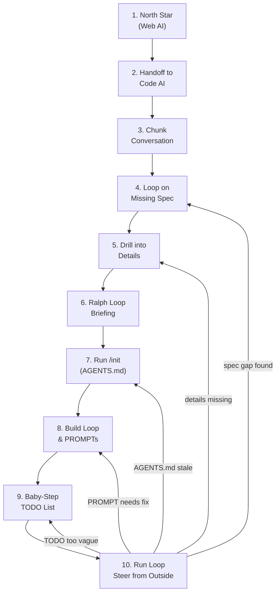

# AI Collaborative Development

A structured 10-step methodology for building software entirely with AI collaboration. The key insight: the build agent only ever reads messages written by another AI - your writing style, syntax errors, and typos never reach it. You steer from outside.

## When to use me

Use this methodology when starting a new project that will be built primarily or entirely by AI agents. Especially valuable when you want to:

- Build something complex without writing the code yourself
- Ensure the AI has enough context to make good decisions autonomously
- Reduce the back-and-forth of constant manual supervision
- Get a production-quality spec before a single line of code is written

## What I do

- Guide you through a 10-step methodology from idea to running code
- Provide scripts for chunking AI conversations, generating BMAD spec templates, and building TODO structures
- Explain *why* each step matters, not just what to do
- Prepare your project for a Ralph loop so the build agent can run without you

## Workflow Overview



Step 10 is not the end — it is the steering point. When the loop stalls or a requirement changes, go back to whichever earlier step owns the problem. Never edit the build agent session directly.

## The 10-Step Methodology

### Step 1 — Start outside the editor

Use a web AI (Gemini, ChatGPT, Claude, Grok, DeepSeek) to develop the north star of the project. This is not a coding session — it is a thinking session. Capture:

- The soul of what you are building
- The core problems it solves
- Who uses it and why they care
- What success looks like

Do not open your editor yet.

### Step 2 — Transition to the code AI

Tell your code AI (OpenCode, Claude Code, Cursor, etc.) that you had a conversation with another AI and are about to pass the context. This primes it to receive structured input rather than expecting a normal user prompt.

Example handoff message:
```
I've been working with another AI to design a project. I'm going to share that conversation
with you one message at a time so you can build a comprehensive spec. Please acknowledge
each message and start building context.
```

### Step 3 — Send the web AI conversation in chunks

Send the conversation **one exchange at a time**: one human message, then one AI response, then pause. Ask the code AI to build specs in BMAD style with "exhaustive verbosity" — meaning every detail should be captured, not summarized.

Why chunks work: A wall of text causes the AI to skim. Chunking forces it to process each idea fully before receiving the next.

```bash
# Use the chunk helper to split a saved conversation
bash scripts/chunk-conversation.sh conversation.txt
```

### Step 4 — Loop on missing spec

This is a long loop. The goal is an airtight spec before any code is written.

1. Ask: "What is missing from this spec? What decisions have we not made?"
2. Have the AI ask you clarifying questions
3. Answer them
4. Repeat until questions stop surfacing

Then bring in an adversarial agent (DeepSeek R1 or similar - large model, strong reasoning) to pressure test the spec:

```
Here is our spec. Act as a senior engineer who has seen projects fail.
What assumptions are we making that could kill this project?
What edge cases have we ignored? What will break at scale?
```

Loop until the adversarial agent can no longer find significant gaps.

### Step 5 — Drill into implementation details

Once the general spec is solid, go deeper on areas the AI typically misses:

- Language and runtime selection (with justification)
- Database options and tradeoffs, chosen schema design
- API structure: endpoints, request/response shapes, auth model
- Error handling and failure modes
- Configuration and environment variables
- File structure and module boundaries
- Deployment and infrastructure requirements

Ask the code AI: "What would a senior engineer need to know before writing the first line?"

### Step 6 — Ralph loop briefing

Tell the agent it will use a Ralph loop to build this project. Have it research what a Ralph loop is (point it at the `ralph-wiggum-loop` skill). Then explain:

> "100% of the code in this project will be AI-written. There will be no human supervision during the build. Every ambiguity must be resolved now. Every edge case must be handled in the spec. We will not be able to answer questions mid-build."

Run multiple adversarial loops on the resulting spec — one focused on the implementation plan, one on the PROMPT.md files the Ralph loop will use, one on the TODO structure.

Key questions to pressure test:
- "Can a build agent execute this TODO item without asking a question?"
- "Does this PROMPT.md give the agent enough context to succeed without human help?"
- "What will the agent do when it hits an error on step 7 of 20?"

### Step 7 — Run `/init`

Run `/init` (or equivalent in your code AI) to build the `AGENTS.md` or `agent.md` file. This file:

- Summarizes the project for agents that haven't seen the full conversation
- Acts as a central notes location
- Is especially useful for less capable models that struggle with long context
- Should include: project goal, tech stack, file structure, conventions, how to run the project

Review and extend this file manually — it is the single most important context document for your build agents.

### Step 8 — Build the Ralph loop and PROMPT files

Generate a Ralph loop scaffold:

```bash
bash scripts/setup-ralph-project.sh ./my-project
```

Then write PROMPT.md files for each agent role. Each prompt must:

- State the agent's role clearly
- Reference the spec explicitly ("Read SPEC.md section 3 before starting")
- Follow software development lifecycle discipline (plan, implement, test, verify)
- Describe how to handle errors and failures
- Say what "done" looks like for a given phase

Example structure:
```
project/
├── TODO.md                    # Tasks in - [ ] format, ordered
├── SPEC.md                    # The exhaustive spec from steps 1-6
├── AGENTS.md                  # Agent context from step 7
├── .memory-bank/
│   ├── inbox/
│   │   ├── builder/PROMPT.md      # Implements TODO items
│   │   ├── verifier/PROMPT.md     # Runs tests, checks requirements
│   │   └── planner/PROMPT.md      # Updates TODO when stuck
│   ├── system/                    # Auto-generated: rules, roles, patterns
│   │   ├── MEMORY_RULES.md        # How the system learns and organizes
│   │   ├── CONTEXT_PATTERNS.md    # Detected context patterns and templates
│   │   └── RETRIEVAL_GUIDE.md     # How to find information in the bank
│   └── evolution/                 # Auto-generated: how memory has grown
│       ├── DECISION_LOG.md        # Why memory structure changed
│       └── LEARNED_HEURISTICS.md  # Patterns the system discovered
└── ralph-loop.py              # Generated loop runner
```

### Step 9 — Build the TODO list with baby steps

The TODO list is where most Ralph loops fail. Items must be:

- **Small**: Fits in one agent context window without compacting
- **Unambiguous**: The agent knows exactly what done looks like
- **Ordered**: Dependencies are respected
- **Referenced**: Each item cites the relevant spec section

Bad TODO item:
```
- [ ] Build the authentication system
```

Good TODO item:
```
- [ ] Implement JWT token generation per SPEC.md section 4.2.
  Create src/auth/tokens.py with generate_token(user_id, expiry) and verify_token(token).
  Token payload must include: sub, iat, exp, role. Use HS256. Secret from env JWT_SECRET.
  Tests in tests/test_tokens.py. All tests must pass before marking complete.
```

Use an adversarial agent to review the TODO list:

```
Review this TODO list. Can each item be completed by a build agent working alone,
with no human available to answer questions? Flag any item that requires a decision,
has an ambiguous success condition, or depends on something not yet built.
```

### Step 10 — Run the loop, steer from outside

Start the Ralph loop:

```bash
python ralph-loop.py loop --commit
```

When changes are needed — because the agent got stuck, a requirement changed, or something broke — **do not intervene in the agent session directly**. Instead, go back to whichever earlier step owns the problem:

| Symptom | Go back to |
|---|---|
| Agent asks questions or guesses wrong | Step 4 — spec has gaps, run another missing-spec loop |
| Agent makes wrong implementation choices | Step 5 — drill deeper on that area |
| Agent lacks project context between runs | Step 7 — update AGENTS.md |
| Agent misunderstands its role or phase | Step 8 — rewrite the relevant PROMPT.md |
| Agent stalls or marks wrong tasks done | Step 9 — rewrite the TODO item with clearer success criteria |

After updating the relevant file, let the loop pick up on the next iteration. Do not restart from scratch — the loop will read the updated files automatically.

**The core principle**: The build agent only ever sees messages written by the other AI. Your writing style, syntax errors, and stream-of-consciousness are excluded from what it reads. This keeps the signal clean and the context usable.

Step 10 is not a finish line — it is a steering loop. You will visit earlier steps multiple times on any non-trivial project. That is expected and correct.

## Scripts

### `scripts/chunk-conversation.sh`
Split a saved AI conversation file into numbered chunks ready to paste one at a time.

```bash
bash scripts/chunk-conversation.sh conversation.txt
# Creates chunks/chunk-001.txt, chunk-002.txt, ...
```

### `scripts/setup-ralph-project.sh`
Scaffold a new project with the Ralph loop structure, empty PROMPT.md files, and a starter TODO.md.

```bash
bash scripts/setup-ralph-project.sh ./my-project
```

### `scripts/validate-todo.sh`
Check a TODO.md for items that are too vague or missing success criteria.

```bash
bash scripts/validate-todo.sh TODO.md
```

## Output format

After completing the methodology you will have:

```
my-project/
├── SPEC.md          # Exhaustive spec covering all decisions
├── AGENTS.md        # Agent context document
├── TODO.md          # Baby-step task list with success criteria
├── ralph-loop.py    # Working loop runner
└── memory-bank/
    └── inbox/
        ├── builder/PROMPT.md
        ├── verifier/PROMPT.md
        └── planner/PROMPT.md
```

The loop can run without you present. When it finishes, you have working code.

## Self-Expanding Memory Bank

The `.memory-bank/` directory is not just storage — it is a **self-improving system**. The prompt files provide the seed, but the system grows its own rules, roles, and organizational patterns based on accumulated project knowledge.

### How Self-Expansion Works

**1. Seed Structure (You Provide)**
```
.memory-bank/
├── inbox/
│   ├── builder/PROMPT.md      # Role and initial guidance
│   ├── verifier/PROMPT.md
│   └── planner/PROMPT.md
```

**2. Auto-Generated System Files (AI Maintains)**

As the project accumulates information, the AI creates and maintains:

- **MEMORY_RULES.md** — Rules for what to save, where, and why. Starts from prompt guidance but expands based on patterns seen.
- **CONTEXT_PATTERNS.md** — Templates for common context types the project uses.
- **RETRIEVAL_GUIDE.md** — How to find things: "For API questions, check SPEC.md section 4; for conventions, check AGENTS.md lines 20-40."
- **DECISION_LOG.md** — Why the memory structure changed: "Created `domain/` subdirectory after discovering 15+ API endpoint docs were cluttering root."
- **LEARNED_HEURISTICS.md** — Patterns the system discovered: "When TODO item mentions 'fix', previous context usually includes an error log."

**3. Expansion Triggers**

The system auto-expands when:

- **Information volume crosses threshold**: "30+ files in inbox/ → create subdirectories by domain"
- **Retrieval patterns detected**: "User asks for 'config' → 90% of time they want ENV_VARS.md"
- **Ambiguity detected**: Two files seem to serve same purpose → create CLARIFICATION.md explaining distinction
- **New information type**: First time seeing a decision record → create DECISION_LOG.md template

**4. User Steering (Not Control)**

You don't micromanage the memory structure. Instead:

- **Ask for rationale**: "Why did you create a `domain/` subdirectory?"
- **Request consolidation**: "The split between `api/` and `endpoints/` is confusing — merge them."
- **Suggest patterns**: "We keep asking about auth — create a canonical AUTH_GUIDE.md."

The AI decides *how* to implement your guidance (which subdirectory, what format) based on accumulated MEMORY_RULES.

**5. Prompt Template for Self-Expanding Memory**

Add to your PROMPT.md files:

```markdown
## Memory Bank Management

You maintain a `.memory-bank/` directory that improves itself:

1. **Save new learnings**: After each task, ask: "What did I learn that future agents need?"
   - Technical decisions → save to `system/DECISION_LOG.md`
   - Context patterns → save to `system/CONTEXT_PATTERNS.md`
   - Retrieval shortcuts → save to `system/RETRIEVAL_GUIDE.md`

2. **Organize when cluttered**: If a directory has 20+ files, suggest a reorganization.
   - Propose new structure in `system/DECISION_LOG.md`
   - Wait for user confirmation before moving files

3. **Detect gaps**: If you can't find something, note it:
   - "Searched for API rate limits → not found. Should add to SPEC.md?"
   - Save search pattern to `system/LEARNED_HEURISTICS.md`: "Common missing: rate limiting details"

4. **Evolve rules**: As patterns emerge, update MEMORY_RULES.md:
   - "Previously: save all docs to inbox/. Now: categorize by domain."

The memory bank should feel like a colleague left you notes — not a filing cabinet you have to decode.
```

## Notes

- Steps 1-6 are the most important. Most AI projects fail because they skip to code too fast.
- The adversarial agent (DeepSeek recommended) is not optional - it catches what you and the code AI both miss.
- A Ralph loop with a bad TODO list will spin forever. Invest time in Step 9.
- The `/init` agent.md is especially valuable when switching models or resuming work after a break.
- If the loop gets stuck more than 3 times on the same item, the spec is missing something - go back to the spec, not the code.
