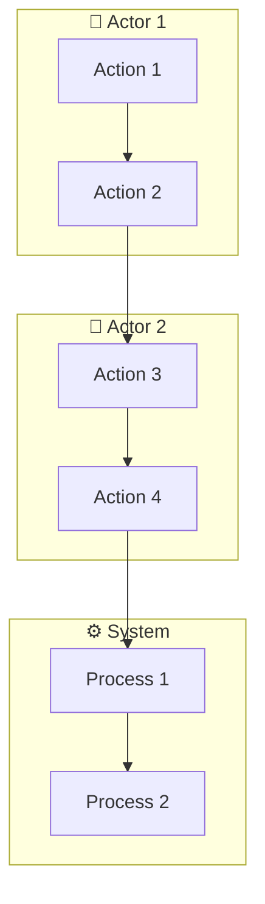

# Product Workflow

Complete product design workflow: Requirements Analysis → Swimlane Diagram → Prototype Design.

## When to Use

- User provides a requirements document or feature list
- User needs to analyze and refine requirements
- User needs swimlane diagrams for business processes
- User needs wireframes or prototypes
- User wants complete product design workflow

## Workflow Overview

```
┌─────────────────┐     ┌─────────────────┐     ┌─────────────────┐
│  Requirements   │ ──► │   Swimlane      │ ──► │   Prototype     │
│    Analysis     │     │    Diagram      │     │     Design      │
└─────────────────┘     └─────────────────┘     └─────────────────┘
```

## Phase 1: Requirements Analysis

### Objective
Transform vague requirements into validated, actionable specifications.

### Analysis States

| State | Name | Symptoms | Actions |
|-------|------|----------|---------|
| RA0 | No Problem Statement | Starts with "I want to build X" | Identify the actual problem |
| RA1 | Solution-First Thinking | Describes implementation, not needs | Extract functions, remove solutions |
| RA2 | Vague Needs | "Users should be able to..." without specifics | Add specificity, acceptance criteria |
| RA3 | Hidden Constraints | Discovering blockers mid-implementation | Create constraint inventory |
| RA4 | Scope Creep | Requirements expanding without priority | Apply MoSCoW prioritization |
| RA5 | Validated | Clear problem, testable requirements | Ready for design phase |

### Key Questions

**Problem Discovery:**
- What's the problem you're solving?
- Who has this problem? (Be specific)
- What do they do today without this solution?
- Why hasn't this been solved before?

**Need Clarification:**
- What must the solution accomplish?
- How would you know if it's working?
- What's the minimum viable version?

**Constraint Discovery:**
- What's your actual time/skill budget?
- What must this integrate with?
- What assumptions haven't been validated?

**Scope Definition:**
- What's in V1 vs. later?
- What would you cut if forced?
- What's explicitly NOT in scope?

### Output Artifacts

1. **Problem Statement Brief**
   - Core problem description
   - Target users
   - Current alternatives and their limitations

2. **Need Hierarchy**
   - Must-have (V1)
   - Should-have
   - Could-have
   - Won't-have (deferred)

3. **Constraint Inventory**
   - Real constraints (budget, time, skills)
   - Assumptions (validated vs. unvalidated)
   - Dependencies

4. **Validated Requirements Document**
   - Testable requirements
   - Acceptance criteria
   - Priority ranking

---

## Phase 2: Swimlane Diagram

### Objective
Visualize business processes across multiple actors/roles.

### Diagram Structure

```
┌─────────────────────────────────────────────────────────────────┐
│                    SWIMLANE DIAGRAM TEMPLATE                     │
├────────────┬────────────┬────────────┬────────────┬─────────────┤
│   Role 1   │   Role 2   │   Role 3   │   Role 4   │   System    │
├────────────┼────────────┼────────────┼────────────┼─────────────┤
│            │            │            │            │             │
│  [Step 1]  │            │            │            │             │
│     │      │            │            │            │             │
│     ▼      │            │            │            │             │
│            │  [Step 2]  │            │            │             │
│            │     │      │            │            │             │
│            │     ▼      │            │            │             │
│            │            │  [Step 3]  │            │             │
│            │            │     │      │            │             │
│            │            │     ▼      │            │             │
│            │            │            │            │  [Step 4]   │
│            │            │            │            │     │       │
│            │            │            │            │     ▼       │
│            │            │            │  [Step 5]  │             │
└────────────┴────────────┴────────────┴────────────┴─────────────┘
```

### Mermaid Syntax



### Diagram Elements

| Element | Symbol | Description |
|---------|--------|-------------|
| Start | ([Start]) | Process beginning |
| End | ([End]) | Process completion |
| Action | [Action] | Activity or task |
| Decision | {Decision?} | Branching point |
| Database | [(Database)] | Data storage |
| Document | [[Document]] | Document output |
| Manual | [[Manual]] | Human task |

### Best Practices

1. **One process per diagram** - Keep focused
2. **Consistent lane order** - Same roles across diagrams
3. **Clear flow direction** - Top to bottom or left to right
4. **Label all elements** - Descriptive action names
5. **Show decision points** - All branches visible
6. **Include error paths** - Exception handling
7. **Number steps** - Easy reference

---

## Phase 3: Prototype Design

### Objective
Create wireframes and prototypes for user validation.

### Design Process: Double Diamond

```
┌─────────────────────────────────────────────────────────────┐
│                      DISCOVER                                │
│    Diverge: Research, explore, understand the problem        │
└──────────────────────────┬──────────────────────────────────┘
                           │
┌──────────────────────────▼──────────────────────────────────┐
│                       DEFINE                                 │
│    Converge: Synthesize, insights, problem statement         │
└──────────────────────────┬──────────────────────────────────┘
                           │
┌──────────────────────────▼──────────────────────────────────┐
│                      DEVELOP                                 │
│    Diverge: Ideate, prototype, test solutions                │
└──────────────────────────┬──────────────────────────────────┘
                           │
┌──────────────────────────▼──────────────────────────────────┐
│                      DELIVER                                 │
│    Converge: Refine, build, launch                          │
└─────────────────────────────────────────────────────────────┘
```

### Wireframe Components

**Layout Components:**
```
+----------------------------------+
|           HEADER                 |
| [Logo]    [Nav] [Nav] [Nav] [CTA]|
+----------------------------------+

+----------------------------------+
|         HERO SECTION             |
|                                  |
|   [Headline]                     |
|   [Subheading]                   |
|   [CTA Button]                   |
|                                  |
+----------------------------------+

+-------+  +-------+  +-------+
|       |  |       |  |       |
| Card  |  | Card  |  | Card  |
|       |  |       |  |       |
+-------+  +-------+  +-------+

+----------------------------------+
|           FOOTER                 |
| [Links] [Links] [Social] [Legal] |
+----------------------------------+
```

**Form Elements:**
```
[Input Field Label]
[___________________]

[Dropdown Label]
[Select ▼]

[Radio Options]
( ) Option 1
( ) Option 2
(•) Option 3

[Checkbox Options]
[✓] Option A
[ ] Option B

[Button]  [Secondary Button]
```

### Design Principles

1. **Hierarchy** - Visual weight guides attention
2. **Consistency** - Reuse patterns and components
3. **Feedback** - Acknowledge user actions
4. **Accessibility** - Color contrast 4.5:1 minimum

### Fidelity Levels

| Fidelity | Purpose | Time | Use Case |
|----------|---------|------|----------|
| Low-Fi | Quick exploration | Minutes | Brainstorming |
| Mid-Fi | Flow validation | Hours | Team alignment |
| High-Fi | Dev handoff | Days | Implementation |

### Deliverables

1. **Wireframes** - ASCII or visual layout
2. **Component Specs** - Sizes, states, behaviors
3. **Interaction Notes** - Click, hover, swipe actions
4. **Responsive Breakpoints** - Mobile, tablet, desktop
5. **States** - Default, loading, error, empty, success

---

## Complete Workflow Execution

### Input
```
Requirements Document / Feature List / XMind Export
```

### Step 1: Analyze Requirements
```
1. Identify problem statement
2. Extract core needs
3. Discover constraints
4. Define V1 scope
5. Create validated requirements
```

### Step 2: Create Swimlane Diagram
```
1. Identify all actors/roles
2. Map process steps to lanes
3. Add decision points
4. Include error paths
5. Validate with stakeholders
```

### Step 3: Design Prototype
```
1. Create information architecture
2. Design low-fi wireframes
3. Add interaction notes
4. Define responsive behavior
5. Document all states
```

### Output
```
├── requirements/
│   ├── problem-statement.md
│   ├── need-hierarchy.md
│   ├── constraints.md
│   └── validated-requirements.md
├── diagrams/
│   ├── swimlane-main.md
│   ├── swimlane-[feature].md
│   └── flow-[process].md
└── prototypes/
    ├── wireframes/
    ├── components/
    └── interactions/
```

---

## Anti-Patterns

| Anti-Pattern | Problem | Solution |
|--------------|---------|----------|
| Solution-first | Building before understanding | Start with problem statement |
| Vague requirements | Can't test or validate | Add specific acceptance criteria |
| Missing constraints | Late blockers | Create constraint inventory early |
| Scope creep | Never finishing | Define explicit V1 boundary |
| No error paths | Incomplete diagrams | Always include exception handling |
| Over-detailed wireframes | Slow iteration | Start low-fi, refine later |

---

## Quick Reference

### Requirements Analysis Commands
- "Analyze this requirements document"
- "What's the core problem here?"
- "Identify hidden constraints"
- "Define V1 scope"

### Swimlane Diagram Commands
- "Create swimlane diagram for [process]"
- "Map the user journey across roles"
- "Show the approval workflow"
- "Diagram the order fulfillment process"

### Prototype Design Commands
- "Create wireframe for [screen]"
- "Design the user flow for [feature]"
- "Show responsive breakpoints"
- "Document component states"
